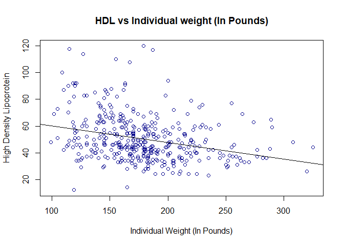
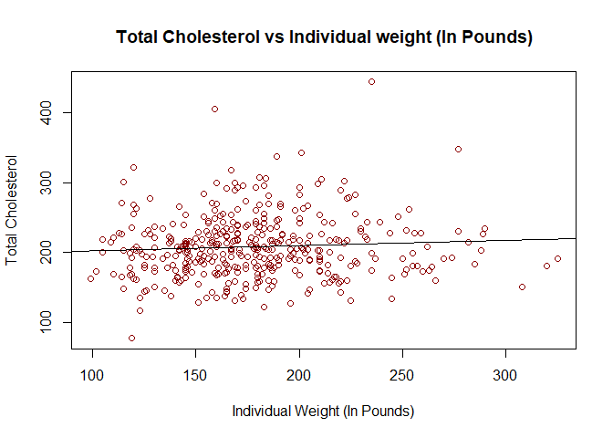
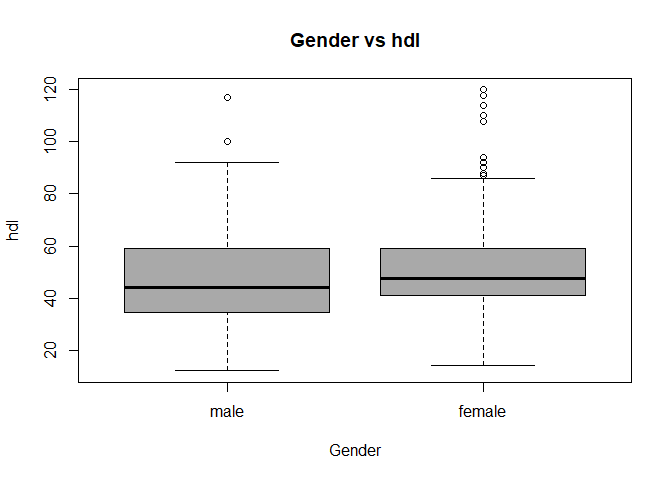
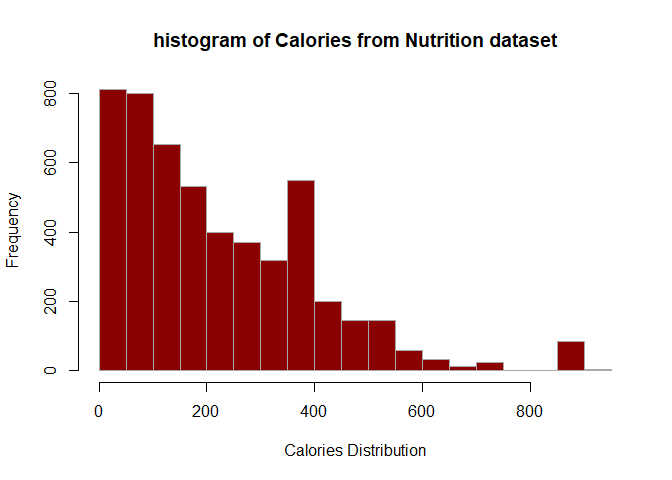
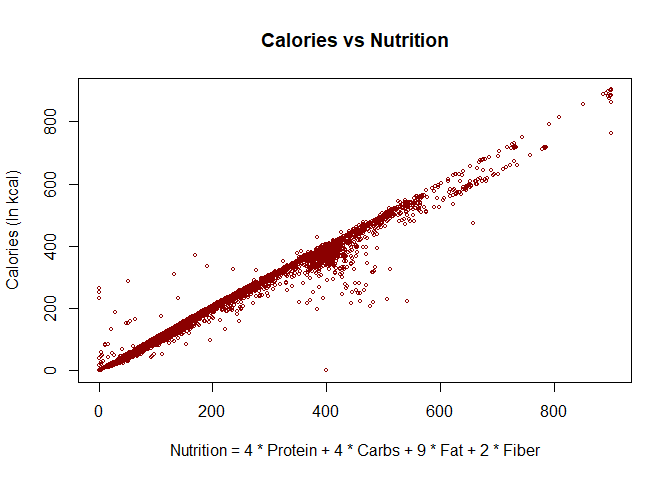

# HomeWork 1
## Nishit K Patel, May - 2017

-   [Exercise 1](#exercise-1)
-   [Exercise 2](#exercise-2)
-   [Exercise 3](#exercise-3)

Exercise 1
----------

For this exercise, we will use the `diabetes` dataset from the `faraway` package.

**(a)** Install and load the `faraway` package. **Do not** include the installation command in your `.Rmd` file. (If you do it will install the package every time you knit your file.) **Do** include the command to load the package into your environment.

``` r
#Installing faraway package
library(faraway)
```

**(b)** Coerce the data to be a tibble instead of a data frame. (You will need the `tibble` package to do so.) How many observations are in this dataset? How many variables? Who are the individuals in this dataset?

``` r
#Installing tibble package and converting diabetes dataset to tibble datatype
library(tibble)
diabetes_t <- as.tibble(diabetes)
diabetes_t
```

    ## # A tibble: 403 x 19
    ##       id  chol stab.glu   hdl ratio glyhb location   age gender height
    ##  * <int> <int>    <int> <int> <dbl> <dbl> <fct>    <int> <fct>   <int>
    ##  1  1000   203       82    56  3.60  4.31 Bucking~    46 female     62
    ##  2  1001   165       97    24  6.90  4.44 Bucking~    29 female     64
    ##  3  1002   228       92    37  6.20  4.64 Bucking~    58 female     61
    ##  4  1003    78       93    12  6.5   4.63 Bucking~    67 male       67
    ##  5  1005   249       90    28  8.90  7.72 Bucking~    64 male       68
    ##  6  1008   248       94    69  3.60  4.81 Bucking~    34 male       71
    ##  7  1011   195       92    41  4.80  4.84 Bucking~    30 male       69
    ##  8  1015   227       75    44  5.20  3.94 Bucking~    37 male       59
    ##  9  1016   177       87    49  3.60  4.84 Bucking~    45 male       69
    ## 10  1022   263       89    40  6.60  5.78 Bucking~    55 female     63
    ## # ... with 393 more rows, and 9 more variables: weight <int>, frame <fct>,
    ## #   bp.1s <int>, bp.1d <int>, bp.2s <int>, bp.2d <int>, waist <int>,
    ## #   hip <int>, time.ppn <int>

-   There are `403` oberservations and `19` variables in diabetes dataset.
-   The individual in this dataset are African Americans who were interviewed in a study to understand the prevalence of obesity, diabetes and other cardiovascular risk factors in cetral virginia.

**(c)** Which variables are factor variables?

-   By observing the dataset, it appears that location, gender and frame are factor variables.

**(d)** What is the mean [HDL](https://en.wikipedia.org/wiki/High-density_lipoprotein) level (High Density Lipoprotein) of individuals in this sample?

-   The mean HDL level of individual in this dataset is 50.4452736. The missing values have been removed when calculating the mean.

**(e)** What is the standard deviation of total cholesterol of individuals in this sample?

-   Ther standard deviation of cholesterol of individual in this dataset is 44.4455574. The missing values have been removed when calculaing the standard deviation.

**(f)** What is the range of ages of individuals in this sample?

``` r
#Calculating range of individual age in diabetes dataset
range(diabetes_t$age)
```

    ## [1] 19 92

-   The range of ages of individual in this dataset is from `19 year` (minimum) to `92 year` (maximum).

**(g)** What is the mean HDL of females in this sample?

``` r
#Filtering diabetes dataset with only femals and calculating means
diabetes_females <- subset(diabetes_t, gender=="female")
mean(diabetes_females$hdl,na.rm = TRUE)
```

    ## [1] 52.11111

-   The mean HDL of females is `52.11111`.

**(h)** Create a scatter plot of HDL (y-axis) vs weight (x-axis). Use a non-default color for the points. (Also, be sure to give the plot a title and label the axes appropriately.) Based on the scatter plot, does there seem to be a relationship between the two variables? Briefly explain.

``` r
#scatter plot for HDL vs weight from diabetes dataset
plot(hdl~weight,data = diabetes_t,
                xlab = "Individual Weight (In Pounds)",
                ylab = "High Density Lipoprotein",
                main = "HDL vs Individual weight (In Pounds)",
                cex = 1,
                col="darkblue")

#Plotting linear model and abline on scatterplot to determine relationship
reg <- lm(diabetes_t$hdl~diabetes_t$weight)
with(diabetes_t,plot(hdl~weight,
                      xlab = "Individual Weight (In Pounds)",
                      ylab = "High Density Lipoprotein",
                      main = "HDL vs Individual weight (In Pounds)",
                      cex = 1,
                      col="darkblue"))
abline(reg)
```



-   At first just by looking at the scatter plot, It is hard to get to the conclusion that if there is any relationship between **HDL** and **Individual Weight**. There are some individuals with high weight who have less hdl which produces slight negative correlation overall i.e. individuals with more weight appear to have lower HDL compare to individual with less weight.

-   We then applied liner model (lm function) on data and drew abline which has negative trend and downwards slope, which tells us that Individual with higher weight tend to have lower level of hdl compare to individual with lower weight.

**(i)** Create a scatter plot of total cholesterol (y-axis) vs weight (x-axis). Use a non-default color for the points. (Also, be sure to give the plot a title and label the axes appropriately.) Based on the scatter plot, does there seem to be a relationship between the two variables? Briefly explain.

``` r
plot(chol~weight,data = diabetes_t,
      xlab = "Individual Weight (In Pounds)",
      ylab = "Total Cholesterol",
      main = "Total Cholesterol vs Individual weight (In Pounds)",
      cex = 1,
      col="darkred")

#Plotting linear model and abline on scatterplot to determine relationship
reg2 <- lm(diabetes_t$chol~diabetes_t$weight)
with(diabetes_t,plot(chol~weight,
                      xlab = "Individual Weight (In Pounds)",
                      ylab = "Total Cholesterol",
                      main = "Total Cholesterol vs Individual weight (In Pounds)",
                      cex = 1,
                      col="darkred"))
abline(reg2)
```



-   Based on scatter plot and lm model regression line, there does not seems to be a relationship between individual's weight and total cholesterol. The data is randomly distributed and regression line is almost flat which depicts that there is a very weak correlation.

**(j)** Create side-by-side boxplots for HDL by gender. Use non-default colors for the plot. (Also, be sure to give the plot a title and label the axes appropriately.) Based on the boxplot, does there seem to be a difference between HDL level and gender? Briefly explain.

``` r
boxplot(hdl~gender, 
        data=diabetes_t,
        xlab = "Gender",
        ylab = "hdl",
        col = "darkgray",
        main = "Gender vs hdl"
)
```



-   Based on above boxplot, the female median HDL level is slightly greater than male. Lower HDL IQR for male is slightly less than female and upper IQR is about the same. In addition to this female data has more spread compare to male.

<br/>

Exercise 2
----------

For this exercise we will use the data stored in [`nutrition.csv`](nutrition.csv). It contains the nutritional values per serving size for a large variety of foods as calculated by the USDA. It is a cleaned version totaling 5138 observations and is current as of September 2015.

The variables in the dataset are:

-   `ID`
-   `Desc` - Short description of food
-   `Water` - in grams
-   `Calories` - in kcal
-   `Protein` - in grams
-   `Fat` - in grams
-   `Carbs` - Carbohydrates, in grams
-   `Fiber` - in grams
-   `Sugar` - in grams
-   `Calcium` - in milligrams
-   `Potassium` - in milligrams
-   `Sodium` - in milligrams
-   `VitaminC` - Vitamin C, in milligrams
-   `Chol` - Cholesterol, in milligrams
-   `Portion` - Description of standard serving size used in analysis

**(a)** Create a histogram of `Calories`. Do not modify `R`'s default bin selection. Make the plot presentable. Describe the shape of the histogram. Do you notice anything unusual?

``` r
library(readr)
nutrition <- read_csv("nutrition.csv")
hist(nutrition$Calories,
     xlab = "Calories Distribution",
     main = "histogram of Calories from Nutrition dataset",
     border = "darkgray",
     col = "darkred")
```



-   The above Calories histogram depicts interesting information. The shape of the histogram is assymetrical around the median and also mean is lower than the median. The data is positively skewed as the tail is longer in positive direction.
-   There is also some calories distrubution in far right towards the tail which has way very high calories compared to rest of datasets.

**(b)** Create a scatter plot of calories (y-axis) vs protein (x-axis). Make the plot presentable. Do you notice any trends? Do you think that knowing only the protein content of a food, you could make a good prediction of the calories in the food?

``` r
plot(nutrition$Calories~nutrition$Protein,
     xlab="Protein (In grams)",
     ylab="Calories (In kcal)",
     main="Calories vs Protein",
     cex = 0.7,
     col="darkblue")

reg1 <- lm(nutrition$Calories~nutrition$Protein)
with(nutrition,plot(Calories~Protein,
                       xlab="Protein (In grams)",
                       ylab="Calories (In kcal)",
                       main="Calories vs Protein",
                       cex = 0.7,
                       col="darkblue"))
abline(reg1)
```


-   Based on scatter plot and drawing lm line we can see here a positive correlation between protein content and calories. But of you look the data, most of the data points are distributed between protein content of 0-30 grams and calories associated varies randomly. The calorie content barely changes/fluctuates when you compare the foods with hign protein content compare to low protein content. In other words foods with high and low protein content has same amount of calories.Even though there seems to be a positive correlation between protein content and calories, based on this data it will be hard to make a good prediction on calories in the food.

**(c)** Create a scatter plot of `Calories` (y-axis) vs `4 * Protein + 4 * Carbs + 9 * Fat + 2 * Fiber` (x-axis). Make the plot presentable. You will either need to add a new variable to the data frame, or, use the `I()` function in your formula in the call to `plot()`. If you are at all familiar with nutrition, you may realize that this formula calculates the calorie count based on the protein, carbohydrate, and fat values. You'd expect then that the result here is a straight line. Is it? If not, can you think of any reasons why it is not?

``` r
library(dplyr)
nutrition_new <- mutate(nutrition, mix_nutritions = 4 * nutrition$Protein + 4 * nutrition$Carbs + 9 * nutrition$Fat + 2 * nutrition$Fiber)
plot(nutrition_new$Calories~nutrition_new$mix_nutritions,
     xlab="Nutrition = 4 * Protein + 4 * Carbs + 9 * Fat + 2 * Fiber",
     ylab="Calories (In kcal)",
     main="Calories vs Nutrition",
     cex = 0.5,
     col="darkred")
```



-   Yes, using the nutrition formula and by plotting it against Calories does give almost a straight line. The true regression line will not be straight but will be very close to it.

<br/>

Exercise 3
----------

For each of the following parts, use the following vectors:

``` r
a = 1:10
b = 10:1
c = rep(1, times = 10)
d = 2 ^ (1:10)
```

**(a)** Write a function called `sum_of_squares`.

-   Arguments:
    -   A vector of numeric data `x`.
-   Output:
    -   The sum of the squares of the elements of the vector. $\\sum\_{i = 1}^n x\_i^2$

Provide your function, as well as the result of running the following code:

``` r
sum_of_squares <- function(x){
  vec <- x^2
  sum(vec)
}
```

``` r
sum_of_squares(x = a)
```

    ## [1] 385

``` r
sum_of_squares(x = c(c, d))
```

    ## [1] 1398110

**(b)** Write a function called `rms_diff`.

-   Arguments:
    -   A vector of numeric data `x`.
    -   A vector of numeric data `y`.
-   Output:
    -   $\\sqrt{\\frac{1}{n}\\sum\_{i = 1}^n (x\_i - y\_i)^{2}}$

Provide your function, as well as the result of running the following code:

``` r
rms_diff <- function(x,y){
  #check length of both vectors and consider longer vector length for value of n
  len <- ifelse(length(x)>length(y),length(x),length(y))
  squared_sum <- (x-y)^2
  squared_sum <- sum(squared_sum)/len
  sqrt(squared_sum)
}
```

``` r
rms_diff(x = a, y = b)
```

    ## [1] 5.744563

``` r
rms_diff(x = d, y = c)
```

    ## [1] 373.3655

``` r
rms_diff(x = d, y = 1)
```

    ## [1] 373.3655

``` r
rms_diff(x = a, y = 0) ^ 2 * length(a)
```

    ## [1] 385
