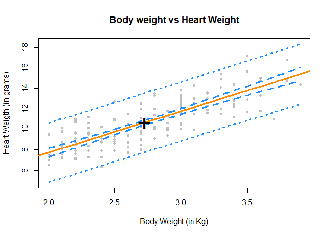
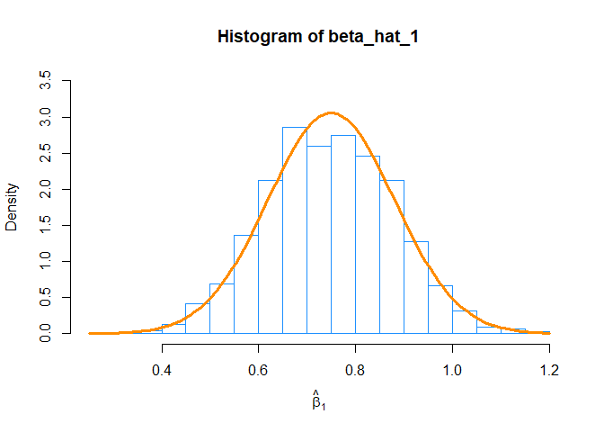
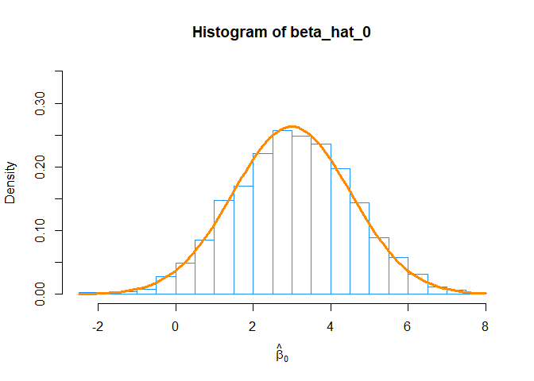

-   [Exercise 1 (Using `lm` for Inference)](#exercise-1-using-lm-for-inference)
-   [Exercise 2 (Using `lm` for Inference)](#exercise-2-using-lm-for-inference)
-   [Exercise 3 (Inference "without" `lm`)](#exercise-3-inference-without-lm)
-   [Exercise 4 (Simulating Sampling Distributions)](#exercise-4-simulating-sampling-distributions)
-   [Exercise 5 (Simulating Confidence Intervals)](#exercise-5-simulating-confidence-intervals)

Exercise 1 (Using `lm` for Inference)
-------------------------------------

For this exercise we will use the `cats` dataset from the `MASS` package. You should use `?cats` to learn about the background of this dataset.

**(a)** Fit the following simple linear regression model in `R`. Use heart weight as the response and body weight as the predictor.

*Y*<sub>*i*</sub> = *β*<sub>0</sub> + *β*<sub>1</sub>*x*<sub>*i*</sub> + *ϵ*<sub>*i*</sub>

Store the results in a variable called `cat_model`. Use a *t* test to test the significance of the regression. Report the following:

``` r
library(MASS)
cat_model <- lm(Hwt~Bwt, data = cats)
```

-   The null and alternative hypotheses
-   The value of the test statistic
-   The p-value of the test
-   A statistical decision at *α* = 0.01
-   A conclusion in the context of the problem

When reporting these, you should explicitly state them in your document, not assume that a reader will find and interpret them from a large block of `R` output.

-   for the null hypothesis, we will consider the model where we assume that there is not a significant linear relationship between the predictor(Cat's body weight) and response variable(Cat's heart weight) and the model would be simply *β*<sub>0</sub> + error. On the other hand the alternative hypothesie would be where value of *β*<sub>1</sub> would be non-zero i.e. response(Cat's heart weight) may depend on predictor variable(Cat's body weight) or there is a significant relationship liner relationship between predictor and response variable.

    The test that we will perform can be written as *H*<sub>0</sub> : *β*<sub>1</sub> = 0 vs *H*<sub>1</sub> : *β*<sub>1</sub> ≠ 0

we are specifically testing for *β*<sub>1</sub> = 0 and can think of model this way, <br/> - Under *H*<sub>0</sub>, there is no significant linear relationship between x and y(Cat's body weight and heart weight). <br/> - Under *H*<sub>1</sub>, there is a significant linear relationship between x and y(Cat's body weight and heart weight).

-   The value of test statistics for *β*<sub>1</sub> is 16.1193908.
-   The p-value of the test for *β*<sub>1</sub> is 6.969044610^{-34}
-   Based on *α* = 0.01 value and very low p-value of 6.969044610^{-34}, we would reject the null ypothesis i.e. our test shows that there is a significant linear relationship between predictor and response.
-   Under the null hypothesis, we assumed that there is no linear relation between cats heart and body weight i.e. heart weight does not depend on cats body weight. but using t test and p-value we saw above, our model shows that there indeed is a significant linear relationship between the cats heart and its body weight. i.e as body weight increases, the average estimate heart weight increase with the value of *β*<sub>1</sub> = 4.0340627 grams.

**(b)** Calculate a 99% confidence interval for *β*<sub>1</sub>. Give an interpretation of the interval in the context of the problem.

``` r
confint(cat_model,level = 0.99)[2,]
```

    ##    0.5 %   99.5 % 
    ## 3.380656 4.687469

-   This means we are 99% confident that for an increase in cat body weight of 1 Kg, the average increase in cat heart weight is between 3.3806562 grams and 4.6874692 grams, which is interval of *β*<sub>1</sub>.

**(c)** Calculate a 90% confidence interval for *β*<sub>0</sub>. Give an interpretation of the interval in the context of the problem.

``` r
confint(cat_model, level = 0.90)[1,]
```

    ##        5 %       95 % 
    ## -1.5028345  0.7895096

-   This result means we are 90% confident that average weight of cat heart with body weight of 0 Kg is between -2.1641253 grams and 1.4508004 grams, which is interval of *β*<sub>0</sub>. we don't really believe lower margin here as we are certain that this number can not be negative.

**(d)** Use a 95% confidence interval to estimate the mean heart weight for body weights of 2.5 and 3.0 kilograms Which of the two intervals is wider? Why?

``` r
new_weights <- data.frame(Bwt = c(2.5, 3.0))
predict(cat_model,newdata=new_weights, interval = c("confidence"), level=.095)
```

    ##         fit       lwr       upr
    ## 1  9.728494  9.712552  9.744437
    ## 2 11.745526 11.728859 11.762193

-   Here we can see that confidence interval of body weight 3 kg is little wider because body weight of 3 Kg is away from mean cat body weight of 2.7236111 Kg and 2.5 is comparatively closer to mean body weight. and we we know that as you move away from mean value of response your confidence interval increases.

**(e)** Use a 95% prediction interval to predict the heart weight for body weights of 2.5 and 4.0 kilograms.

``` r
new_weights <- data.frame(Bwt = c(2.5, 4.0))
predict(cat_model,newdata=new_weights, interval = c("prediction"), level=.095)
```

    ##         fit       lwr       upr
    ## 1  9.728494  9.554117  9.902872
    ## 2 15.779588 15.601203 15.957974

-   After using the predict function with `prediction` interval, we can see that for cat of body weight 2.5 kg the estimated average heart weight would be between 9.554117 grams and 9.9028716 grams 95% of the time. for the body weight of 4 kg, the estimated heart weight would be between 15.6012032 grams and 15.9579735 grams 95% of the time.

**(f)** Create a scatterplot of the data. Add the regression line, 95% confidence bands, and 95% prediction bands.

``` r
grid <- seq(min(cats$Bwt), max(cats$Bwt), by = 0.01)
cat_ci_band <- predict(cat_model, newdata = data.frame(Bwt = grid), interval = "confidence", level = 0.95)
cat_pi_band <- predict(cat_model, newdata = data.frame(Bwt = grid), interval = "prediction", level = 0.95)

plot(Hwt ~ Bwt, data = cats,
     xlab = "Body Weight (in Kg)",
     ylab = "Heart Weigth (in grams)",
     main = "Body weight vs Heart Weight",
     pch  = 20,
     cex  = 1,
     col  = "grey",
     ylim = c(min(cat_pi_band), max(cat_pi_band)))
abline(cat_model, lwd = 3, col = "darkorange")

lines(grid, cat_ci_band[,"lwr"], col = "dodgerblue", lwd = 3, lty = 2)
lines(grid, cat_ci_band[,"upr"], col = "dodgerblue", lwd = 3, lty = 2)
lines(grid, cat_pi_band[,"lwr"], col = "dodgerblue", lwd = 3, lty = 3)
lines(grid, cat_pi_band[,"upr"], col = "dodgerblue", lwd = 3, lty = 3)
points(mean(cats$Bwt), mean(cats$Hwt), pch = "+", cex = 3)
```



<br/>

Exercise 2 (Using `lm` for Inference)
-------------------------------------

For this exercise we will use the `diabetes` dataset, which can be found in the `faraway` package.

**(a)** Fit the following simple linear regression model in `R`. Use the total cholesterol as the response and weight as the predictor.

*Y*<sub>*i*</sub> = *β*<sub>0</sub> + *β*<sub>1</sub>*x*<sub>*i*</sub> + *ϵ*<sub>*i*</sub>

Store the results in a variable called `cholesterol_model`. Use a *t* test to test the significance of the regression. Report the following:

-   The null and alternative hypotheses
-   The value of the test statistic
-   The p-value of the test
-   A statistical decision at *α* = 0.05
-   A conclusion in the context of the problem

When reporting these, you should explicitly state them in your document, not assume that a reader will find and interpret them from a large block of `R` output.

``` r
library(faraway)
cholesterol_model <- lm(chol~weight, data = diabetes)
```

-   For the null hypothesis, we will consider the model where we assume that there is no linear relationship between the predictor and response variable and the model that would be *β*<sub>1</sub> + error. On the contrary, the alternative hypothesie would be where value of *β*<sub>1</sub> would be non-zero i.e. response may depend on predictor variable. we can write our hypothesis as *H*<sub>0</sub> : *β*<sub>1</sub> = 0 vs *H*<sub>1</sub> : *β*<sub>1</sub> ≠ 0

we are specifically testing for *β*<sub>1</sub> = 0 and can think of model this way, <br/> - Under *H*<sub>0</sub>, there is no significant linear relationship between x and y(Body weight and cholesterol level). <br/> - Under *H*<sub>1</sub>, there is a significant linear relationship between x and y(Body weight and cholesterol level).

-   The value of t statistics here is 1.3390958
-   The p-value of the model is 0.1813018.
-   Considering the *α* = 0.05, we see here that p-value is higher than alpha value. also our t statistics is also slight higher. considering the p-value and alpha, we fail to reject the null hypothesis. i.e. results are statistically nonsignificant showing there is no significant relationship between x and y here.
-   In the context of this problem, we are here saying that based on our hypothesis testing, we did not find any statistical significant relationship between the body weight and level of cholesterol. It means that there might not be a linear relationship between the body weight and cholesterol level of individuals and cholesterol level is non dependant of indivisual body weight.

**(b)** Fit the following simple linear regression model in `R`. Use HDL as the response and weight as the predictor.

*Y*<sub>*i*</sub> = *β*<sub>0</sub> + *β*<sub>1</sub>*x*<sub>*i*</sub> + *ϵ*<sub>*i*</sub>

Store the results in a variable called `hdl_model`. Use a *t* test to test the significance of the regression. Report the following:

-   The null and alternative hypotheses
-   The value of the test statistic
-   The p-value of the test
-   A statistical decision at *α* = 0.05
-   A conclusion in the context of the problem

When reporting these, you should explicitly state them in your document, not assume that a reader will find and interpret them from a large block of `R` output.

``` r
hdl_model <- lm(hdl~weight, data = diabetes)
```

-   For the null hypothesis, we will consider the model where we assume that there is no relationship between the predictor and response variable and the model that would be ??1 would be 0. On the other hand the alternative hypothesie would be where value of ??1 would be non-zero i.e. there may be a relationship between the predictor and response. we write these hypothesis as *H*<sub>0</sub> : *β*<sub>1</sub> = 0 vs *H*<sub>1</sub> : *β*<sub>1</sub> ≠ 0

we are specifically testing for *β*<sub>1</sub> = 0 and can think of model this way, <br/> - Under *H*<sub>0</sub>, there is no significant linear relationship between x and y(Body weight and hdl). <br/> - Under *H*<sub>1</sub>, there is a significant linear relationship between x and y(Body weight and hdl).

-   The value of t statistics here is -6.0752572
-   The p-value of the model is 2.890525910^{-9}.
-   Considering the *α* = 0.05, we see here that p-value is extremely low compare to alpha value. It is very unlikely that this data could be generated using this model hence, we reject the null hypothesis. It is an indication that there is a linear relationship between the predictor and response variable.
-   In the context of this problem, we are saying that based on our hypothesis testing, we did find statistical significant relationship between the body weight and hdl. That hdl may depend on body weight of individuals.

<br/>

Exercise 3 (Inference "without" `lm`)
-------------------------------------

Write a function named `get_p_val_beta_1` that performs the test

*H*<sub>0</sub> : *β*<sub>1</sub> = *β*<sub>10</sub> vs *H*<sub>1</sub> : *β*<sub>1</sub> ≠ *β*<sub>10</sub>

for the linear model

*Y*<sub>*i*</sub> = *β*<sub>0</sub> + *β*<sub>1</sub>*x*<sub>*i*</sub> + *ϵ*<sub>*i*</sub>.

The function should take two inputs:

-   A model object that is the result of fitting the SLR model with `lm()`
-   A hypothesized value of *β*<sub>1</sub>, *β*<sub>10</sub>, with a default value of 0

The function should return a named vector with elements:

-   `t`, which stores the value of the test statistic for performing the test
-   `p_val`, which stores the p-value for performing the test

``` r
get_p_val_beta_1 <- function(model, beta_10 = 0) {
  beta_1_hat <- summary(model)$coefficient[2,1]
  beta_hyp <- beta_10
  s_e <- summary(model)$coefficient[2,2]
  
  t_statistics <- (beta_1_hat - beta_hyp) / s_e
  p_value <- summary(model)$coefficient[2,4]
  
  c(t = t_statistics, p_val = p_value)
}
```

**(a)** After writing the function, run these three lines of code:

``` r
get_p_val_beta_1(cat_model, beta_1 = 4.2)
```

    ##             t         p_val 
    ## -6.630557e-01  6.969045e-34

``` r
get_p_val_beta_1(cholesterol_model)
```

    ##         t     p_val 
    ## 1.3390958 0.1813018

``` r
get_p_val_beta_1(hdl_model)
```

    ##             t         p_val 
    ## -6.075257e+00  2.890526e-09

**(b)** Return to the goalies dataset from the previous homework, which is stored in [`goalies.csv`](goalies.csv). Fit a simple linear regression model with `W` as the response and `MIN` as the predictor. Store the results in a variable called `goalies_model_min`. After doing so, run these three lines of code:

``` r
library(readr)
goalies <- read_csv("goalies.csv")
goalies_model_min <- lm(W~MIN, data=goalies)

get_p_val_beta_1(goalies_model_min)
```

    ##       t   p_val 
    ## 154.724   0.000

``` r
get_p_val_beta_1(goalies_model_min, beta_1 = coef(goalies_model_min)[2])
```

    ## t.MIN p_val 
    ##     0     0

``` r
get_p_val_beta_1(goalies_model_min, beta_1 = 0.008)
```

    ##         t     p_val 
    ## -3.036956  0.000000

<br/>

Exercise 4 (Simulating Sampling Distributions)
----------------------------------------------

For this exercise we will simulate data from the following model:

*Y*<sub>*i*</sub> = *β*<sub>0</sub> + *β*<sub>1</sub>*x*<sub>*i*</sub> + *ϵ*<sub>*i*</sub>

Where *ϵ*<sub>*i*</sub> ∼ *N*(0, *σ*<sup>2</sup>). Also, the parameters are known to be:

-   *β*<sub>0</sub> = 3
-   *β*<sub>1</sub> = 0.75
-   *σ*<sup>2</sup> = 25

We will use samples of size *n* = 42.

**(a)** Simulate this model 1500 times. Each time use `lm()` to fit a simple linear regression model, then store the value of $\\hat{\\beta}\_0$ and $\\hat{\\beta}\_1$. Set a seed using **your** birthday before performing the simulation. Note, we are simulating the *x* values once, and then they remain fixed for the remainder of the exercise.

``` r
birthday <- 19880918
set.seed(birthday)
n <- 42
x <- seq(0, 20, length = n)

beta_0 <- 3
beta_1 <- 0.75
sigma <- 5
Sxx <- sum((x-mean(x)) ^2)

var_beta_hat_1 <- sigma ^ 2 / Sxx 
var_beta_hat_0 <- sigma ^ 2 * ( 1/ n + mean(x) ^ 2 / Sxx)

beta_hat_0 <- rep(0,1500)
beta_hat_1 <- rep(0,1500)

for(i in 1:1500) {
  eps <- rnorm(n,mean=0,sd=sigma)
  y <- beta_0 + beta_1 * x + eps
  model <- lm(y~x)
  beta_hat_0[i] <- coef(model)[1]
  beta_hat_1[i] <- coef(model)[2]
}
```

**(b)** For the *known* values of *x*, what is the expected value of $\\hat{\\beta}\_1$?

``` r
beta_1             #true mean
```

    ## [1] 0.75

**(c)** For the known values of *x*, what is the standard deviation of $\\hat{\\beta}\_1$?

``` r
sqrt(var_beta_hat_1)
```

    ## [1] 0.1304859

**(d)** What is the mean of your simulated values of $\\hat{\\beta}\_1$? Does this make sense given your answer in **(b)**?

``` r
mean(beta_hat_1)   #empirical mean
```

    ## [1] 0.7460543

-   Yes, we expect the mean of simulated values of $\\hat{\\beta}\_1$ to be close to expected value of *x*, which in this case is pretty close.

**(e)** What is the standard deviation of your simulated values of $\\hat{\\beta}\_1$? Does this make sense given your answer in **(c)**?

``` r
sd(beta_hat_1)  
```

    ## [1] 0.1316349

-   Yes, we expect the sd of simulated values of $\\hat{\\beta}\_1$ to be close to expected standard deviation value of *x*, which in this case is pretty close. We checked this by taking square root of expected variance and compared with sd of simlated value of $\\hat{\\beta}\_1$.

**(f)** For the known values of *x*, what is the expected value of $\\hat{\\beta}\_0$?

``` r
beta_0
```

    ## [1] 3

**(g)** For the known values of *x*, what is the standard deviation of $\\hat{\\beta}\_0$?

``` r
sqrt(var_beta_hat_0)
```

    ## [1] 1.515881

**(h)** What is the mean of your simulated values of $\\hat{\\beta}\_0$? Does this make sense given your answer in **(f)**?

``` r
mean(beta_hat_0)
```

    ## [1] 3.042752

-   Yes, we expect the mean of simulated values of $\\hat{\\beta}\_0$ to be close to expected value of *x*, which in this case is pretty close.

**(i)** What is the standard deviation of your simulated values of $\\hat{\\beta}\_0$? Does this make sense given your answer in **(g)**?

``` r
sd(beta_hat_0)
```

    ## [1] 1.528298

-   Yes, we expect the sd of simulated values of $\\hat{\\beta}\_0$ to be close to expected sd value of *x*, which in this case is pretty close. We checked this by takign square root of expected variance and compared with sd of simlated value of $\\hat{\\beta}\_0$.

**(j)** Plot a histogram of your simulated values for $\\hat{\\beta}\_1$. Add the normal curve for the true sampling distribution of $\\hat{\\beta}\_1$.

``` r
hist( beta_hat_1, prob = TRUE, breaks = 30, xlab = expression(hat(beta)[1]), ylim = c(0.0,3.5), main = "Histogram of beta_hat_1" , border = "dodgerblue")
curve(dnorm(x, mean = beta_1, sd = sqrt(var_beta_hat_1)), col = "darkorange", add = TRUE, lwd = 3)
```



**(k)** Plot a histogram of your simulated values for $\\hat{\\beta}\_0$. Add the normal curve for the true sampling distribution of $\\hat{\\beta}\_0$.

``` r
hist( beta_hat_0, prob = TRUE, breaks =30, xlab = expression(hat(beta)[0]), ylim = c(0.00,0.35),  main = "Histogram of beta_hat_0", border = "dodgerblue")
curve(dnorm(x, mean = beta_0, sd = sqrt(var_beta_hat_0)), col = "darkorange", add = TRUE, lwd = 3)
```



<br/>

Exercise 5 (Simulating Confidence Intervals)
--------------------------------------------

For this exercise we will simulate data from the following model:

*Y*<sub>*i*</sub> = *β*<sub>0</sub> + *β*<sub>1</sub>*x*<sub>*i*</sub> + *ϵ*<sub>*i*</sub>

Where *ϵ*<sub>*i*</sub> ∼ *N*(0, *σ*<sup>2</sup>). Also, the parameters are known to be:

-   *β*<sub>0</sub> = 1
-   *β*<sub>1</sub> = 3
-   *σ*<sup>2</sup> = 16

We will use samples of size *n* = 20.

Our goal here is to use simulation to verify that the confidence intervals really do have their stated confidence level. Do **not** use the `confint()` function for this entire exercise.

**(a)** Simulate this model 2000 times. Each time use `lm()` to fit a simple linear regression model, then store the value of $\\hat{\\beta}\_0$ and *s*<sub>*e*</sub>. Set a seed using **your** birthday before performing the simulation. Note, we are simulating the *x* values once, and then they remain fixed for the remainder of the exercise.

``` r
birthday <- 19880918
set.seed(birthday)
n <- 20
beta_0 <- 1
beta_1 <- 3
sigma <- 4
x <- seq(-5, 5, length = n)

beta_hat_0 <- rep(0,2000)
beta_hat_1 <- rep(0,2000)
beta_hat_0_se <- rep(0,2000)

Sxx <- sum((x - mean(x)) ^ 2)

for(i in 1:2000) {
  eps <- rnorm(n,mean=0,sd=sigma)
  y <- beta_0 + beta_1 * x + eps

  model <- lm(y~x)
  
  beta_hat_0[i] <- coef(model)[1]
  beta_hat_1[i] <- coef(model)[2]
  beta_hat_0_se[i] <- summary(model)$coefficient[1,2]
}
```

**(b)** For each of the $\\hat{\\beta}\_0$ that you simulated, calculate a 90% confidence interval. Store the lower limits in a vector `lower_90` and the upper limits in a vector `upper_90`. Some hints:

-   You will need to use `qt()` to calculate the critical value, which will be the same for each interval.
-   Remember that `x` is fixed, so *S*<sub>*x**x*</sub> will be the same for each interval.
-   You could, but do not need to write a `for` loop. Remember vectorized operations.

``` r
crit_90 <- qt(0.950, df = length(resid(model)) - 2)

lower_90 <- c(beta_hat_0 - crit_90 * beta_hat_0_se)
upper_90 <- c(beta_hat_0 + crit_90 * beta_hat_0_se)

result <- data.frame(beta0hat = beta_hat_0, CI_low = lower_90, CI_High = upper_90)
```

**(c)** What proportion of these intervals contain the true value of *β*<sub>0</sub>?

``` r
interval_90_contains_beta_0 <- subset(result, CI_low < beta_0 & beta_0 < CI_High)
proportion_90 <- nrow(interval_90_contains_beta_0 ) / nrow(result)
proportion_90
```

    ## [1] 0.901

-   As we can see here that after calculating 90% of confidence interval for *β*<sub>0</sub>, approximately 0.901 of the time the true value of *β*<sub>0</sub> is between 90% of lower and upper bound values of confidence interval.

**(d)** Based on these intervals, what proportion of the simulations would reject the test *H*<sub>0</sub> : *β*<sub>0</sub> = 0 vs *H*<sub>1</sub> : *β*<sub>0</sub> ≠ 0 at *α* = 0.10?

``` r
interval_90_contains_0 <- subset(result, CI_low < 0 & 0 < CI_High)
proportion_for_beta_0_test_90 <- nrow(interval_90_contains_0 ) / nrow(result)
1 - proportion_for_beta_0_test_90
```

    ## [1] 0.2905

-   we would reject null hypothesis 0.2905 of the time. as 0.7095 of the time 0 is in between the confidence interval.

**(e)** For each of the $\\hat{\\beta}\_0$ that you simulated, calculate a 99% confidence interval. Store the lower limits in a vector `lower_99` and the upper limits in a vector `upper_99`.

``` r
crit_99 <- qt(0.995, df = length(resid(model)) - 2)

lower_99 <- c(beta_hat_0 - crit_99 * beta_hat_0_se)
upper_99 <- c(beta_hat_0 + crit_99 * beta_hat_0_se)
```

**(f)** What proportion of these intervals contain the true value of *β*<sub>0</sub>?

``` r
interval_99_contains_beta_0 <- subset(result, lower_99 < beta_0 & beta_0 < upper_99)
proportion_99 <- nrow(interval_99_contains_beta_0 ) / nrow(result)
proportion_99
```

    ## [1] 0.9915

-   As we can see here that after calculating 99% of confidence interval for *β*<sub>0</sub>, approximately `1 - proportion_99` of the time the true value of *β*<sub>0</sub> is between 99% of lower and upper bound values of confidence interval.

**(g)** Based on these intervals, what proportion of the simulations would reject the test *H*<sub>0</sub> : *β*<sub>0</sub> = 0 vs *H*<sub>1</sub> : *β*<sub>0</sub> ≠ 0 at *α* = 0.01?

``` r
interval_99_contains_beta_0 <- subset(result, lower_99 < 0 & 0 < upper_99)
proportion_for_beta_0_test_99 <- nrow(interval_99_contains_beta_0 ) / nrow(result)
1 - proportion_for_beta_0_test_99
```

    ## [1] 0.0615

-   we would reject the null test 0.0615 of the time in this case.
