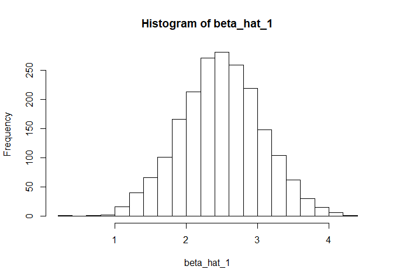
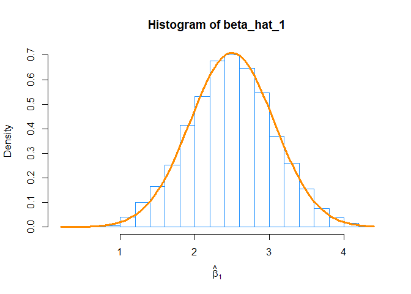

-   [Exercise 1 (Using `lm`)](#exercise-1-using-lm)
-   [Exercise 2 (More `lm`)](#exercise-2-more-lm)
-   [Exercise 3 (Regression without `lm`)](#exercise-3-regression-without-lm)
-   [Exercise 4 (Regression for Prediction)](#exercise-4-regression-for-prediction)
-   [Exercise 5 (Simulating Multiple Regression)](#exercise-5-simulating-multiple-regression)

Exercise 1 (Using `lm`)
-----------------------

For this exercise we will use the data stored in [`nutrition.csv`](nutrition.csv). It contains the nutritional values per serving size for a large variety of foods as calculated by the USDA. It is a cleaned version totaling 5,138 observations and is current as of September 2015.

The variables in the dataset are:

-   `ID`
-   `Desc` - Short description of food
-   `Water` - in grams
-   `Calories`
-   `Protein` - in grams
-   `Fat` - in grams
-   `Carbs` - Carbohydrates, in grams
-   `Fiber` - in grams
-   `Sugar` - in grams
-   `Calcium` - in milligrams
-   `Potassium` - in milligrams
-   `Sodium` - in milligrams
-   `VitaminC` - Vitamin C, in milligrams
-   `Chol` - Cholesterol, in milligrams
-   `Portion` - Description of standard serving size used in analysis

**(a)** Fit the following multiple linear regression model in `R`. Use `Calories` as the response and `Carbs`, `Fat`, and `Protein` as predictors.

*Y*<sub>*i*</sub> = *β*<sub>0</sub> + *β*<sub>1</sub>*x*<sub>*i*1</sub> + *β*<sub>2</sub>*x*<sub>*i*2</sub> + *β*<sub>3</sub>*x*<sub>*i*3</sub> + *ϵ*<sub>*i*</sub>.

Here,

-   *Y*<sub>*i*</sub> is `Calories`.
-   *x*<sub>*i*1</sub> is `Carbs`.
-   *x*<sub>*i*2</sub> is `Fat`.
-   *x*<sub>*i*3</sub> is `Protein`.

``` r
library(readr)
nutrition <- read_csv("nutrition.csv")
nutrition_model <- lm(Calories~ Carbs + Fat + Protein, data = nutrition)
```

Use an *F*-test to test the significance of the regression. Report the following:

-   The null and alternative hypotheses
-   The value of the test statistic
-   The p-value of the test
-   A statistical decision at *α* = 0.01
-   A conclusion in the context of the problem

When reporting these, you should explicitly state them in your document, not assume that a reader will find and interpret them from a large block of `R` output.

-   For the null hypothesis, we will consider the model where none of the predictor have a significant relationship with response. On the contrary the alternative hypothesis would be that atleast one of the predictors from null hypothesis is not 0, i.e. atleast one of the predictor has significant relationship with response. we can write these model as:

    -   null model - *H*<sub>0</sub> : *β*<sub>1</sub> = *β*<sub>2</sub> = *β*<sub>3</sub> = ......*β*<sub>(</sub>*p* − 1)=0 or *Y*<sub>*i*</sub> = *β*<sub>0</sub> + *ϵ*<sub>*i*</sub>.
    -   full model - *H*<sub>1</sub> : *β*<sub>*j*</sub> ≠ 0, *j* = 1, 2, ....(*p* − 1) or *Y*<sub>*i*</sub> = *β*<sub>0</sub> + *β*<sub>1</sub>*x*<sub>*i*1</sub> + *β*<sub>2</sub>*x*<sub>*i*2</sub> + *β*<sub>3</sub>*x*<sub>*i*3</sub> + *ϵ*<sub>*i*</sub>.

``` r
null_nutrition_model <- lm(Calories ~ 1, data = nutrition)
full_nutrition_model <- lm(Calories ~ Carbs + Fat + Protein, data = nutrition)
anova(null_nutrition_model, full_nutrition_model)
```

    ## Analysis of Variance Table
    ## 
    ## Model 1: Calories ~ 1
    ## Model 2: Calories ~ Carbs + Fat + Protein
    ##   Res.Df       RSS Df Sum of Sq      F    Pr(>F)    
    ## 1   5137 165044306                                  
    ## 2   5134   1832206  3 163212100 152445 < 2.2e-16 ***
    ## ---
    ## Signif. codes:  0 '***' 0.001 '**' 0.01 '*' 0.05 '.' 0.1 ' ' 1

``` r
anova(null_nutrition_model, full_nutrition_model)[2,5]  #test statistic value
```

    ## [1] 152444.8

``` r
anova(null_nutrition_model, full_nutrition_model)[2,6]  # p-value
```

    ## [1] 0

-   The value of test statistics is 1.524448210^{5}.
-   p-value of the test is 0.
-   As we can see from p-value which is extremely low, we would reject the null hypothesis at the alpha value of 0.01 and say that there is a significant linear relationship between response and atleast one predictor.
-   Atleast one of the predictors (`Carbs`, `Fat` and `Protein`) included in the model have significant relationship with the response variable (`Calorie`).

**(b)** Output only the estimated regression coefficients. Interpret all $\\hat{\\beta}\_j$ coefficients in the context of the problem.

``` r
summary(nutrition_model)$coefficients[,1]
```

    ## (Intercept)       Carbs         Fat     Protein 
    ##    3.768066    3.773605    8.804109    3.967269

-   Above are the estimated coefficients of the model that we fit. we interpret this model in this manner. For a particular value `Fat` and `Protein`, as `Carbs` intake increases, `Calories` increases by 3.7736045. Similarly for a particular value of `Carbs` and `Protein`, as `Fat` intake increases, `Calories` increases by 8.8041089. and lastly for a particular values of `Carbs` and `Fat`, as `Protein` intake increases, Calories increases by 3.9672687

**(c)** Use your model to predict the number of `Calories` in a Big Mac. According to [McDonald's publicized nutrition facts](http://nutrition.mcdonalds.com/getnutrition/nutritionfacts.pdf), the Big Mac contains 47g of carbohydrates, 28g of fat, and 25g of protein.

``` r
new_nutrition <- data.frame(Carbs = 47, Fat = 28, Protein = 25)
predict(nutrition_model, newdata = new_nutrition)
```

    ##        1 
    ## 526.8242

-   The number of `calories` in a Big Mac would be 526.8242445.

**(d)** Calculate the standard deviation, *s*<sub>*y*</sub>, for the observed values in the Calories variable. Report the value of *s*<sub>*e*</sub> from your multiple regression model. Interpret both estimates in the context of this problem.

``` r
sd(nutrition$Calories)
```

    ## [1] 179.2444

``` r
summary(nutrition_model)$sigma
```

    ## [1] 18.89119

-   standard deviation of *s*<sub>*y*</sub> is 179.244356.
-   *s*<sub>*e*</sub> value of the model is 18.8911855. It means that considering `Carbs`, `Fat` and `Protein` in the model, the actual value of `Calories` deviates by 18.8911855 from the mean `Calories` value.

**(e)** Report the value of *R*<sup>2</sup> for the model. Interpret its meaning in the context of the problem.

``` r
summary(nutrition_model)$r.squared
```

    ## [1] 0.9888987

-   The *R*<sup>2</sup> value of the model is 0.9888987 which means that our model is explaining 0.9888987 amount of variability about response i.e. this model is explaining 0.9888987 amount of variability considering all the predictors.

**(f)** Calculate a 90% confidence interval for *β*<sub>2</sub>. Give an interpretation of the interval in the context of the problem.

``` r
confint(nutrition_model, level = 0.90 )[3,]
```

    ##      5 %     95 % 
    ## 8.778930 8.829288

-   Here we say that we are 90% confident that for a particular value of `Carbs` and `Protein`, the mean value of `Fat` would be between 8.77893 grams and 8.8292877 grams.

**(g)** Calculate a 95% confidence interval for *β*<sub>0</sub>. Give an interpretation of the interval in the context of the problem.

``` r
confint(nutrition_model, level = 0.90 )[1,]
```

    ##      5 %     95 % 
    ## 2.958016 4.578116

-   The above interval suggests that for a `Carbs`, `Fat` and `Protein` value of 0 grams, we are 90% confident that `Calories` content would be between 2.9580162, 4.5781158 and 2.9580162, 4.5781158.

**(h)** Use a 99% confidence interval to estimate the mean `Calorie` content of a small order of McDonald's french fries that has 30g of `carbohydrates`, 11g of `fat`, and 2g of `protein`. Interpret the interval in context.

``` r
new_nutrition_fries <- data.frame(Carbs = 30, Fat = 11, Protein = 2)
predict(nutrition_model, newdata = new_nutrition_fries, interval = "confidence", level = 0.99)
```

    ##        fit      lwr      upr
    ## 1 221.7559 220.8924 222.6195

-   For a french fried with content suggested above, the mean expected `Calorie` content would be 221.7559373 and we are 90% confident that the mean expected `Calorie` would be between .220.8923815 and 222.619493.

**(i)** Use a 90% prediction interval to predict the Calorie content of new healthy menu item that has 11g of carbohydrates, 1.5g of fat, and 1g of protein. Interpret the interval in context.

``` r
new_nutrition_healthyMenu <- data.frame(Carbs = 11, Fat = 1.5, Protein = 1)
predict(nutrition_model, newdata = new_nutrition_healthyMenu, interval = "prediction", level = 0.90)
```

    ##        fit     lwr      upr
    ## 1 62.45115 31.3649 93.53739

-   Using the prediction interval, the predicted Calorie content would be 62.451148 and the would fall between 31.364902 and 93.5373939 90% of the time.

Exercise 2 (More `lm`)
----------------------

For this exercise we will use the data stored in [`goalies_cleaned.csv`](goalies_cleaned.csv). It contains career data for 462 players in the National Hockey League who played goaltender at some point up to and including the 2014-2015 season. The variables in the dataset are:

-   `W` - Wins
-   `GA` - Goals Against
-   `SA` - Shots Against
-   `SV` - Saves
-   `SV_PCT` - Save Percentage
-   `GAA` - Goals Against Average
-   `SO` - Shutouts
-   `MIN` - Minutes
-   `PIM` - Penalties in Minutes

For this exercise we will consider three models, each with Wins as the response. The predictors for these models are:

-   Model 1: Goals Against, Shots Against, Saves
-   Model 2: Goals Against, Shots Against, Saves, Minutes, Penalties in Minutes
-   Model 3: All Available

**(a)** Use an *F*-test to compares models 1 and 2. Report the following:

-   The null hypothesis
-   The value of the test statistic
-   The p-value of the test
-   A statistical decision at *α* = 0.01
-   The model you prefer

``` r
library(readr)
goalies_cleaned <- read_csv("goalies_cleaned.csv")
model_1 <- lm(W ~ GA + SA + SV, data = goalies_cleaned)
model_2 <- lm(W ~ GA + SA + SV + MIN + PIM, data = goalies_cleaned)
model_3 <- lm(W ~ ., data = goalies_cleaned)
anova(model_1,model_2)
```

    ## Analysis of Variance Table
    ## 
    ## Model 1: W ~ GA + SA + SV
    ## Model 2: W ~ GA + SA + SV + MIN + PIM
    ##   Res.Df    RSS Df Sum of Sq      F    Pr(>F)    
    ## 1    458 178208                                  
    ## 2    456  71903  2    106305 337.09 < 2.2e-16 ***
    ## ---
    ## Signif. codes:  0 '***' 0.001 '**' 0.01 '*' 0.05 '.' 0.1 ' ' 1

``` r
anova(model_1, model_2)[2,5]  #test statistic value
```

    ## [1] 337.0864

``` r
anova(model_1, model_2)[2,6]  #p-value
```

    ## [1] 1.339521e-90

-   Here we can see that model\_1 is subset of model\_2. i.e. model\_1(null model) contains subset of predictors from model\_2 (full model) and no additional predictors. both model have *β*<sub>0</sub> as well as coefficient. we would write null model as below:

*H*<sub>0</sub> : *β*<sub>*M**I**N*</sub> = *β*<sub>*P**I**M*</sub> = 0
*H*<sub>1</sub> : *β*<sub>*j*</sub> ≠ 0 (*a**t* *a**t**l**e**a**s**t* *o**n**e* *β*<sub>0</sub> *i**s* *n**o**t* 0)

-   value of test statistic is 337.0864493.
-   p-value of the test is 1.339520910^{-90}.
-   since p-value of the model is extremely low, we would reject the null hypothesis at *α* = 0.01.
-   we would prefer model\_2 which says that atleast `Minutes` or `Penalties in Minutes` is a significant predictor with `Goal Against`, `Shots Against` and `Saves` in the model.

**(b)** Use an *F*-test to compare model 3 to your preferred model from part **(a)**. Report the following:

-   The null hypothesis
-   The value of the test statistic
-   The p-value of the test
-   A statistical decision at *α* = 0.01
-   The model you prefer

``` r
anova(model_2, model_3)
```

    ## Analysis of Variance Table
    ## 
    ## Model 1: W ~ GA + SA + SV + MIN + PIM
    ## Model 2: W ~ GA + SA + SV + SV_PCT + GAA + SO + MIN + PIM
    ##   Res.Df   RSS Df Sum of Sq      F Pr(>F)
    ## 1    456 71903                           
    ## 2    453 70994  3    909.31 1.9341 0.1233

``` r
anova(model_2, model_3)[2,5]  #test statistic value
```

    ## [1] 1.93405

``` r
anova(model_2, model_3)[2,6]  #p-value
```

    ## [1] 0.1232638

-   Here we can see that model\_2 is subset of model\_3. i.e. model\_2(null model) contains subset of predictors from model\_3 (full model) and no additional predictors. both model have *β*<sub>0</sub> as well as coefficient. we would write null model as below:

*H*<sub>0</sub> : *β*<sub>*S**V**P**C**T*</sub> = *β*<sub>*G**A**A*</sub> = *β*<sub>*S**O*</sub> = 0

-   Alternative hypothesis would be at least one of the *β*<sub>*j*</sub> from null model is not 0.
-   value of test statistic is 1.9340501.
-   p-value of the test is 0.1232638.
-   since p-value of the model is large and F statistics is 1.9340501, we fail to reject the null hypothesis at *α* = 0.01.
-   we would prefer model\_2 because from the significance test above we saw that `Save Percentage`, `Goals Aginast Average` and `Shutouts` are not significant predictors given predictors `Goal Against`, `Shots Against`, `Saves`, `Minutes` and `Penalties in Minutes` already in the model.

**(c)** Use a *t*-test to test *H*<sub>0</sub> : *β*<sub>SA</sub> = 0 vs *H*<sub>1</sub> : *β*<sub>SA</sub> ≠ 0 for the model you preferred in part **(b)**. Report the following:

-   The value of the test statistic
-   The p-value of the test
-   A statistical decision at *α* = 0.01

``` r
summary(model_2)
```

    ## 
    ## Call:
    ## lm(formula = W ~ GA + SA + SV + MIN + PIM, data = goalies_cleaned)
    ## 
    ## Residuals:
    ##     Min      1Q  Median      3Q     Max 
    ## -50.922  -3.546   1.294   2.737  63.656 
    ## 
    ## Coefficients:
    ##               Estimate Std. Error t value Pr(>|t|)    
    ## (Intercept) -2.0198636  0.7457250  -2.709 0.007011 ** 
    ## GA          -0.1359994  0.0110400 -12.319  < 2e-16 ***
    ## SA           0.0512308  0.0135668   3.776 0.000180 ***
    ## SV          -0.0581577  0.0151029  -3.851 0.000135 ***
    ## MIN          0.0148741  0.0006045  24.607  < 2e-16 ***
    ## PIM          0.0426871  0.0135557   3.149 0.001746 ** 
    ## ---
    ## Signif. codes:  0 '***' 0.001 '**' 0.01 '*' 0.05 '.' 0.1 ' ' 1
    ## 
    ## Residual standard error: 12.56 on 456 degrees of freedom
    ## Multiple R-squared:  0.9856, Adjusted R-squared:  0.9855 
    ## F-statistic:  6262 on 5 and 456 DF,  p-value: < 2.2e-16

``` r
summary(model_2)$coef[3,3]  #test statistic value
```

    ## [1] 3.776203

``` r
summary(model_2)$coef[3,4]  #p-value
```

    ## [1] 0.0001803057

-   The test statistics value is 3.776203
-   p-value is 1.803057310^{-4}.
-   In this case for the *α* = 0.01 we would reject the null hypothesis i.e. predictor `Shots Against` is a significant predictor considering `Goal Aginast`, `Saves`, `Minutes` and `Penalties in Minutes` are already in the model.

Exercise 3 (Regression without `lm`)
------------------------------------

For this exercise we will once again use the data stored in [`goalies_cleaned.csv`](goalies_cleaned.csv). The goal of this exercise is to fit a model with `W` as the response and the remaining variables as predictors.

**(a)** Obtain the estimated regression coefficients **without** the use of `lm()` or any other built-in functions for regression. That is, you should use only matrix operations. Store the results in a vector `beta_hat_no_lm`. To ensure this is a vector, you may need to use `as.vector()`. Return this vector as well as the results of `sum(beta_hat_no_lm)`.

``` r
library(readr)
goalies_cleaned <- read_csv("goalies_cleaned.csv")

n <- nrow(goalies_cleaned)
X <- cbind(rep(1,n),goalies_cleaned$GA,goalies_cleaned$SA,goalies_cleaned$SV,goalies_cleaned$SV_PCT,goalies_cleaned$GAA,goalies_cleaned$SO,goalies_cleaned$MIN,goalies_cleaned$PIM)
y <- goalies_cleaned$W

beta_hat_no_lm <- solve(t(X) %*% X) %*% t(X) %*% y
beta_hat_no_lm <- as.vector(beta_hat_no_lm)

beta_hat_no_lm
```

    ## [1]  5.26516186 -0.11328049  0.05163855 -0.05821512 -8.04751911 -0.04960055
    ## [7]  0.45993589  0.01317900  0.04684216

``` r
sum(beta_hat_no_lm)
```

    ## [1] -2.431858

**(b)** Obtain the estimated regression coefficients **with** the use of `lm()`. Store the results in a vector `beta_hat_lm`. To ensure this is a vector, you may need to use `as.vector()`. Return this vector as well as the results of `sum(beta_hat_lm)`.

``` r
model <- lm(W~., data = goalies_cleaned)

beta_hat_lm <- as.vector(coef(model))
beta_hat_lm
```

    ## [1]  5.26516186 -0.11328049  0.05163855 -0.05821512 -8.04751912 -0.04960055
    ## [7]  0.45993589  0.01317900  0.04684216

``` r
sum(beta_hat_lm)
```

    ## [1] -2.431858

**(c)** Use the `all.equal()` function to verify that the results are the same. You may need to remove the names of one of the vectors. The `as.vector()` function will do this as a side effect, or you can directly use `unname()`.

``` r
all.equal(beta_hat_no_lm,beta_hat_lm)
```

    ## [1] TRUE

**(d)** Calculate *s*<sub>*e*</sub> without the use of `lm()`. That is, continue with your results from **(a)** and perform additional matrix operations to obtain the result. Output this result. Also, verify that this result is the same as the result obtained from `lm()`.

``` r
y_hat <- X %*% solve(t(X) %*% X) %*% t(X) %*% y
e <- y - y_hat
p <- ncol(goalies_cleaned)

s_e_no_lm <- as.vector(sqrt(t(e) %*% e / (n - p)))
s_e_lm <- as.vector(summary(model)$sigma)

s_e_lm  #Se value using lm
```

    ## [1] 12.51873

``` r
s_e_no_lm   #Se value without using lm
```

    ## [1] 12.51873

``` r
all.equal(s_e_no_lm,s_e_lm)
```

    ## [1] TRUE

**(e)** Calculate *R*<sup>2</sup> without the use of `lm()`. That is, continue with your results from **(a)** and **(d)**, and perform additional operations to obtain the result. Output this result. Also, verify that this result is the same as the result obtained from `lm()`.

``` r
SSReg <- sum((y_hat - mean(y))^2)
SSTotal <- sum((y - mean(y))^2)

r_square_no_lm <- as.vector(SSReg/SSTotal)
r_square_lm <- summary(model)$r.squared

r_square_no_lm  #r square value without using lm
```

    ## [1] 0.9858258

``` r
r_square_lm   #r square value using lm
```

    ## [1] 0.9858258

``` r
all.equal(r_square_no_lm ,r_square_lm)
```

    ## [1] TRUE

Exercise 4 (Regression for Prediction)
--------------------------------------

For this exercise use the `Boston` dataset from the `MASS` package. Use `?Boston` to learn about the dataset. The goal of this exercise is to find a model that is useful for **predicting** the response `medv`.

When evaluating a model for prediction, we often look at RMSE. However, if we both fit the model with all the data as well as evaluate RMSE using all the data, we're essentially cheating. We'd like to use RMSE as a measure of how well the model will predict on *unseen* data. If you haven't already noticed, the way we had been using RMSE resulted in RMSE decreasing as models became larger.

To correct for this, we will only use a portion of the data to fit the model, and then we will use leftover data to evaluate the model. We will call these datasets **train** (for fitting) and **test** (for evaluating). The definition of RMSE will stay the same

$$
\\text{RMSE}(\\text{model, data}) = \\sqrt{\\frac{1}{n} \\sum\_{i = 1}^{n}(y\_i - \\hat{y}\_i)^2}
$$

where

-   *y*<sub>*i*</sub> are the actual values of the response for the given data
-   $\\hat{y}\_i$ are the predicted values using the fitted model and the predictors from the data

However, we will now evaluate it on both the **train** set and the **test** set separately. So each model you fit will have a **train** RMSE and a **test** RMSE. When calculating **test** RMSE, the predicted values will be found by predicting the response using the **test** data with the model fit using the **train** data. ***Test** data should never be used to fit a model.*

-   Train RMSE: Model fit with train data. Evaluate on **train** data.
-   Test RMSE: Model fit with train data. Evaluate on **test** data.

Set a seed of `42`, and then split the `Boston` data into two datasets, one called `train_data` and one called `test_data`. The `train_data` dataframe should contain 250 randomly chosen observations. `test_data` will contain the remaining observations. Hint: consider the following code:

``` r
library(MASS)
set.seed(42)
train_index = sample(1:nrow(Boston), 250)
train_data <- Boston[train_index,]
test_data <- Boston[-train_index,]
```

Fit a total of five models using the training data.

-   One must use all possible predictors.
-   One must use only `tax` as a predictor.
-   The remaining three you can pick to be anything you like. One of these should be the best of the five for predicting the response.

``` r
model_boston_full_train <- lm(medv ~ ., data = train_data)   #train full model
model_boston_tax_train <- lm(medv ~ tax, data = train_data)  #train property tax model 
model_1 <- lm(medv ~ rm + dis + ptratio + lstat + nox + black + tax + + zn + crim + rad, data = train_data)  
model_2 <- lm(medv ~ rm + dis + ptratio + lstat + nox + black + tax + + zn + rad, data = train_data)  
model_3 <- lm(medv ~ rm + dis + ptratio + lstat + nox, data = train_data)  

#model RMSE with train data
train_data_full_model_RMSE <- sqrt(sum(residuals(model_boston_full_train)^2) / length(residuals(model_boston_full_train)))
train_data_tax_model_RMSE <- sqrt(sum(residuals(model_boston_tax_train)^2) / length(residuals(model_boston_tax_train)))
train_model_1 <- sqrt(sum(residuals(model_1)^2) / length(residuals(model_1)))
train_model_2 <- sqrt(sum(residuals(model_2)^2) / length(residuals(model_2)))
train_model_3 <- sqrt(sum(residuals(model_3)^2) / length(residuals(model_3)))

#model RMSE with test data
test_data_full_model_RMSE <- sqrt(sum((test_data$medv - predict(model_boston_full_train, newdata=test_data))^2) / length(test_data$medv))
test_data_tax_model_RMSE <- sqrt(sum((test_data$medv - predict(model_boston_tax_train, newdata=test_data))^2)/ length(test_data$medv))
test_model_1 <- sqrt(sum((test_data$medv - predict(model_1, newdata=test_data))^2) / length(test_data$medv))
test_model_2 <- sqrt(sum((test_data$medv - predict(model_2, newdata=test_data))^2) / length(test_data$medv))
test_model_3 <- sqrt(sum((test_data$medv - predict(model_3, newdata=test_data))^2) / length(test_data$medv))
```

For each model report the **train** and **test** RMSE. Arrange your results in a well-formatted markdown table. Argue that one of your models is the best for predicting the response.

``` r
library(knitr)

RMSE_table <- data.frame(
                          Model = c("Full","Tax","Model_1","Model_2","Model_3"),
                          train_RMSE = c(
                                          train_data_full_model_RMSE,
                                          train_data_tax_model_RMSE,
                                          train_model_1,
                                          train_model_2,
                                          train_model_3
                                        ),
                          test_RMSE = c(
                                          test_data_full_model_RMSE,
                                          test_data_tax_model_RMSE,
                                          test_model_1,
                                          test_model_2,
                                          test_model_3
                                       )
                        )
  
kable(RMSE_table, caption = "Boston Models")
```

| Model    |  train\_RMSE|  test\_RMSE|
|:---------|------------:|-----------:|
| Full     |     4.489747|    5.157132|
| Tax      |     7.536976|    8.666215|
| Model\_1 |     4.501708|    5.065440|
| Model\_2 |     4.508817|    5.129541|
| Model\_3 |     4.642123|    5.341088|

-   we first splitted the data into training and test sets and fitted the model first with all predictors and then with predictor `tax` only. After fitting full model. we looked at the summaru and identified predictors with low p-value which are significant. This resulted in selection of `rm`, `dis`, `ptratio`,`lstat`, `nox`, `black`,`tax`, `zn`, `crim` and `rad`. After fitting the model with these predictors, we saw that the `train_RMSE` was slightly higher than full model but `test_RMSE` was lower than full model which tells us that this model is fitting better on test data compare to full model. we subsequently performed the same process and by looking into summary from these models and by eliminatating non-significant predictors (by using higher p-value) we arrived at 3 addition model and comparted all five models.
-   By comparing all five models it appears that model\_1 is a better fit (based on `test_RMSE`) compare to rest of the models. This model contains predictors `rm`, `dis`, `ptratio`,`lstat`, `nox`, `black`,`tax`, `zn`, `crim` and `rad`. This modle has lowest `test_RMSE` value of `5.065440`. Hence we select this model for predicting the response.

Exercise 5 (Simulating Multiple Regression)
-------------------------------------------

For this exercise we will simulate data from the following model:

*Y*<sub>*i*</sub> = *β*<sub>0</sub> + *β*<sub>1</sub>*x*<sub>*i*1</sub> + *β*<sub>2</sub>*x*<sub>*i*2</sub> + *β*<sub>3</sub>*x*<sub>*i*3</sub> + *β*<sub>4</sub>*x*<sub>*i*4</sub> + *ϵ*<sub>*i*</sub>

Where *ϵ*<sub>*i*</sub> ∼ *N*(0, *σ*<sup>2</sup>). Also, the parameters are known to be:

-   *β*<sub>0</sub> = 1
-   *β*<sub>1</sub> = 2.5
-   *β*<sub>2</sub> = 0
-   *β*<sub>3</sub> = 4
-   *β*<sub>4</sub> = 1
-   *σ*<sup>2</sup> = 16

We will use samples of size `n = 20`.

We will verify the distribution of $\\hat{\\beta}\_1$ as well as investigate some hypothesis tests.

**(a)** We will first generate the *X* matrix and data frame that will be used throughout the exercise. Create the following 9 variables:

-   `x0`: a vector of length `n` that contains all `1`
-   `x1`: a vector of length `n` that is randomly drawn from a uniform distribution between `0` and `5`
-   `x2`: a vector of length `n` that is randomly drawn from a uniform distribution between `0` and `10`
-   `x3`: a vector of length `n` that is randomly drawn from a normal distribution with a mean of `0` and a standard deviation of `1`
-   `x4`: a vector of length `n` that is randomly drawn from a normal distribution with a mean of `0` and a standard deviation of `2`
-   `X`: a matrix that contains `x0`, `x1`, `x2`, `x3`, `x4` as its columns
-   `C`: the *C* matrix that is defined as (*X*<sup>⊤</sup>*X*)<sup>−1</sup>
-   `y`: a vector of length `n` that contains all `0`
-   `sim_data`: a data frame that stores `y` and the **four** predictor variables. `y` is currently a placeholder that we will update during the simulation

Report the diagonal of `C` as well as the 10th row of `sim_data`. For this exercise we will use the seed `1337`. Generate the above variables in the order listed after running the code below to set a seed.

``` r
set.seed(1337)
sample_size <- 20

beta_0 <- 1
beta_1 <- 2.5
beta_2 <- 0
beta_3 <- 4
beta_4 <- 1
sigma <- 4

x0 <- rep(1,sample_size)
x1 <- runif(sample_size,0,5)
x2 <- runif(sample_size,0,10)
x3 <- rnorm(sample_size,0,1)
x4 <- rnorm(sample_size,0,2)
X <- cbind(x0,x1,x2,x3,x4)
C <- solve(t(X) %*% X)
y <- rep(0,sample_size)
sim_data <- data.frame(y,x1,x2,x3,x4)

diag(X)
```

    ## [1]  1.0000000  2.8237106  0.4661798 -0.4997717 -1.4257382

``` r
sim_data[10,]
```

    ##    y        x1       x2         x3        x4
    ## 10 0 0.7302181 9.950081 0.06427374 -1.396521

**(b)** Create three vectors of length `2000` that will store results from the simulation in part **(c)**. Call them `beta_hat_1`, `beta_2_pval`, and `beta_3_pval`.

``` r
beta_hat_1 <- rep(0,2000)
beta_2_pval <- rep(0,2000)
beta_3_pval <- rep(0,2000)
```

**(c)** Simulate 2000 samples of size `n = 20` from the model above. Each time update the `y` value of `sim_data`. Then use `lm()` to fit a multiple regression model. Each time store:

-   The value of $\\hat{\\beta}\_1$ in `beta_hat_1`
-   The p-value for the two-sided test of *β*<sub>2</sub> = 0 in `beta_2_pval`
-   The p-value for the two-sided test of *β*<sub>3</sub> = 0 in `beta_3_pval`

``` r
 for(i in 1:2000) {
  eps <- rnorm(sample_size,mean=0,sd=sigma)
  sim_data$y <- beta_0 * x0 + beta_1 * x1 + beta_2 * x2 + beta_3 * x3 + beta_4 * x4 + eps
  model <- lm(y ~ x1 + x2 + x3 + x4, data = sim_data)
  beta_hat_1[i] <- coef(model)[2]
  beta_2_pval[i] <- summary(model)$coefficients[3,4]
  beta_3_pval[i] <- summary(model)$coefficients[4,4]
 } 
```

**(d)** Based on the known values of *X*, what is the true distribution of $\\hat{\\beta}\_1$?

``` r
hist(beta_hat_1,breaks =20)
```



-   Based on histogram the true distribution of $\\hat{\\beta}\_1$ follows normal distribution with mean of 2.5 and variance of 0.3248149.

**(e)** Calculate the mean and variance of `beta_hat_1`. Are they close to what we would expect? Plot a histogram of `beta_hat_1`. Add a curve for the true distribution of $\\hat{\\beta}\_1$. Does the curve seem to match the histogram?

``` r
mean(beta_hat_1)
```

    ## [1] 2.490049

``` r
var(beta_hat_1)
```

    ## [1] 0.3248149

``` r
hist( beta_hat_1, prob = TRUE, breaks =20, xlab = expression(hat(beta)[1]),   main = "Histogram of beta_hat_1", border = "dodgerblue")
curve(dnorm(x, mean = beta_1,sd = sqrt(sigma ^ 2 * C[1+1,1+1])), col = "darkorange", add = TRUE, lwd = 3)
```



-   The mean of `beta_hat_1` is 2.4900487 which is very close to true beta\_1 value of 2.5 (what we would expect) and variance is 0.3248149. also variance of `beta_hat_1` is 0.3248149 which is very close to true variance of `beta_1` value of 0.316049.

**(f)** What proportion of the p-values stored in `beta_3_pval` are less than 0.05? Is this what you would expect?

``` r
proportion_1 <- sum(beta_3_pval < 0.05)
proportion_1 / length(beta_3_pval)
```

    ## [1] 0.9985

-   0.9985 proportion of `beta_3_pval` values are less than 0.05 which is what would expect.

**(g)** What proportion of the p-values stored in `beta_2_pval` are less than 0.05? Is this what you would expect?

``` r
proportion_2 <- sum(beta_2_pval < 0.05)
proportion_2 / length(beta_2_pval)
```

    ## [1] 0.05

-   0.05 proportion of the values are less than 0.05 which is not expected.
