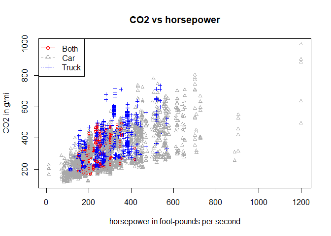
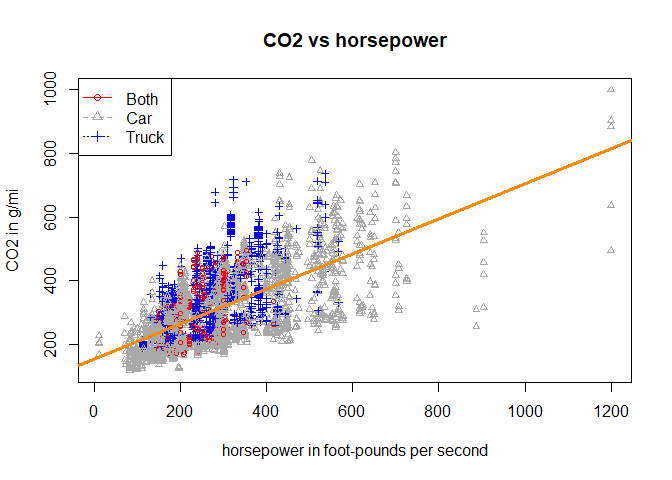
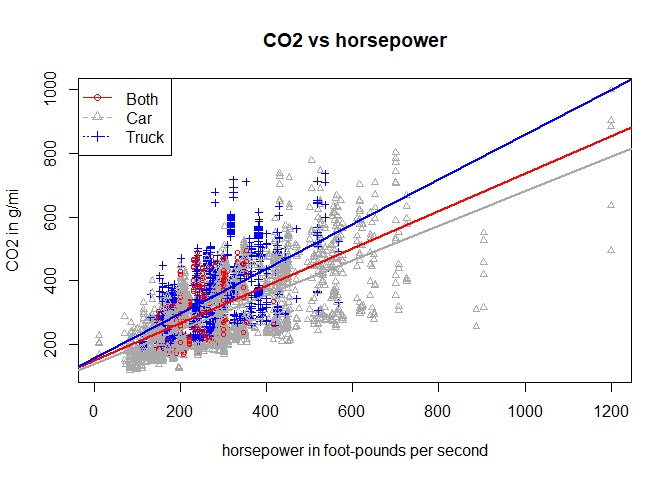

-   [Exercise 1 (EPA Emissions Data)](#exercise-1-epa-emissions-data)
-   [Exercise 2 (Hospital SUPPORT Data)](#exercise-2-hospital-support-data)
-   [Exercise 3 (Fish Data)](#exercise-3-fish-data)
-   [Exercise 4 (*t*-test Is a Linear Model)](#exercise-4-t-test-is-a-linear-model)

Exercise 1 (EPA Emissions Data)
-------------------------------

For this exercise, we will use the data stored in [`epa2015.csv`](epa2015.csv). It contains detailed descriptions of 4,411 vehicles manufactured in 2015 that were used for fuel economy testing [as performed by the Environment Protection Agency](https://www3.epa.gov/otaq/tcldata.htm). The variables in the dataset are:

-   `Make` - manufacturer
-   `Model` - model of vehicle
-   `ID` - manufacturer defined vehicle identification number within EPA's computer system (not a VIN number)
-   `disp` - cubic inch displacement of test vehicle
-   `type` - car, truck, or both (for vehicles that meet specifications of both car and truck, like smaller SUVs or crossovers)
-   `horse` - rated horsepower, in foot-pounds per second
-   `cyl` - number of cylinders
-   `lockup` - vehicle has transmission lockup; N or Y
-   `drive` - drivetrain system code
    -   A = All-wheel drive
    -   F = Front-wheel drive
    -   P = Part-time 4-wheel drive
    -   R = Rear-wheel drive
    -   4 = 4-wheel drive
-   `weight` - test weight, in pounds
-   `axleratio` - axle ratio
-   `nvratio` - n/v ratio (engine speed versus vehicle speed at 50 mph)
-   `THC` - total hydrocarbons, in grams per mile (g/mi)
-   `CO` - carbon monoxide (a regulated pollutant), in g/mi
-   `CO2` - carbon dioxide (the primary byproduct of all fossil fuel combustion), in g/mi
-   `mpg` - fuel economy, in miles per gallon

We will attempt to model `CO2` using both `horse` and `type`. In practice, we would use many more predictors, but limiting ourselves to these two, one numeric and one factor, will allow us to create a number of plots.

Load the data, and check its structure using `str()`. Verify that `type` is a factor; if not, coerce it to be a factor.

``` r
library(readr)
epa2015 <- read_csv("epa2015.csv")
str(epa2015)
```

    ## Classes 'tbl_df', 'tbl' and 'data.frame':    4411 obs. of  16 variables:
    ##  $ Make     : chr  "aston martin" "aston martin" "aston martin" "aston martin" ...
    ##  $ Model    : chr  "DB9" "DB9" "Rapide S" "Rapide S" ...
    ##  $ ID       : chr  "143TT1042" "143TT1042" "410TT4202" "410TT4202" ...
    ##  $ disp     : num  5.9 5.9 6 6 6 6 4.7 4.7 4.7 4.7 ...
    ##  $ type     : chr  "Car" "Car" "Car" "Car" ...
    ##  $ horse    : int  510 510 552 552 565 565 420 420 430 430 ...
    ##  $ cyl      : int  12 12 12 12 12 12 8 8 8 8 ...
    ##  $ lockup   : chr  "Y" "Y" "Y" "Y" ...
    ##  $ drive    : chr  "R" "R" "R" "R" ...
    ##  $ weight   : int  4500 4500 4750 4750 4250 4250 4000 4000 4000 4000 ...
    ##  $ axleratio: num  3.46 3.46 2.73 2.73 3.73 3.73 3.91 3.91 4.18 4.18 ...
    ##  $ nvratio  : num  31 31 22.4 22.4 33.6 33.6 38.6 38.6 36.2 36.2 ...
    ##  $ THC      : num  0.0251 0.0022 0.0269 0.0008 0.0248 ...
    ##  $ CO       : num  0.12 0.0118 0.5 0.06 0.61 ...
    ##  $ CO2      : num  550 344 512 297 603 ...
    ##  $ mpg      : num  16.1 25.8 17.3 29.9 14.8 25.3 16 26.5 16.7 28.8 ...
    ##  - attr(*, "spec")=List of 2
    ##   ..$ cols   :List of 16
    ##   .. ..$ Make     : list()
    ##   .. .. ..- attr(*, "class")= chr  "collector_character" "collector"
    ##   .. ..$ Model    : list()
    ##   .. .. ..- attr(*, "class")= chr  "collector_character" "collector"
    ##   .. ..$ ID       : list()
    ##   .. .. ..- attr(*, "class")= chr  "collector_character" "collector"
    ##   .. ..$ disp     : list()
    ##   .. .. ..- attr(*, "class")= chr  "collector_double" "collector"
    ##   .. ..$ type     : list()
    ##   .. .. ..- attr(*, "class")= chr  "collector_character" "collector"
    ##   .. ..$ horse    : list()
    ##   .. .. ..- attr(*, "class")= chr  "collector_integer" "collector"
    ##   .. ..$ cyl      : list()
    ##   .. .. ..- attr(*, "class")= chr  "collector_integer" "collector"
    ##   .. ..$ lockup   : list()
    ##   .. .. ..- attr(*, "class")= chr  "collector_character" "collector"
    ##   .. ..$ drive    : list()
    ##   .. .. ..- attr(*, "class")= chr  "collector_character" "collector"
    ##   .. ..$ weight   : list()
    ##   .. .. ..- attr(*, "class")= chr  "collector_integer" "collector"
    ##   .. ..$ axleratio: list()
    ##   .. .. ..- attr(*, "class")= chr  "collector_double" "collector"
    ##   .. ..$ nvratio  : list()
    ##   .. .. ..- attr(*, "class")= chr  "collector_double" "collector"
    ##   .. ..$ THC      : list()
    ##   .. .. ..- attr(*, "class")= chr  "collector_double" "collector"
    ##   .. ..$ CO       : list()
    ##   .. .. ..- attr(*, "class")= chr  "collector_double" "collector"
    ##   .. ..$ CO2      : list()
    ##   .. .. ..- attr(*, "class")= chr  "collector_double" "collector"
    ##   .. ..$ mpg      : list()
    ##   .. .. ..- attr(*, "class")= chr  "collector_double" "collector"
    ##   ..$ default: list()
    ##   .. ..- attr(*, "class")= chr  "collector_guess" "collector"
    ##   ..- attr(*, "class")= chr "col_spec"

``` r
is.factor(epa2015$type)
```

    ## [1] FALSE

``` r
epa2015$type <- as.factor(epa2015$type)
```

**(a)** Do the following:

-   Make a scatterplot of `CO2` versus `horse`. Use a different color point for each vehicle `type`.

``` r
plot_colors = c("red","Darkgrey","blue")
plot(CO2 ~ horse, data = epa2015, col = plot_colors[type], pch=as.numeric(type), cex = 0.7, main="CO2 vs horsepower",xlab="horsepower in foot-pounds per second", ylab="CO2 in g/mi" )
legend("topleft", c("Both", "Car","Truck"), col = plot_colors ,lty = c(1,2,3), pch=c(1,2,3))
```



-   Fit a simple linear regression model with `CO2` as the response and only `horse` as the predictor.

``` r
co2_model <- lm(CO2 ~ horse, data=epa2015)
```

-   Add the fitted regression line to the scatterplot. Comment on how well this line models the data.

``` r
plot_colors = c("red","Darkgrey","blue")
plot(CO2 ~ horse, data = epa2015, col = plot_colors[type], pch=as.numeric(type), cex = 0.7, main="CO2 vs horsepower", xlab="horsepower in foot-pounds per second", ylab="CO2 in g/mi")
legend("topleft", c("Both", "Car","Truck"), col = plot_colors ,lty = c(1,2,3), pch=c(1,2,3))
abline(co2_model,col="darkorange", lwd=3)
```



Overall the regression lines seems to fit the data well but when you take car type into account, it doesn't seem to be doing a good job. for example for type `Car` it seems to overfit the data and for the type `truck` and `both`, it seems to be underfitting.

-   Give an estimate for the average change in `CO2` for a one foot-pound per second increase in `horse` for a vehicle of type `car`.

``` r
summary(co2_model)$coefficient[2,1]
```

    ## [1] 0.5499

-   Give a 99% prediction interval using this model for the `CO2` of a Subaru Impreza Wagon, which is a vehicle with 148 horsepower and is considered type `Both`. (Interestingly, the dataset gives the wrong drivetrain for most Subarus in this dataset, as they are almost all listed as `F`, when they are in fact all-wheel drive.)

``` r
new_data <- data.frame(horse = 148, type = "Both")
predict(co2_model,newdata = new_data, interval = "prediction", level = 0.99)
```

    ##     fit   lwr   upr
    ## 1 236.1 6.409 465.8

**(b)** Do the following:

-   Make a scatterplot of `CO2` versus `horse`. Use a different color point for each vehicle `type`.

``` r
plot_colors = c("red","Darkgrey","blue")
plot(CO2 ~ horse, data = epa2015, col = plot_colors[type], pch=as.numeric(type), cex = 0.7, main="CO2 vs horsepower", xlab="horsepower in foot-pounds per second", ylab="CO2 in g/mi" )
legend("topleft", c("Both", "Car","Truck"), col = plot_colors ,lty = c(1,2,3), pch=c(1,2,3))
```


-   Fit an additive multiple regression model with `CO2` as the response and `horse` and `type` as the predictors.

``` r
co2_model_add <- lm(CO2 ~ horse + type, data=epa2015)
```

-   Add the fitted regression "lines" to the scatterplot with the same colors as their respective points (one line for each vehicle type). Comment on how well this line models the data.

``` r
int_both <- coef(co2_model_add)[1]
int_car <- coef(co2_model_add)[1] + coef(co2_model_add)[3]
int_truck <- coef(co2_model_add)[1] + coef(co2_model_add)[4]

slope_add <- coef(co2_model_add)[2]

plot_colors = c("red","Darkgrey","blue")
plot(CO2 ~ horse, data = epa2015, col = plot_colors[type], pch=as.numeric(type), cex = 0.7, main="CO2 vs horsepower", xlab="horsepower in foot-pounds per second", ylab="CO2 in g/mi")
legend("topleft", c("Both", "Car","Truck"), col = plot_colors ,lty = c(1,2,3), pch=c(1,2,3))

abline(int_both, slope_add, col=plot_colors[1], lty=1,lwd=2)
abline(int_car, slope_add, col=plot_colors[2], lty=1,lwd=2)
abline(int_truck, slope_add, col=plot_colors[3], lty=1,lwd=2)
```


As we can see here that this model fits better than previous we saw(with single predictor only). Here we see that for every type, there is a different regression line which seems to be fitting data well. One thing to note here is that all of there regression lines have same slope and differs by sum of *β*<sub>0</sub> and *β*<sub>2</sub> and sum of *β*<sub>0</sub> and *β*<sub>3</sub> for type of `Car` and `Truck` respectively. The type `Both` here is referense type chosen by R.

-   Give an estimate for the average change in `CO2` for a one foot-pound per second increase in `horse` for a vehicle of type `car`.

``` r
summary(co2_model_add)$coefficient[2,1]
```

    ## [1] 0.5611

-   Give a 99% prediction interval using this model for the `CO2` of a Subaru Impreza Wagon, which is a vehicle with 148 horsepower and is considered type `Both`.

``` r
predict(co2_model_add, data.frame(horse=148,type="Both"), interval = "prediction", level = 0.99)
```

    ##   fit   lwr upr
    ## 1 239 19.06 459

**(c)** Do the following:

-   Make a scatterplot of `CO2` versus `horse`. Use a different color point for each vehicle `type`.

``` r
plot_colors = c("red","Darkgrey","blue")
plot(CO2 ~ horse, data = epa2015, col = plot_colors[type], pch=as.numeric(type), cex = 0.7, main="CO2 vs horsepower", xlab="horsepower in foot-pounds per second", ylab="CO2 in g/mi")
legend("topleft", c("Both", "Car","Truck"), col = plot_colors ,lty = c(1,2,3), pch=c(1,2,3))
```


-   Fit an interaction multiple regression model with `CO2` as the response and `horse` and `type` as the predictors.

``` r
co2_model_int <- lm(CO2 ~ horse * type, data=epa2015)
```

-   Add the fitted regression "lines" to the scatterplot with the same colors as their respective points (one line for each vehicle type). Comment on how well this line models the data.

``` r
int_both <- coef(co2_model_int)[1]
int_car <- coef(co2_model_int)[1] + coef(co2_model_int)[3]
int_truck <- coef(co2_model_int)[1] + coef(co2_model_int)[4]

slope_both <- coef(co2_model_int)[2]
slope_car <- coef(co2_model_int)[2] + coef(co2_model_int)[5]
slope_truck <- coef(co2_model_int)[2] + coef(co2_model_int)[6]

plot_colors = c("red","Darkgrey","blue")
plot(CO2 ~ horse, data = epa2015, col = plot_colors[type], pch=as.numeric(type), cex = 0.7, main="CO2 vs horsepower", xlab="horsepower in foot-pounds per second", ylab="CO2 in g/mi" )
legend("topleft", c("Both", "Car","Truck"), col = plot_colors ,lty = c(1,2,3), pch=c(1,2,3))

abline(int_both, slope_both, col=plot_colors[1], lty=1,lwd=2)
abline(int_car, slope_car, col=plot_colors[2], lty=1,lwd=2)
abline(int_truck, slope_truck, col=plot_colors[3], lty=1,lwd=2)
```



-   Give an estimate for the average change in `CO2` for a one foot-pound per second increase in `horse` for a vehicle of type `car`.

``` r
summary(co2_model_int)$coefficient[2] + summary(co2_model_int)$coefficient[5]
```

    ## [1] 0.5432

-   Give a 99% prediction interval using this model for the `CO2` of a Subaru Impreza Wagon, which is a vehicle with 148 horsepower and is considered type `Both`.

``` r
predict(co2_model_int, data.frame(horse=148,type="Both"), interval = "prediction", level = 0.99)
```

    ##     fit   lwr   upr
    ## 1 236.6 16.67 456.6

**(d)** Based on the previous plots, you probably already have an opinion on the best model. Now use an ANOVA *F*-test to compare the additive and interaction models. Based on this test and a significance level of *α* = 0.01, which model is preferred?

``` r
anova(co2_model_add,co2_model_int)
```

    ## Analysis of Variance Table
    ## 
    ## Model 1: CO2 ~ horse + type
    ## Model 2: CO2 ~ horse * type
    ##   Res.Df      RSS Df Sum of Sq    F   Pr(>F)    
    ## 1   4407 32054899                               
    ## 2   4405 31894278  2    160621 11.1 0.000016 ***
    ## ---
    ## Signif. codes:  0 '***' 0.001 '**' 0.01 '*' 0.05 '.' 0.1 ' ' 1

``` r
anova(co2_model_add,co2_model_int)[2,6]
```

    ## [1] 0.00001567

Since the p-value from ANOVA test is significant compare to given *α* value, we prefer interaction model.

Exercise 2 (Hospital SUPPORT Data)
----------------------------------

For this exercise, we will use the data stored in [`hospital.csv`](hospital.csv). It contains a random sample of 580 seriously ill hospitalized patients from a famous study called "SUPPORT" (Study to Understand Prognoses Preferences Outcomes and Risks of Treatment). As the name suggests, the purpose of the study was to determine what factors affected or predicted outcomes, such as how long a patient remained in the hospital. The variables in the dataset are:

-   `Days` - Days to death or hospital discharge
-   `Age` - Age on day of hospital admission
-   `Sex` - Female or male
-   `Comorbidity` - Patient diagnosed with more than one chronic disease
-   `EdYears` - Years of education
-   `Education` - Education level; high or low
-   `Income` - Income level; high or low
-   `Charges` - Hospital charges, in dollars
-   `Care` - Level of care required; high or low
-   `Race` - Non-white or white
-   `Pressure` - Blood pressure, in mmHg
-   `Blood` - White blood cell count, in gm/dL
-   `Rate` - Heart rate, in bpm

For this exercise, we will use `Charges`, `Pressure`, `Care`, and `Race` to model `Days`.

**(a)** Load the data, and check its structure using `str()`. Verify that `Care` and `Race` are factors; if not, coerce them to be factors. What are the levels of `Care` and `Race`?

``` r
hospital <- read_csv("hospital.csv")
str(hospital)
```

    ## Classes 'tbl_df', 'tbl' and 'data.frame':    580 obs. of  13 variables:
    ##  $ Days       : int  8 14 21 4 11 9 25 26 9 16 ...
    ##  $ Age        : num  42.3 63.7 41.5 42 52.1 ...
    ##  $ Sex        : chr  "female" "female" "male" "male" ...
    ##  $ Comorbidity: chr  "no" "no" "yes" "yes" ...
    ##  $ EdYears    : int  11 22 18 16 8 12 12 13 16 30 ...
    ##  $ Education  : chr  "low" "high" "high" "high" ...
    ##  $ Income     : chr  "high" "high" "high" "high" ...
    ##  $ Charges    : num  9914 283303 320843 4173 13414 ...
    ##  $ Care       : chr  "low" "high" "high" "low" ...
    ##  $ Race       : chr  "non-white" "white" "white" "white" ...
    ##  $ Pressure   : int  84 69 66 97 89 57 99 115 93 102 ...
    ##  $ Blood      : num  11.3 30.1 0.2 10.8 6.4 ...
    ##  $ Rate       : int  94 108 130 88 92 114 150 132 86 90 ...
    ##  - attr(*, "spec")=List of 2
    ##   ..$ cols   :List of 13
    ##   .. ..$ Days       : list()
    ##   .. .. ..- attr(*, "class")= chr  "collector_integer" "collector"
    ##   .. ..$ Age        : list()
    ##   .. .. ..- attr(*, "class")= chr  "collector_double" "collector"
    ##   .. ..$ Sex        : list()
    ##   .. .. ..- attr(*, "class")= chr  "collector_character" "collector"
    ##   .. ..$ Comorbidity: list()
    ##   .. .. ..- attr(*, "class")= chr  "collector_character" "collector"
    ##   .. ..$ EdYears    : list()
    ##   .. .. ..- attr(*, "class")= chr  "collector_integer" "collector"
    ##   .. ..$ Education  : list()
    ##   .. .. ..- attr(*, "class")= chr  "collector_character" "collector"
    ##   .. ..$ Income     : list()
    ##   .. .. ..- attr(*, "class")= chr  "collector_character" "collector"
    ##   .. ..$ Charges    : list()
    ##   .. .. ..- attr(*, "class")= chr  "collector_double" "collector"
    ##   .. ..$ Care       : list()
    ##   .. .. ..- attr(*, "class")= chr  "collector_character" "collector"
    ##   .. ..$ Race       : list()
    ##   .. .. ..- attr(*, "class")= chr  "collector_character" "collector"
    ##   .. ..$ Pressure   : list()
    ##   .. .. ..- attr(*, "class")= chr  "collector_integer" "collector"
    ##   .. ..$ Blood      : list()
    ##   .. .. ..- attr(*, "class")= chr  "collector_double" "collector"
    ##   .. ..$ Rate       : list()
    ##   .. .. ..- attr(*, "class")= chr  "collector_integer" "collector"
    ##   ..$ default: list()
    ##   .. ..- attr(*, "class")= chr  "collector_guess" "collector"
    ##   ..- attr(*, "class")= chr "col_spec"

``` r
hospital$Care <- as.factor(hospital$Care)
hospital$Race <- as.factor(hospital$Race)

levels(hospital$Care)
```

    ## [1] "high" "low"

``` r
levels(hospital$Race)
```

    ## [1] "non-white" "white"

**(b)** Fit an additive multiple regression model with `Days` as the response using `Charges`, `Pressure`, `Care`, and `Race` as predictors. What does `R` choose as the reference level for `Care` and `Race`?

``` r
days_mod_add <- lm(Days ~ Charges + Pressure + Care + Race, data=hospital)
coef(days_mod_add)
```

    ## (Intercept)     Charges    Pressure     Carelow   Racewhite 
    ##  -3.8500693   0.0001909   0.1031889  -0.0964599   3.0692863

`R` chooses `high` as a reference level for `Care` and `non-white` as reference level for `Race` varibales as both of those are alphabatically comes first in their respective order of variable levels.

**(c)** Fit a multiple regression model with `Days` as the response. Use the main effects of `Charges`, `Pressure`, `Care`, and `Race`, as well as the interaction of `Care` with each of the numeric predictors as predictors (that is, the interaction of `Care` with `Charges` and the interaction of `Care` with `Pressure`). Use a statistical test to compare this model to the additive model using a significance level of *α* = 0.01. Which do you prefer?

``` r
days_mod_int_care <- lm(Days ~ Charges + Pressure + Race + Care + Charges * Care + Pressure * Care, data = hospital)
anova(days_mod_add,days_mod_int_care)
```

    ## Analysis of Variance Table
    ## 
    ## Model 1: Days ~ Charges + Pressure + Care + Race
    ## Model 2: Days ~ Charges + Pressure + Race + Care + Charges * Care + Pressure * 
    ##     Care
    ##   Res.Df    RSS Df Sum of Sq    F Pr(>F)   
    ## 1    575 155596                            
    ## 2    573 152996  2      2600 4.87  0.008 **
    ## ---
    ## Signif. codes:  0 '***' 0.001 '**' 0.01 '*' 0.05 '.' 0.1 ' ' 1

Since p-value of the test is lower, we will prefer interaction model with `care` as factor variable.

**(d)** Fit a multiple regression model with `Days` as the response. Use the predictors from the model in **(c)** as well as the interaction of `Race` with each of the numeric predictors (that is, the interaction of `Race` with `Charges` and the interaction of `Race` with `Pressure`). Use a statistical test to compare this model to the additive model using a significance level of *α* = 0.01. Which do you prefer?

``` r
days_mod_int_race <- lm(Days ~ Charges + Pressure + Race + Care + Charges * Care + Pressure * Care + Charges * Race + Pressure * Race, data = hospital)
anova(days_mod_add,days_mod_int_race)
```

    ## Analysis of Variance Table
    ## 
    ## Model 1: Days ~ Charges + Pressure + Care + Race
    ## Model 2: Days ~ Charges + Pressure + Race + Care + Charges * Care + Pressure * 
    ##     Care + Charges * Race + Pressure * Race
    ##   Res.Df    RSS Df Sum of Sq   F  Pr(>F)    
    ## 1    575 155596                             
    ## 2    571 147730  4      7867 7.6 5.7e-06 ***
    ## ---
    ## Signif. codes:  0 '***' 0.001 '**' 0.01 '*' 0.05 '.' 0.1 ' ' 1

Since p-value of the test is lower, we will prefer interaction model with `Race` as factor variable.

**(e)** Using the model in **(d)**, give an estimate of the change in average `Days` for a one-unit increase in `Pressure` for a `"non-white"` patient that required a low level of care.

``` r
coef(days_mod_int_race)[3] + coef(days_mod_int_race)[7]
```

    ## Pressure 
    ##  0.03218

**(f)** Find a model using the four predictors that we have been considering that is more flexible than the model in **(d)** and that is also statistically significant as compared to the model in **(d)** at a significance level of *α* = 0.01.

``` r
days_mod_int <- lm(Days ~ Charges * Pressure * Race * Care, data = hospital)
anova(days_mod_int_race, days_mod_int)
```

    ## Analysis of Variance Table
    ## 
    ## Model 1: Days ~ Charges + Pressure + Race + Care + Charges * Care + Pressure * 
    ##     Care + Charges * Race + Pressure * Race
    ## Model 2: Days ~ Charges * Pressure * Race * Care
    ##   Res.Df    RSS Df Sum of Sq    F Pr(>F)    
    ## 1    571 147730                             
    ## 2    564 128445  7     19285 12.1  2e-14 ***
    ## ---
    ## Signif. codes:  0 '***' 0.001 '**' 0.01 '*' 0.05 '.' 0.1 ' ' 1

Based on `ANOVA` test above, we see that p-value is extremely small therefore full interlation model is significantly better than model created in **(d)**.

Exercise 3 (Fish Data)
----------------------

For this exercise, we will use the data stored in [`fish.csv`](fish.csv). It contains data for 158 fish of 7 different species all gathered from the same lake in one season. The variables in the dataset are:

-   `Species` - Common name (*Latin name*)
    -   1 = Bream (*Abramis brama*)
    -   2 = Whitewish (*Leuciscus idus*)
    -   3 = Roach (*Leuciscus rutilus*)
    -   4 = <None> (*Abramis bjoerkna*)
    -   5 = Smelt (*Osmerus eperlanus*)
    -   6 = Pike (*Esox Lucius*)
    -   7 = Perch (*Perca fluviatilis*)
-   `Weight` - Weight of the fish, in grams
-   `Length1` - Length from the nose to the beginning of the tail, in cm
-   `Length2` - Length from the nose to the notch of the tail, in cm
-   `Length3` - Length from the nose to the end of the tail, in cm
-   `HeightPct` - Maximal height as % of Length3
-   `WidthPct` - Maximal width as % of Length3
-   `Sex` - 0 = female, 1 = male

We will attempt to predict `Weight` using `Length1`, `HeightPct`, and `WidthPct`.

Consider the model

*Y* = *β*<sub>0</sub> + *β*<sub>1</sub>*x*<sub>1</sub> + *β*<sub>2</sub>*x*<sub>2</sub> + *β*<sub>3</sub>*x*<sub>3</sub> + *β*<sub>4</sub>*x*<sub>1</sub>*x*<sub>2</sub> + *β*<sub>5</sub>*x*<sub>1</sub>*x*<sub>3</sub> + *β*<sub>6</sub>*x*<sub>2</sub>*x*<sub>3</sub> + *β*<sub>7</sub>*x*<sub>1</sub>*x*<sub>2</sub>*x*<sub>3</sub> + *ϵ*,

where

-   *Y* is `Weight`
-   *x*<sub>1</sub> is `Length1`
-   *x*<sub>2</sub> is `HeightPct`
-   *x*<sub>3</sub> is `WidthPct`.

**(a)** Fit the model above. Also consider fitting a smaller model in `R`.

``` r
fish <- read_csv("fish.csv")
fish_bigger <- lm(Weight ~ Length1 * HeightPct * WidthPct, data = fish)
fish_smaller <- lm(Weight ~ Length1 + HeightPct * WidthPct, data = fish)
```

Use a statistical test to compare this model with the previous. Report the following:

-   The null and alternative hypotheses in terms of the model given in the exercise description
-   The value of the test statistic
-   The p-value of the test
-   A statistical decision using a significance level of *α* = 0.05
-   Which model you prefer

``` r
anova(fish_smaller, fish_bigger)
```

    ## Analysis of Variance Table
    ## 
    ## Model 1: Weight ~ Length1 + HeightPct * WidthPct
    ## Model 2: Weight ~ Length1 * HeightPct * WidthPct
    ##   Res.Df     RSS Df Sum of Sq    F Pr(>F)    
    ## 1    153 2480494                             
    ## 2    150 1868778  3    611716 16.4  3e-09 ***
    ## ---
    ## Signif. codes:  0 '***' 0.001 '**' 0.01 '*' 0.05 '.' 0.1 ' ' 1

``` r
anova(fish_smaller, fish_bigger)[2,5]
```

    ## [1] 16.37

-   Hypothesis testing

*H*<sub>0</sub> : *β*<sub>4</sub> = *β*<sub>5</sub> = *β*<sub>7</sub> = 0.

*H*<sub>1</sub> : *β*<sub>4</sub> ≠ *β*<sub>5</sub> ≠ *β*<sub>7</sub> ≠ 0.

-   Value of test statistic is 16.3667.
-   p-value of the test is 2.972410^{-9}.
-   Since p-value of the test is very small compare to *α* value, we would reject the null hypothesis.
-   We would prefer bigger model.

**(c)** Give an expression based on the model in the exercise description for the true change in average weight for a 1 cm increase in `Length1` for a fish with a `HeightPct` of 25 and a `WidthPct` of 15. Your answer should be a linear function of the *β*s.

``` r
coef(fish_bigger)[2] + coef(fish_bigger)[5] * 25 + coef(fish_bigger)[6] * 15 + coef(fish_bigger)[8] * 25 * 15
```

    ## Length1 
    ##   33.33

-   The expression would be

    *β*<sub>1</sub> + *β*<sub>4</sub>*x*<sub>2</sub> + *β*<sub>5</sub>*x*<sub>3</sub> + *β*<sub>7</sub>*x*<sub>2</sub>*x*<sub>3</sub>

Based on above expression, we can see that coefficient of *x*<sub>1</sub> depends on linear function of *β* as well as predictors *x*<sub>2</sub> i.e. `HeightPct` and *x*<sub>3</sub> i.e. `WidthPct`.

**(d)** Give an expression based on the smaller model in the exercise description for the true change in average weight for a 1 cm increase in `Length1` for a fish with a `HeightPct` of 25 and a `WidthPct` of 15. Your answer should be a linear function of the *β*s.

``` r
coef(fish_smaller)[2] 
```

    ## Length1 
    ##   31.49

-   The expression would be

*β*<sub>1</sub>

In this case the coefifcient of *x*<sub>1</sub> i.e. `Length1` is *β*<sub>1</sub>. It does not depend on any other *β* value and other predictors.

Exercise 4 (*t*-test Is a Linear Model)
---------------------------------------

In this exercise, we will try to convince ourselves that a two-sample *t*-test assuming equal variance is the same as a *t*-test for the coefficient in front of a single two-level factor variable (dummy variable) in a linear model.

First, we set up the data frame that we will use throughout.

``` r
n = 20

sim_data = data.frame(
  groups = c(rep("A", n / 2), rep("B", n / 2)),
  values = rep(0, n))
str(sim_data)
```

    ## 'data.frame':    20 obs. of  2 variables:
    ##  $ groups: Factor w/ 2 levels "A","B": 1 1 1 1 1 1 1 1 1 1 ...
    ##  $ values: num  0 0 0 0 0 0 0 0 0 0 ...

We will use a total sample size of `20`, `10` for each group. The `groups` variable splits the data into two groups, `A` and `B`, which will be the grouping variable for the *t*-test and a factor variable in a regression. The `values` variable will store simulated data.

We will repeat the following process a number of times.

``` r
sim_data$values = rnorm(n, mean = 5, sd = 2.2) # simulate response data
summary(lm(values ~ groups, data = sim_data))
```

    ## 
    ## Call:
    ## lm(formula = values ~ groups, data = sim_data)
    ## 
    ## Residuals:
    ##    Min     1Q Median     3Q    Max 
    ## -4.857 -1.205 -0.311  1.217  3.416 
    ## 
    ## Coefficients:
    ##             Estimate Std. Error t value Pr(>|t|)    
    ## (Intercept)    5.389      0.631    8.54  9.5e-08 ***
    ## groupsB       -1.645      0.892   -1.84    0.082 .  
    ## ---
    ## Signif. codes:  0 '***' 0.001 '**' 0.01 '*' 0.05 '.' 0.1 ' ' 1
    ## 
    ## Residual standard error: 1.99 on 18 degrees of freedom
    ## Multiple R-squared:  0.159,  Adjusted R-squared:  0.112 
    ## F-statistic:  3.4 on 1 and 18 DF,  p-value: 0.0816

``` r
t.test(values ~ groups, data = sim_data, var.equal = TRUE)
```

    ## 
    ##  Two Sample t-test
    ## 
    ## data:  values by groups
    ## t = 1.8, df = 18, p-value = 0.08
    ## alternative hypothesis: true difference in means is not equal to 0
    ## 95 percent confidence interval:
    ##  -0.2286  3.5193
    ## sample estimates:
    ## mean in group A mean in group B 
    ##           5.389           3.744

We use `lm()` to test

*H*<sub>0</sub> : *β*<sub>1</sub> = 0

for the model

*Y* = *β*<sub>0</sub> + *β*<sub>1</sub>*x*<sub>1</sub> + *ϵ*

where *Y* are the values of interest, and *x*<sub>1</sub> is a dummy variable that splits the data in two. We will let `R` take care of the dummy variable.

We use `t.test()` to test

*H*<sub>0</sub> : *μ*<sub>*A*</sub> = *μ*<sub>*B*</sub>

where *μ*<sub>*A*</sub> is the mean for the `A` group, and *μ*<sub>*B*</sub> is the mean for the `B` group.

The following code sets up some variables for storage.

``` r
num_sims = 200
lm_t = rep(0, num_sims)
lm_p = rep(0, num_sims)
tt_t = rep(0, num_sims)
tt_p = rep(0, num_sims)
```

-   `lm_t` will store the test statistic for the test *H*<sub>0</sub> : *β*<sub>1</sub> = 0.
-   `lm_p` will store the p-value for the test *H*<sub>0</sub> : *β*<sub>1</sub> = 0.
-   `tt_t` will store the test statistic for the test *H*<sub>0</sub> : *μ*<sub>*A*</sub> = *μ*<sub>*B*</sub>.
-   `tt_p` will store the p-value for the test *H*<sub>0</sub> : *μ*<sub>*A*</sub> = *μ*<sub>*B*</sub>.

The variable `num_sims` controls how many times we will repeat this process, which we have chosen to be `200`.

**(a)** Set a seed equal to your birthday. Then write code that repeats the above process `200` times. Each time, store the appropriate values in `lm_t`, `lm_p`, `tt_t`, and `tt_p`. Specifically, each time you should use `sim_data$values = rnorm(n, mean = 5, sd = 2.2)` to update the data. The grouping will always stay the same.

``` r
birthday <- 19880918
set.seed(birthday)

for(i in 1:num_sims){
  sim_data$values = rnorm(n, mean = 5, sd = 2.2)
  model <- lm(values ~ groups, data = sim_data)
  ttest <- t.test(values ~ groups, data = sim_data, var.equal = TRUE)
  lm_t[i] <- summary(model)$coefficient[2,3] 
  lm_p[i] <- summary(model)$coefficient[2,4]
  
  tt_t[i] <- ttest$statistic 
  tt_p[i] <- ttest$p.value
}
```

**(b)** Report the value obtained by running `mean(lm_t == tt_t)`, which tells us what proportion of the test statistics are equal. The result may be extremely surprising!

``` r
mean(lm_t == tt_t)
```

    ## [1] 0

**(c)** Report the value obtained by running `mean(lm_p == tt_p)`, which tells us what proportion of the p-values are equal. The result may be extremely surprising!

``` r
mean(lm_p == tt_p)
```

    ## [1] 0.24

**(d)** If you have done everything correctly so far, your answers to the last two parts won't indicate the equivalence we want to show! What the heck is going on here? The first issue is one of using a computer to do calculations. When a computer checks for equality, it demands **equality**; nothing can be different. However, when a computer performs calculations, it can only do so with a certain level of precision. So, if we calculate two quantities we know to be analytically equal, they can differ numerically. Instead of `mean(lm_p == tt_p)` run `all.equal(lm_p, tt_p)`. This will perform a similar calculation, but with a very small error tolerance for each equality. What is the result of running this code? What does it mean?

``` r
all.equal(lm_p, tt_p)
```

    ## [1] TRUE

After running the code and comparing using `all.equal` we see that mean of group `A` is indeed same as mean of group `B`.

**(e)** Your answer in **(d)** should now make much more sense. Then what is going on with the test statistics? Look at the values stored in `lm_t` and `tt_t`. What do you notice? Is there a relationship between the two? Can you explain why this is happening?

``` r
head(lm_t,n=10)
```

    ##  [1] -2.13139 -0.17594 -0.08057  0.57305 -0.66854  1.66265 -1.29160 -1.11285
    ##  [9]  2.68283  0.18874

``` r
head(tt_t, n=10)
```

    ##  [1]  2.13139  0.17594  0.08057 -0.57305  0.66854 -1.66265  1.29160  1.11285
    ##  [9] -2.68283 -0.18874

When looking at the first 10 elements of `lm_t` and `tt_t`, we see a pattern where each of the value from `lm_t` are of opposite sign from `tt_t`. This is because for `lm_t` the `lm` method when `R`created *x*<sub>1</sub> (`Gropus` in this case), the dummy variable, it used `Groups A` as a reference level which is default value of factor variable so when dummy variable is 0, the model represents reference level, which is `Group A` in this case.
