-   [Exercise 1 (Writing Functions)](#exercise-1-writing-functions)
-   [Exercise 2 (Swiss Fertility Data)](#exercise-2-swiss-fertility-data)
-   [Exercise 3 (Why Bother?)](#exercise-3-why-bother)
-   [Exercise 4 (TV Is Healthy?)](#exercise-4-tv-is-healthy)
-   [Exercise 5 (Brains)](#exercise-5-brains)

Exercise 1 (Writing Functions)
------------------------------

**(a)** Write a function named `diagnostics` that takes as input the arguments:

-   `model`, an object of class `lm(), that is a model fit via`lm()\`
-   `pcol`, for controlling point colors in plots, with a default value of `black`
-   `lcol`, for controlling line colors in plots, with a default value of `white`
-   `alpha`, the significance level of any test that will be performed inside the function, with a default value of `0.05`
-   `plotit`, a logical value for controlling display of plots with default value `TRUE`
-   `testit`, a logical value for controlling outputting the results of tests with default value `TRUE`

The function should output:

-   A list with two elements when `testit` is `TRUE`:
    -   `p_val`, the p-value for the Shapiro-Wilk test for assesing normality
    -   `decision`, the decision made when performing the Shapiro-Wilk test using the `alpha` value input to the function. "Reject" if the null hypothesis is rejected, otherwise "Fail to Reject".
-   Two plots, side-by-side, when `plotit` is `TRUE`:
    -   A fitted versus residuals plot that adds a horizontal line at *y* = 0, and labels the *x*-axis "Fitted" and the *y*-axis "Residuals". The points and line should be colored according to the input arguments. Give the plot a title.
    -   A Normal Q-Q plot of the residuals that adds the appropriate line using `qqline()`. The points and line should be colored according to the input arguments. Be sure the plot has a title.

``` r
diagnostics <- function(model, pcol = "black", lcol="black",alpha = 0.05, plotit = TRUE, testit = TRUE){
    if(plotit == TRUE){
    par(mfrow = c(1, 2))
    plot(fitted(model), resid(model), col = pcol,pch = 20,xlab = "Fitted", ylab = "Residuals", main = "Data from Model")
    abline(h = 0, col = lcol, lwd = 2)
    
    qqnorm(resid(model), main = "Normal Q-Q Plot", col = pcol)
    qqline(resid(model), col = lcol, lwd = 2)
    }
  
  if(testit == TRUE){
    p_val <- shapiro.test(resid(model))$p.value
    decision <- ifelse(alpha > p_val, "Reject","Fail to Reject")
    list(p_val = p_val, decision = decision)
  }
}
```

**(b)** Run the following code.

``` r
set.seed(42)
data1 = data.frame(x = runif(n = 20, min = 0, max = 10),
                   y = rep(x = 0, times = 20))
data1$y = with(data1, 5 + 2 * x + rnorm(n = 20))
fit1 = lm(y ~ x, data = data1)

data2 = data.frame(x = runif(n = 30, min = 0, max = 10),
                   y = rep(x = 0, times = 30))
data2$y = with(data2, 2 + 1 * x + rexp(n = 30))
fit2 = lm(y ~ x, data = data2)

data3 = data.frame(x = runif(n = 40, min = 0, max = 10),
                   y = rep(x = 0, times = 40))
data3$y = with(data3, 2 + 1 * x + rnorm(n = 40, sd = x))
fit3 = lm(y ~ x, data = data3)

diagnostics(fit1, plotit = FALSE)$p_val
```

    ## [1] 0.518

``` r
diagnostics(fit1, testit = FALSE, pcol = "darkorange", lcol = "dodgerblue")
```

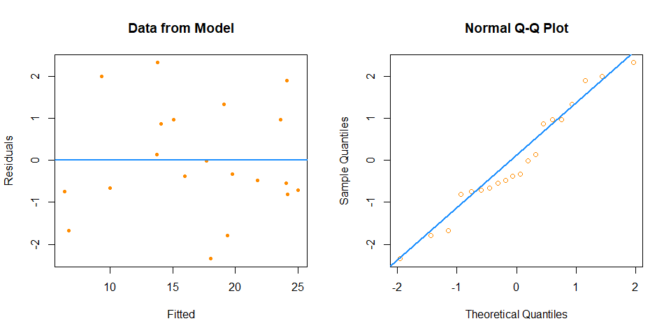

``` r
diagnostics(fit2, plotit = FALSE)$decision
```

    ## [1] "Reject"

``` r
diagnostics(fit2, testit = FALSE, pcol = "grey", lcol = "green")
```

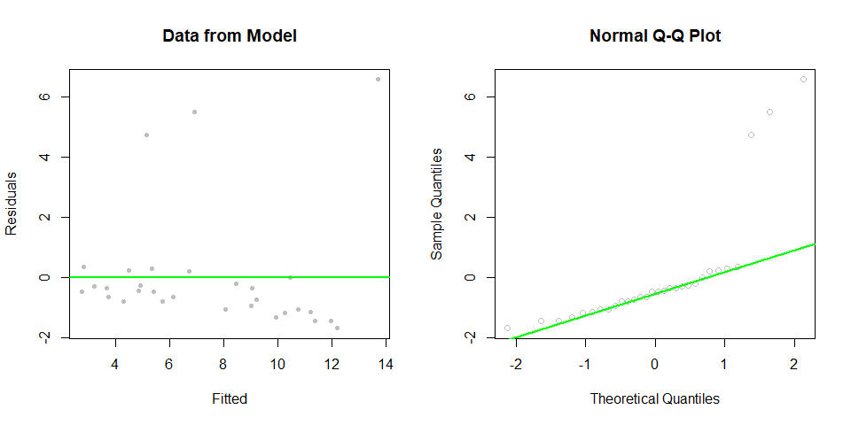

``` r
diagnostics(fit3)
```

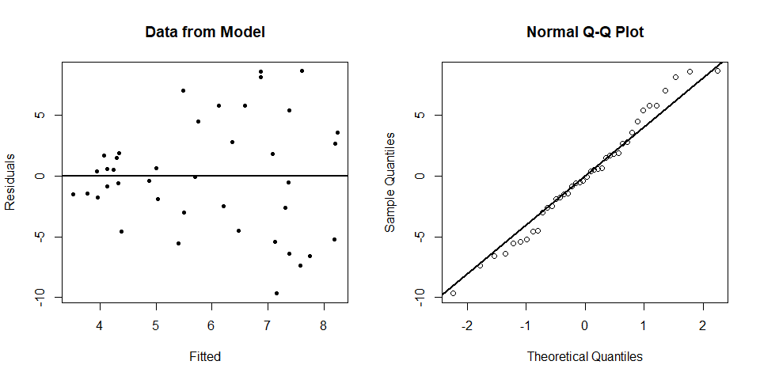

    ## $p_val
    ## [1] 0.7288
    ## 
    ## $decision
    ## [1] "Fail to Reject"

Exercise 2 (Swiss Fertility Data)
---------------------------------

For this exercise, we will use the `swiss` data, which can be found in the `faraway` package. After loading the `faraway` package, use `?swiss` to learn about this dataset.

``` r
library(faraway)
```

**(a)** Fit an additive multiple regression model with `Fertility` as the response and the remaining variables in the `swiss` dataset as predictors. Report the *R*<sup>2</sup> for this model.

``` r
fertility_model <- lm(Fertility ~ ., data = swiss)
summary(fertility_model)$r.squared
```

    ## [1] 0.7067

**(b)** Check the constant variance assumption for this model. Do you feel it has been violated? Justify your answer.

``` r
library(lmtest)
#fitted vs residual plot
plot(fitted(fertility_model), resid(fertility_model), col = "grey", pch = 20,xlab = "Fitted", ylab = "Residuals", main = "Data from Fertility Model")
abline(h = 0, col = "darkorange", lwd = 2)
```

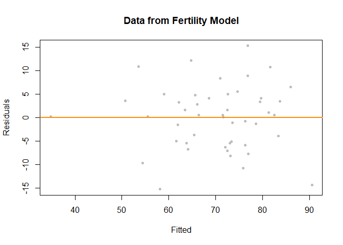

``` r
#BP test
bptest(fertility_model)
```

    ## 
    ##  studentized Breusch-Pagan test
    ## 
    ## data:  fertility_model
    ## BP = 5.9, df = 5, p-value = 0.3

First we plotted fitted vs residual plot and by looking at the plot, there seem to be a constant variation and to make sure this we performed BP test which return a high p-value so we do not reject homoscedasticity.

**(c)** Check the normality assumption for this model. Do you feel it has been violated? Justify your answer.

``` r
#Q-Q plot
qqnorm(resid(fertility_model), main = "Normal Q-Q Plot, fertility model", col = "grey")
qqline(resid(fertility_model), col = "darkorange", lwd = 2)
```

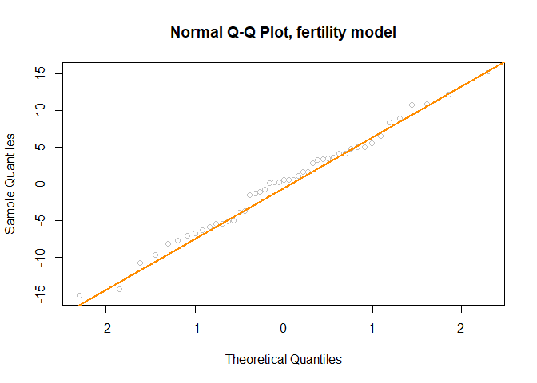

``` r
#shapiro-wilk test    
shapiro.test(resid(fertility_model))
```

    ## 
    ##  Shapiro-Wilk normality test
    ## 
    ## data:  resid(fertility_model)
    ## W = 0.99, p-value = 0.9

By looking at the Q-Q plot, it seems that data is sampled from normal distribution as the points are closely aligned with the line. To check this we performed shapiro-wilk test and we see that it has high p-value.

**(d)** Check for any high leverage observations. Report any observations you determine to have high leverage.

``` r
hv <- hatvalues(fertility_model) > 2 * mean(hatvalues(fertility_model))
hatvalues(fertility_model)[hv]
```

    ##    La Vallee V. De Geneve 
    ##       0.3512       0.4558

we do see two high leveragwe points `La Vallee` and `V. De Geneve`.

**(e)** Check for any influential observations. Report any observations you determine to be influential.

``` r
cd_fertility_model <- cooks.distance(fertility_model)
cd <- cd_fertility_model > 4 / length(cd_fertility_model)
cd_fertility_model[cd]
```

    ##  Porrentruy      Sierre   Neuchatel Rive Droite Rive Gauche 
    ##      0.2077      0.1476      0.1249      0.1025      0.1124

After calculating cooks distance for all observations, we found that there are 5 points that are influentials.

**(f)** Refit the additive multiple regression model without any points you identified as influential. Compare the coefficients of this fitted model to the previously fitted model.

``` r
fertility_model_no_inf <- lm(Fertility ~ Agriculture + Examination + Education + Catholic + Infant.Mortality, data = swiss, subset = cd_fertility_model < 4 / length(cd_fertility_model))

coef(fertility_model)
```

    ##      (Intercept)      Agriculture      Examination        Education 
    ##          66.9152          -0.1721          -0.2580          -0.8709 
    ##         Catholic Infant.Mortality 
    ##           0.1041           1.0770

``` r
coef(fertility_model_no_inf)
```

    ##      (Intercept)      Agriculture      Examination        Education 
    ##         66.44458         -0.21820         -0.50016         -0.69047 
    ##         Catholic Infant.Mortality 
    ##          0.09847          1.35767

After comparing original additive model with model with non influential points, we see that there was extremely small change in intercept and slight changes `Agriculture`, `Education`, `Catholic`, `Infant.Mortality`. We also saw a significant change in coefficient of `Examination`.

**(g)** Create a data frame that stores the observations that were "removed" because they were influential. Use the two models you have fit to make predictions with these observations. Comment on the difference between these two sets of predictions.

``` r
df <- subset(swiss,rownames(swiss) %in% names(cd_fertility_model[cd]))
predict(fertility_model, newdata = df)
```

    ##  Porrentruy      Sierre   Neuchatel Rive Droite Rive Gauche 
    ##       90.50       76.88       53.52       54.36       58.07

``` r
predict(fertility_model_no_inf,newdata=df)
```

    ##  Porrentruy      Sierre   Neuchatel Rive Droite Rive Gauche 
    ##       94.44       76.34       55.90       57.93       61.32

When predicting influencial observation using both model from above, we see that estimated predicted values changed for all obeservations except `Sierre`. `Sierre` value was almost the same when predicted using both models.

Exercise 3 (Why Bother?)
------------------------

**Why** do we care about violations of assumptions? One key reason is that the distributions of the parameters that we have used are all reliant on these assumptions. When the assumptions are violated, the distributional results are not correct, so our tests are garbage. **Garbage In, Garbage Out!**

Consider the following setup that we will use for the remainder of the exercise. We choose a sample size of 50.

``` r
n = 100
set.seed(42)
x_1 = runif(n, -2, 2)
x_2 = runif(n, 0, 5)
```

Consider the model,

*Y* = 5 + 0*x*<sub>1</sub> + 1*x*<sub>2</sub> + *ϵ*.

That is,

-   *β*<sub>0</sub> = 5
-   *β*<sub>1</sub> = 0
-   *β*<sub>2</sub> = 1

We now simulate `y_1` in a manner that does not violate any assumptions, which we will verify. In this case *ϵ* ∼ *N*(0, 1).

``` r
set.seed(420)
y_1 <- 5 + 0 * x_1 + 1 * x_2 + rnorm(n = n, mean = 0, sd = 1)
fit_1 <- lm(y_1 ~ x_1 + x_2)
qqnorm(resid(fit_1), col = "dodgerblue")
qqline(resid(fit_1), col = "darkorange", lwd = 2)
```

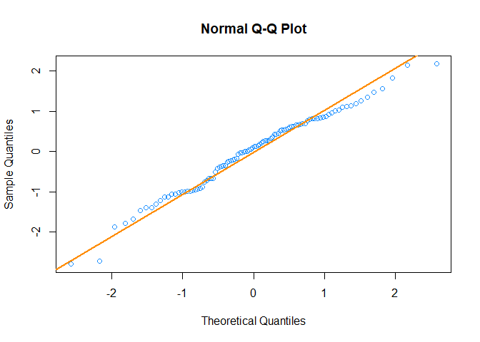

``` r
shapiro.test(resid(fit_1))
```

    ## 
    ##  Shapiro-Wilk normality test
    ## 
    ## data:  resid(fit_1)
    ## W = 0.98, p-value = 0.2

Then, we simulate `y_2` in a manner that **does** violate assumptions, which we again verify. In this case *ϵ* ∼ *N*(0, *σ* = |*x*<sub>2</sub>|).

``` r
set.seed(42)
y_2 <- 5 + 0 * x_1 + 1 * x_2  + rnorm(n = n, mean = 0, sd = abs(x_1))
fit_2 <- lm(y_2 ~ x_1 + x_2)
qqnorm(resid(fit_2), col = "dodgerblue")
qqline(resid(fit_2), col = "darkorange", lwd = 2)
```

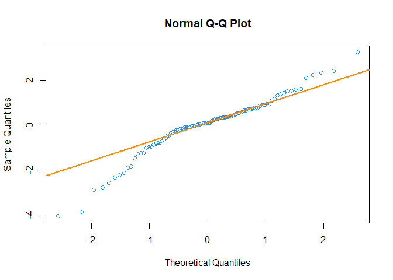

``` r
shapiro.test(resid(fit_2))
```

    ## 
    ##  Shapiro-Wilk normality test
    ## 
    ## data:  resid(fit_2)
    ## W = 0.95, p-value = 0.0005

**(a)** Use the following code after changing `birthday` to your birthday.

``` r
num_sims <- 2500
p_val_1 <- rep(0, num_sims)
p_val_2 <- rep(0, num_sims)
birthday <- 19880918
set.seed(birthday)
```

Repeat the above process of generating `y_1` and `y_2` as defined above, and fit models with each as the response `2500` times. Each time, store the p-value for testing,

``` r
for(i in 1:num_sims){
  y_1 <- 5 + 0 * x_1 + 1 * x_2 + rnorm(n = n, mean = 0, sd = 1)
  fit_1 <- lm(y_1 ~ x_1 + x_2)
  p_val_1[i] <- summary(fit_1)$coefficient[2,4]
  
  y_2 = 5 + 0 * x_1 + 1 * x_2  + rnorm(n = n, mean = 0, sd = abs(x_1))
  fit_2 = lm(y_2 ~ x_1 + x_2)
  p_val_2[i] <- summary(fit_2)$coefficient[2,4]
}
```

*β*<sub>1</sub> = 0,

using both models, in the appropriate variables defined above. (You do not need to use a data frame as we have in the past. Although, feel free to modify the code to instead use a data frame.)

**(b)** What proportion of the `p_val_1` values are less than 0.01? Less than 0.05? Less than 0.10? What proportion of the `p_val_2` values are less than 0.01? Less than 0.05? Less than 0.10? Arrange your results in a table. Briefly explain these results.

``` r
library(knitr)
p_val_table <- data.frame(
                            
                          Description = c(
                                          "Fit_1 p-values less than 0.01",
                                          "Fit_1 p-values less than 0.05",
                                          "Fit_1 p-values less than 0.10",
                                          "Fit_2 p-values less than 0.01",
                                          "Fit_2 p-values less than 0.05",
                                          "Fit_2 p-values less than 0.10"
                                         ),
                          Proportion = c(
                                          sum(p_val_1 < 0.01) / length(p_val_1),
                                          sum(p_val_1 < 0.05) / length(p_val_1),
                                          sum(p_val_1 < 0.10) / length(p_val_1),
                                          sum(p_val_2 < 0.01) / length(p_val_2),
                                          sum(p_val_2 < 0.05) / length(p_val_2),
                                          sum(p_val_2 < 0.10) / length(p_val_2)       
                                        )
                         )
kable(p_val_table,caption = "p-value proportions")
```

| Description                    |  Proportion|
|:-------------------------------|-----------:|
| Fit\_1 p-values less than 0.01 |      0.0088|
| Fit\_1 p-values less than 0.05 |      0.0540|
| Fit\_1 p-values less than 0.10 |      0.1020|
| Fit\_2 p-values less than 0.01 |      0.0412|
| Fit\_2 p-values less than 0.05 |      0.1244|
| Fit\_2 p-values less than 0.10 |      0.2056|

In the first model `fit_1`, we see that there was no violation of normality so the p-value proportions are lesser equal to *α* value, which we would expect. On the contrary for the model `fit_2`, we seen that there was a violation in normality and when we checked the poportions are little higher than model `fit_1`. i.e. for given *α* value, we would reject null hypothesis more often compare to first model `fit_1`.

Exercise 4 (TV Is Healthy?)
---------------------------

For this exercise, we will use the `tvdoctor` data, which can be found in the `faraway` package. After loading the `faraway` package, use `?tvdoctor` to learn about this dataset.

``` r
library(faraway)
```

**(a)** Fit a simple linear regression with `life` as the response and `tv` as the predictor. Plot a scatterplot and add the fitted line. Check the assumptions of this model.

``` r
life_model <- lm(life ~ tv, data=tvdoctor)
plot(life~tv, data=tvdoctor, main="life expectancy vs Tv", ylab = "life expectancy (In years)")
abline(life_model, col="darkorange", lwd=3)
```

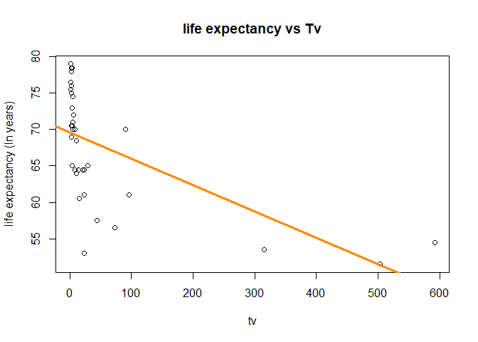

-   Fitted vs residual plots

``` r
plot(fitted(life_model), resid(life_model), col = "grey", pch = 20,
     xlab = "Fitted", ylab = "Residuals", main = "Data from life vs Tv model")
abline(h = 0, col = "darkorange", lwd = 2)
```

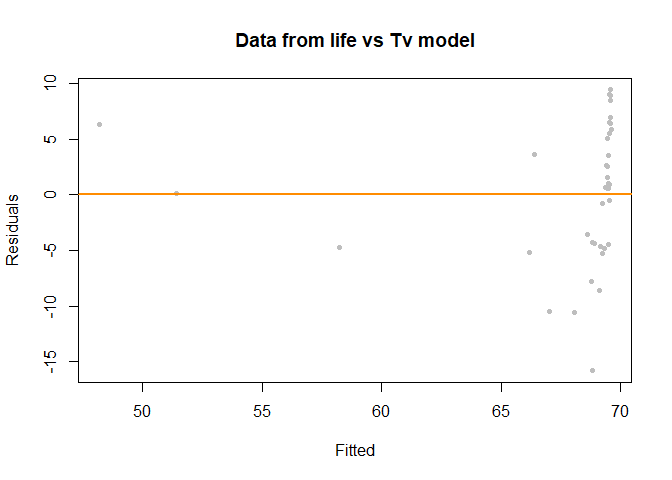

in the above fitted vs residual plot we can see that variance does not seem to be constant. The variace seems to be increasing for some fitted values as well. Next We will perform BP test.

-   BP test

``` r
library(lmtest)
bptest(life_model)
```

    ## 
    ##  studentized Breusch-Pagan test
    ## 
    ## data:  life_model
    ## BP = 0.16, df = 1, p-value = 0.7

The BP test provides a high p-value here suggesting no suspect for constant variation.

-   Q-Q plots

``` r
qqnorm(resid(life_model), main = "Normal Q-Q Plot, life model", col = "darkgrey")
qqline(resid(life_model), col = "dodgerblue", lwd = 2)
```

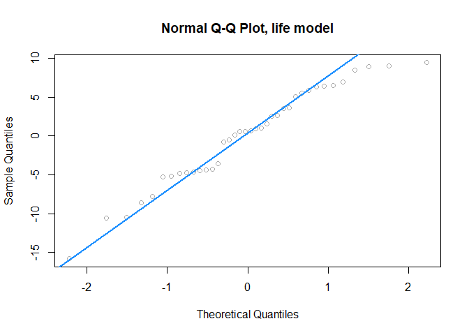

Looking at the normal Q-Q plot, there seem to be some points that give a clue of violation of normality. we will determine it using Shapiro test next which provide a rather large p-value.

-   Shapiro-Wilk normality test

``` r
shapiro.test(resid(life_model))
```

    ## 
    ##  Shapiro-Wilk normality test
    ## 
    ## data:  resid(life_model)
    ## W = 0.96, p-value = 0.2

**(b)** Fit higher order polynomial models of degree 3, 5, and 7. For each, plot a fitted versus residuals plot and comment on the constant variance assumption. Based on those plots, which of these three models do you think are acceptable? Use a statistical test(s) to compare the models you just chose. Based on the test, which is preferred? Check the normality assumption of this model. Identify any influential observations of this model.

``` r
life_model_poly3 <- lm(life ~ tv + I(tv ^ 2) + I(tv ^ 3), data=tvdoctor)
life_model_poly5 <- lm(life ~ tv + I(tv ^ 2) + I(tv ^ 3) + I(tv ^ 4) + I(tv ^ 5), data=tvdoctor)
life_model_poly7 <- lm(life ~ tv + I(tv ^ 2) + I(tv ^ 3) + I(tv ^ 4) + I(tv ^ 5) + I(tv ^ 6) + I(tv ^ 7), data=tvdoctor)

plot(fitted(life_model_poly3), resid(life_model_poly3), col = "grey", pch = 20,
     xlab = "Fitted", ylab = "Residuals", main = "Data from life vs tv model Polynomial 3")
abline(h = 0, col = "darkorange", lwd = 2)
```

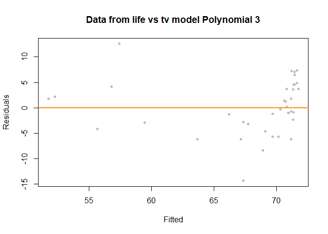

``` r
plot(fitted(life_model_poly5), resid(life_model_poly5), col = "grey", pch = 20,
     xlab = "Fitted", ylab = "Residuals", main = "Data from life vs tv model Polynomial 5")
abline(h = 0, col = "darkorange", lwd = 2)
```


``` r
plot(fitted(life_model_poly7), resid(life_model_poly7), col = "grey", pch = 20,
     xlab = "Fitted", ylab = "Residuals", main = "Data from life vs tv model Polynomial 7")
abline(h = 0, col = "darkorange", lwd = 2)
```

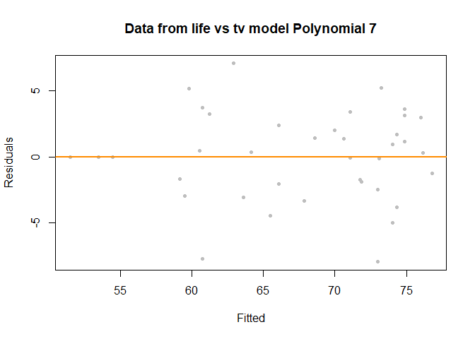

We started with polynomial of degree 3 model, though it appears to be fitting better than original model that we fit, it still appear to be violating contant variation rule. Next we fit model with polynomial of 5, which is fitting better than polynomial of degree 3 and seems to have a constant variation. We went a step furthur and fitted model with 7 degtree polynomial and saw further improvement over polynomial of degree 5. So when comparing all of these model, we will choose model with polynomial of degree 7.

BP Test and anova test for chosen model

``` r
bptest(life_model_poly7)
```

    ## 
    ##  studentized Breusch-Pagan test
    ## 
    ## data:  life_model_poly7
    ## BP = 5.8, df = 7, p-value = 0.6

``` r
anova(life_model_poly3, life_model_poly5)
```

    ## Analysis of Variance Table
    ## 
    ## Model 1: life ~ tv + I(tv^2) + I(tv^3)
    ## Model 2: life ~ tv + I(tv^2) + I(tv^3) + I(tv^4) + I(tv^5)
    ##   Res.Df  RSS Df Sum of Sq  F  Pr(>F)    
    ## 1     34 1028                            
    ## 2     32  457  2       571 20 2.3e-06 ***
    ## ---
    ## Signif. codes:  0 '***' 0.001 '**' 0.01 '*' 0.05 '.' 0.1 ' ' 1

``` r
anova(life_model_poly3, life_model_poly7)
```

    ## Analysis of Variance Table
    ## 
    ## Model 1: life ~ tv + I(tv^2) + I(tv^3)
    ## Model 2: life ~ tv + I(tv^2) + I(tv^3) + I(tv^4) + I(tv^5) + I(tv^6) + 
    ##     I(tv^7)
    ##   Res.Df  RSS Df Sum of Sq    F   Pr(>F)    
    ## 1     34 1028                               
    ## 2     30  428  4       600 10.5 0.000019 ***
    ## ---
    ## Signif. codes:  0 '***' 0.001 '**' 0.01 '*' 0.05 '.' 0.1 ' ' 1

``` r
anova(life_model_poly5, life_model_poly7)
```

    ## Analysis of Variance Table
    ## 
    ## Model 1: life ~ tv + I(tv^2) + I(tv^3) + I(tv^4) + I(tv^5)
    ## Model 2: life ~ tv + I(tv^2) + I(tv^3) + I(tv^4) + I(tv^5) + I(tv^6) + 
    ##     I(tv^7)
    ##   Res.Df RSS Df Sum of Sq    F Pr(>F)
    ## 1     32 457                         
    ## 2     30 428  2      28.9 1.01   0.38

After performing BP test with chosen model with polynomial of degree 7, we see that it has a large p-value. Also by checking p-value form `anova` test, we see that higher polynomials are fitting better and are significant in the model. Though test for polynomial of degree 5 and 7 had large p-value, we will plot a Q-Q plot to visually see it.

``` r
qqnorm(resid(life_model_poly5), main="Normal Q-Q Plot, Polynomial 5 degree", col="darkgray")
qqline(resid(life_model_poly5), col="dodgerblue", lwd=2)
```


``` r
qqnorm(resid(life_model_poly7), main="Normal Q-Q Plot, Polynomial 7 degree", col="darkgray")
qqline(resid(life_model_poly7), col="dodgerblue", lwd=2)
```

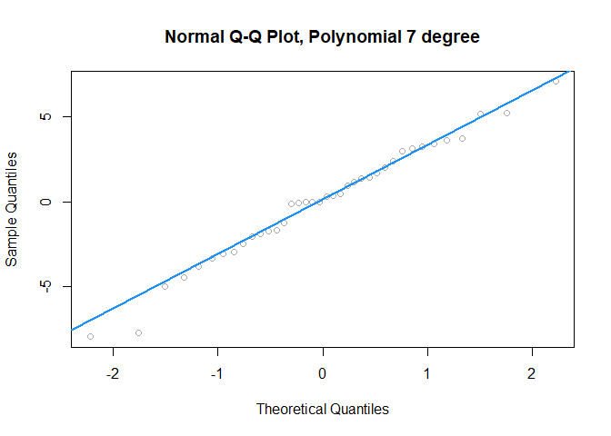

After looking at the plot, it appears that model with polynomial of degree 7 was a better fit so we would prefer that model.

Exercise 5 (Brains)
-------------------

The data set `mammals` from the `MASS` package contains the average body weight in kilograms (*x*) and the average brain weight in grams (*y*) for 62 species of land mammals. Use `?mammals` to learn more.

``` r
library(MASS)
```

**(a)** Plot average brain weight (*y*) versus average body weight (*x*).

``` r
plot(brain ~ body, data=mammals, main="Avg brain weight (in g) Vs Avg body weight (in kg)", ylab = "Brain weight", xlab="Body weight")
```

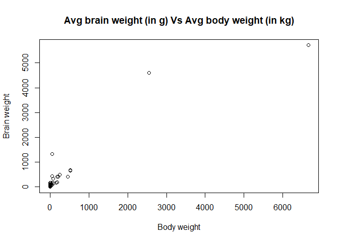

**(b)** Fit a linear model with `brain` as the response and `body` as the predictor. Test for significance of regression. Do you think this is an appropriate model?

``` r
brain_model <- lm(brain~body, data = mammals)
life_model <- lm(life ~ tv, data=tvdoctor)
plot(brain~body, data=mammals, main="brain weight (in g) vs body weight (in kg)", ylab = "brain weight")
abline(brain_model, col="darkorange", lwd=3)
```

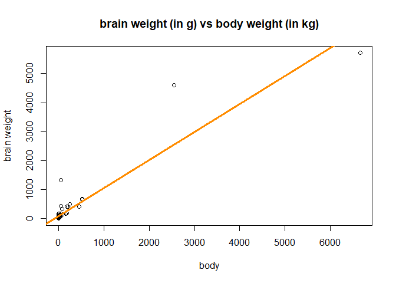

``` r
summary(brain_model)
```

    ## 
    ## Call:
    ## lm(formula = brain ~ body, data = mammals)
    ## 
    ## Residuals:
    ##    Min     1Q Median     3Q    Max 
    ## -810.1  -88.5  -79.6  -13.0 2050.3 
    ## 
    ## Coefficients:
    ##             Estimate Std. Error t value Pr(>|t|)    
    ## (Intercept)  91.0044    43.5526    2.09    0.041 *  
    ## body          0.9665     0.0477   20.28   <2e-16 ***
    ## ---
    ## Signif. codes:  0 '***' 0.001 '**' 0.01 '*' 0.05 '.' 0.1 ' ' 1
    ## 
    ## Residual standard error: 335 on 60 degrees of freedom
    ## Multiple R-squared:  0.873,  Adjusted R-squared:  0.871 
    ## F-statistic:  411 on 1 and 60 DF,  p-value: <2e-16

After fitting the model, we see that there are 2 data points which are far away from rest of the dataset and could me outliers and/or influencial points. Also after performing the significance of regression test, we see that predictor `body` was significant.

**(c)** Since the body weights do range over more than one order of magnitude and are strictly positive, we will use log(body weight) as our *predictor*, with no further justification. (Recall, *the log rule*: if the values of a variable range over more than one order of magnitude and the variable is strictly positive, then replacing the variable by its logarithm is likely to be helpful.) Use the Box-Cox method to verify that log(brain weight) is then a "recommended" transformation of the *response* variable. That is, verify that *λ* = 0 is among the "recommended" values of *λ* when considering,

*g*<sub>*λ*</sub>(*y*)=*β*<sub>0</sub> + *β*<sub>1</sub>log(body weight)+*ϵ*

Include the relevant plot in your results, using an appropriate zoom onto the relevant values.

``` r
boxcox(brain_model, plotit = TRUE, lambda = seq(-0.4, 0.4, by = 0.1))
```

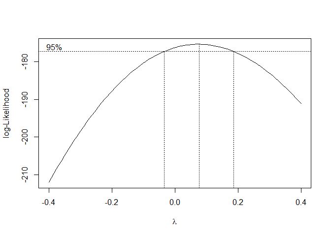

After applying `boxcox` method, we see that method is finding around `0` as the best transformation of the form. Here it plots the log-Likelihood as a function of possible *λ* values. It also indicated both the value that maximizes the log-likelihood, as well as a confidence interval for the *λ* value that maximizes the log-likelihood and we can clearly see that it appears to be happening around `0`.

**(d)** Fit the model justified in part **(c)**. That is, fit a model with log(brain weight) as the response and log(body weight) as a predictor. Plot log(brain weight) versus log(body weight) and add the regression line to the plot. Does a linear relationship seem to be appropriate here?

``` r
log_brain_model <- lm(log(brain)~log(body), data = mammals)
plot(log(brain)~log(body), data=mammals, main="brain weight (in g) vs body weight (in kg)", ylab = "brain weight", col="darkgray")
abline(log_brain_model, col="darkorange", lwd=3)
```

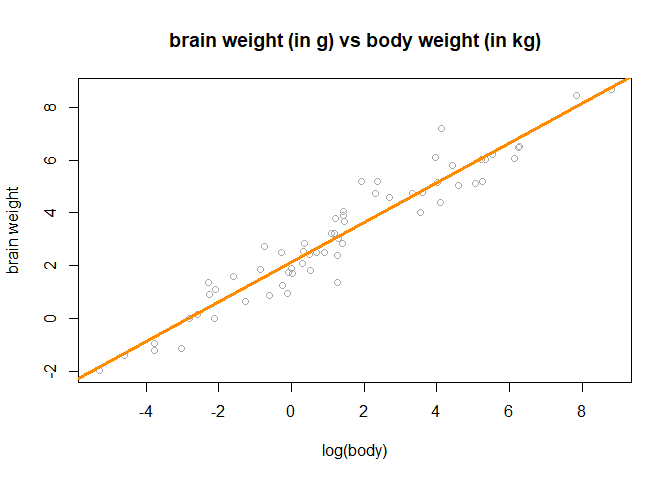

After log transformation on both response and predictor we see that linear relationship now fits much better than original model.

**(e)** Use a Q-Q plot to check the normality of the errors for the model fit in part **(d)**.

``` r
qqnorm(resid(log_brain_model), main="Normal Q-Q Plot, log brain model", col="darkgray")
qqline(resid(log_brain_model), col="dodgerblue", lwd=2)
```

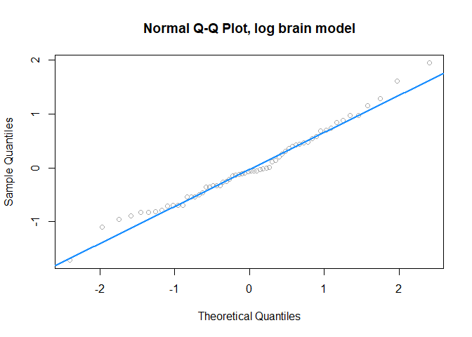

**(f)** Use the model from part **(d)** to predict the brain weight of a male Snorlax which has a body weight of 1014.1 pounds. (A Snorlax would be a mammal, right?) Construct a 90% prediction interval.

``` r
#pound to kg conversion for body weight
wt <- 1014.1 * 0.454
exp(predict(log_brain_model,newdata = data.frame(body = wt), interval = "prediction",level = 0.90))
```

    ##     fit lwr  upr
    ## 1 849.1 258 2795
