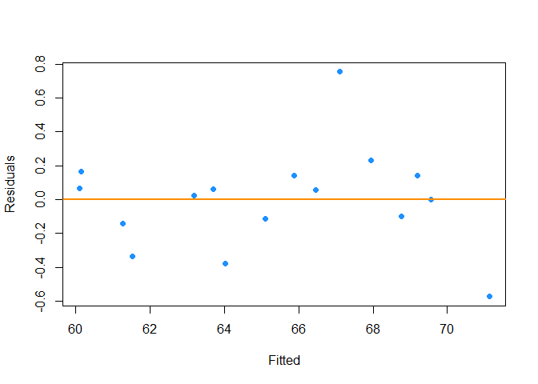
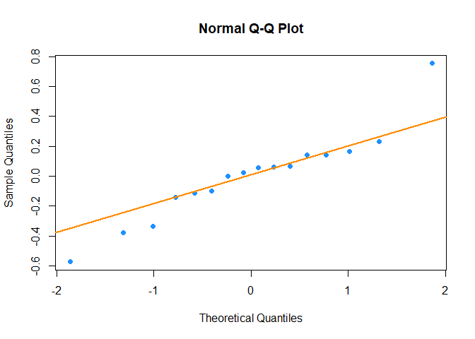
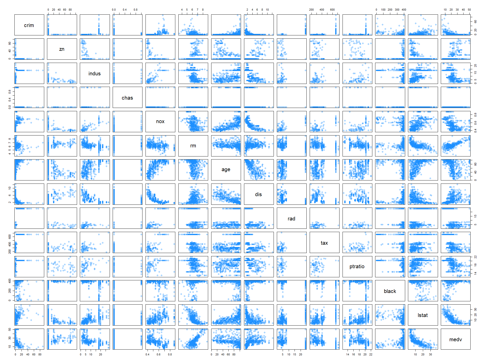
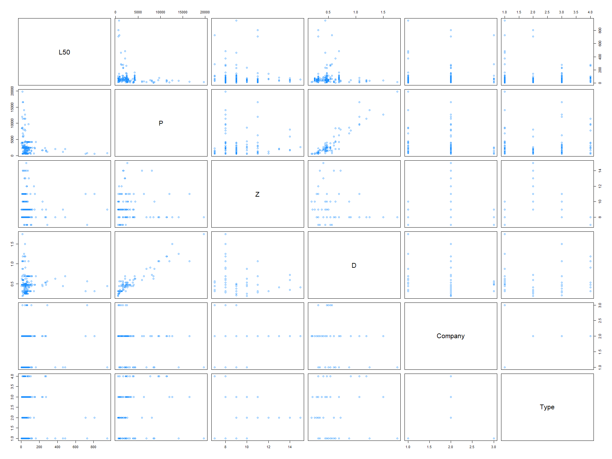
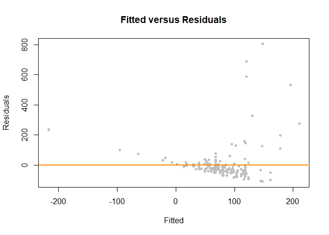
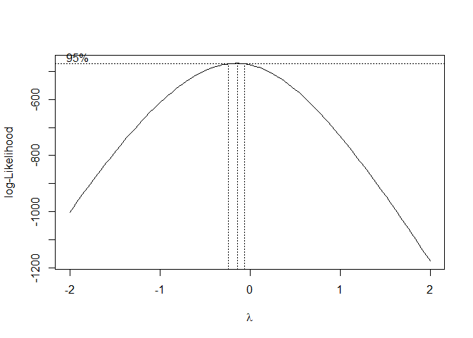
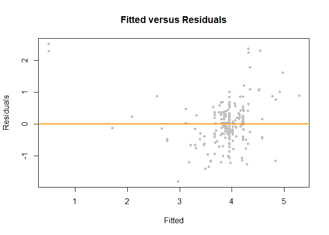

-   [Exercise 1 (`longley` Macroeconomic Data)](#exercise-1-longley-macroeconomic-data)
-   [Exercise 2 (`Boston` Housing Data)](#exercise-2-boston-housing-data)
-   [Exercise 3 (Ball Bearings)](#exercise-3-ball-bearings)
-   [Exercise 4 (Does It Work?)](#exercise-4-does-it-work)

Exercise 1 (`longley` Macroeconomic Data)
-----------------------------------------

The built-in dataset `longley` contains macroeconomic data for predicting employment. We will attempt to model the `Employed` variable.

``` r
View(longley)
?longley
```

**(a)** What is the largest correlation between any pair of predictors in the dataset?

``` r
round(cor(longley), 3)
```

    ##              GNP.deflator   GNP Unemployed Armed.Forces Population  Year
    ## GNP.deflator        1.000 0.992      0.621        0.465      0.979 0.991
    ## GNP                 0.992 1.000      0.604        0.446      0.991 0.995
    ## Unemployed          0.621 0.604      1.000       -0.177      0.687 0.668
    ## Armed.Forces        0.465 0.446     -0.177        1.000      0.364 0.417
    ## Population          0.979 0.991      0.687        0.364      1.000 0.994
    ## Year                0.991 0.995      0.668        0.417      0.994 1.000
    ## Employed            0.971 0.984      0.502        0.457      0.960 0.971
    ##              Employed
    ## GNP.deflator    0.971
    ## GNP             0.984
    ## Unemployed      0.502
    ## Armed.Forces    0.457
    ## Population      0.960
    ## Year            0.971
    ## Employed        1.000

The largest correlation is between predictors `Year` and `GNP` which is `0.995`.

**(b)** Fit a model with `Employed` as the response and the remaining variables as predictors. Calculate and report the variance inflation factor (VIF) for each of the predictors. Which variable has the largest VIF? Do any of the VIFs suggest multicollinearity?

``` r
employed_model <- lm(Employed ~ ., data=longley)
summary(employed_model)
```

    ## 
    ## Call:
    ## lm(formula = Employed ~ ., data = longley)
    ## 
    ## Residuals:
    ##     Min      1Q  Median      3Q     Max 
    ## -0.4101 -0.1577 -0.0282  0.1016  0.4554 
    ## 
    ## Coefficients:
    ##               Estimate Std. Error t value Pr(>|t|)    
    ## (Intercept)  -3.48e+03   8.90e+02   -3.91  0.00356 ** 
    ## GNP.deflator  1.51e-02   8.49e-02    0.18  0.86314    
    ## GNP          -3.58e-02   3.35e-02   -1.07  0.31268    
    ## Unemployed   -2.02e-02   4.88e-03   -4.14  0.00254 ** 
    ## Armed.Forces -1.03e-02   2.14e-03   -4.82  0.00094 ***
    ## Population   -5.11e-02   2.26e-01   -0.23  0.82621    
    ## Year          1.83e+00   4.55e-01    4.02  0.00304 ** 
    ## ---
    ## Signif. codes:  0 '***' 0.001 '**' 0.01 '*' 0.05 '.' 0.1 ' ' 1
    ## 
    ## Residual standard error: 0.305 on 9 degrees of freedom
    ## Multiple R-squared:  0.995,  Adjusted R-squared:  0.992 
    ## F-statistic:  330 on 6 and 9 DF,  p-value: 4.98e-10

``` r
car::vif(employed_model)
```

    ## GNP.deflator          GNP   Unemployed Armed.Forces   Population         Year 
    ##      135.532     1788.513       33.619        3.589      399.151      758.981

Almost All the predictors except `Armed.Forces` seems to have multicollinearity issue as all have very high variance inflation factor. Predictor `GNP` has largest vaiance inflation factor value of `1788.513`.

**(c)** What proportion of the observed variation in `Population` is explained by a linear relationship with the other predictors?

``` r
pop_model <- lm(Population ~ . - Employed, data=longley)
summary(pop_model)$r.squared
```

    ## [1] 0.9975

99.7495% of the observed variation in Population is explained by a linear relationship with the other predictors.

**(d)** Calculate the partial correlation coefficient for `Population` and `Employed` **with the effects of the other predictors removed**.

``` r
emp_model <- lm(Employed ~ . - Population, data = longley)
cor(resid(pop_model), resid(emp_model))
```

    ## [1] -0.07514

Partial corrleation coeffient is -0.0751.

**(e)** Fit a new model with `Employed` as the response and the predictors from the model in **(b)** that were significant. (Use *α* = 0.05.) Calculate and report the variance inflation factor for each of the predictors. Which variable has the largest VIF? Do any of the VIFs suggest multicollinearity?

``` r
employed_model2 <- lm(Employed ~  Unemployed + Armed.Forces + Year, data = longley)
car::vif(employed_model2)
```

    ##   Unemployed Armed.Forces         Year 
    ##        3.318        2.223        3.891

After fitting the model, We see that predictor `Year` has largest VIF. none of the predictors seems to have multicollinearity issues.

**(f)** Use an *F*-test to compare the models in parts **(b)** and **(e)**. Report the following:

-   The null hypothesis
-   The test statistic
-   The distribution of the test statistic under the null hypothesis
-   The p-value
-   A decision
-   Which model you prefer, **(b)** or **(e)**

``` r
anova(employed_model2, employed_model)
```

    ## Analysis of Variance Table
    ## 
    ## Model 1: Employed ~ Unemployed + Armed.Forces + Year
    ## Model 2: Employed ~ GNP.deflator + GNP + Unemployed + Armed.Forces + Population + 
    ##     Year
    ##   Res.Df   RSS Df Sum of Sq    F Pr(>F)
    ## 1     12 1.323                         
    ## 2      9 0.836  3     0.487 1.75   0.23

-   null hypothesis would be coefficients of `GNP.deflator1`, `GNP` and `Population` are 0. i.e. *H*<sub>0</sub> : *β*<sub>5</sub> = *β*<sub>6</sub> = *β*<sub>7</sub> = 0
-   alternative hypothesis would be atleast one of the coefficients of `GNP.deflator1`, `GNP` and `Population` are not 0. i.e. *H*<sub>1</sub> : *a**t* *l**e**a**s**t* *o**n**e* *o**f* *t**h**e* *p**a**r**a**m**e**t**e**r**s* *β*<sub>5</sub>, *β*<sub>6</sub>, *β*<sub>7</sub> ≠ 0

-   the value of test statistic is .
-   test statistics follows F-distribution with `12` and `9` degrees of freedom.
-   p-value is 0.227.
-   Considering the significance level of 0.05, we fail to reject null hypothesis.
-   We would prefer smaller or null model.

**(g)** Check the assumptions of the model chosen in part **(f)**. Do any assumptions appear to be violated?

``` r
plot_fitted_resid = function(model, pointcol = "dodgerblue", linecol = "darkorange") {
  plot(fitted(model), resid(model), 
       col = pointcol, pch = 20, cex = 1.5,
       xlab = "Fitted", ylab = "Residuals")
  abline(h = 0, col = linecol, lwd = 2)
}

plot_qq = function(model, pointcol = "dodgerblue", linecol = "darkorange") {
  qqnorm(resid(model), col = pointcol, pch = 20, cex = 1.5)
  qqline(resid(model), col = linecol, lwd = 2)
}

plot_fitted_resid(employed_model2)
```



``` r
plot_qq(employed_model2)
```



-   The model seems to have a contant variation but it appers to be violating the normality assumptions. When we look at the qq plot, we can see points being away from the line.

Exercise 2 (`Boston` Housing Data)
----------------------------------

**(a)** Use the `Boston` data found in the `MASS` package to find a "good" model for `medv`. Use any methods seen in class. The model should reach a LOOCV-RMSE below `3.25` and the Breusch-Pagan test should fail to reject at an *α* of 0.01. Do not use any transformations of the response variable.

``` r
library(MASS)
pairs(Boston, col="dodgerblue")
```



-   By looking at pairs graphs, we can see that there is a possibility of using polynomial transformation for some of the predictors, we will start the model with all 2 way interation terms and 3 degree polynomials for predictors `crim`, `indus`, `nox` and `lstat` as these predictors seems to have polynomial relationship with response variable.

``` r
library(leaps)
#Adding polynomials
boston_model_poly <- lm(medv ~ . ^ 2 + I(crim) ^ 3 + I(indus) ^ 3 + I(nox) ^ 3 + I(lstat) ^ 3 + I(black) ^ 3, data=Boston)

# Backward AIC
boston_model_back_aic <- step(boston_model_poly, direction = "backward", trace = 0)
boston_model_back_aic
```

    ## 
    ## Call:
    ## lm(formula = medv ~ crim + zn + indus + chas + nox + rm + age + 
    ##     dis + rad + tax + ptratio + black + lstat + crim:zn + crim:chas + 
    ##     crim:nox + crim:rm + crim:dis + crim:rad + crim:tax + crim:ptratio + 
    ##     crim:black + crim:lstat + zn:dis + zn:tax + zn:lstat + indus:nox + 
    ##     indus:rm + indus:rad + chas:nox + chas:rm + chas:ptratio + 
    ##     chas:black + chas:lstat + nox:age + nox:dis + nox:ptratio + 
    ##     nox:lstat + rm:age + rm:dis + rm:tax + rm:ptratio + rm:black + 
    ##     rm:lstat + age:dis + age:rad + age:tax + age:black + age:lstat + 
    ##     dis:rad + dis:tax + dis:lstat + rad:lstat + tax:ptratio + 
    ##     tax:lstat + black:lstat, data = Boston)
    ## 
    ## Coefficients:
    ##  (Intercept)          crim            zn         indus          chas  
    ##    -2.00e+02     -1.34e+01     -1.53e-01     -3.86e+00      5.37e+01  
    ##          nox            rm           age           dis           rad  
    ##     8.12e+01      3.06e+01      1.04e+00     -4.96e+00      4.32e-01  
    ##          tax       ptratio         black         lstat       crim:zn  
    ##     9.57e-02      4.78e+00      1.01e-01      1.88e+00      3.59e-01  
    ##    crim:chas      crim:nox       crim:rm      crim:dis      crim:rad  
    ##     2.38e+00     -1.14e+00      2.20e-01     -1.19e-01     -5.30e-01  
    ##     crim:tax  crim:ptratio    crim:black    crim:lstat        zn:dis  
    ##     2.71e-02      3.46e-01     -3.44e-04      2.87e-02      1.48e-02  
    ##       zn:tax      zn:lstat     indus:nox      indus:rm     indus:rad  
    ##     4.04e-04     -1.05e-02      3.20e+00      3.86e-01     -2.07e-02  
    ##     chas:nox       chas:rm  chas:ptratio    chas:black    chas:lstat  
    ##    -3.10e+01     -5.14e+00     -7.97e-01      2.91e-02     -2.41e-01  
    ##      nox:age       nox:dis   nox:ptratio     nox:lstat        rm:age  
    ##    -8.26e-01      5.99e+00     -5.75e+00      9.57e-01     -4.95e-02  
    ##       rm:dis        rm:tax    rm:ptratio      rm:black      rm:lstat  
    ##     3.68e-01     -2.58e-02     -6.44e-01     -5.13e-03     -3.07e-01  
    ##      age:dis       age:rad       age:tax     age:black     age:lstat  
    ##    -1.97e-02      1.15e-02     -2.65e-04     -5.78e-04     -5.42e-03  
    ##      dis:rad       dis:tax     dis:lstat     rad:lstat   tax:ptratio  
    ##    -8.18e-02     -4.11e-03      1.35e-01     -2.24e-02      5.04e-03  
    ##    tax:lstat   black:lstat  
    ##    -1.40e-03     -6.26e-04

``` r
# Backward BIC
n <- length(resid(boston_model_poly))
boston_model_back_bic <- step(boston_model_poly, direction = "backward", k=log(n), trace = 0)
boston_model_back_bic
```

    ## 
    ## Call:
    ## lm(formula = medv ~ crim + zn + indus + chas + nox + rm + age + 
    ##     dis + rad + tax + ptratio + black + lstat + crim:chas + crim:rm + 
    ##     crim:rad + crim:black + crim:lstat + zn:tax + zn:lstat + 
    ##     indus:nox + indus:rm + chas:nox + chas:rm + chas:black + 
    ##     chas:lstat + nox:age + nox:ptratio + rm:age + rm:tax + rm:ptratio + 
    ##     rm:lstat + age:dis + age:rad + age:black + age:lstat + dis:tax + 
    ##     tax:ptratio + tax:lstat, data = Boston)
    ## 
    ## Coefficients:
    ## (Intercept)         crim           zn        indus         chas          nox  
    ##   -2.19e+02    -4.47e-01    -9.60e-02    -3.56e+00     3.95e+01     1.17e+02  
    ##          rm          age          dis          rad          tax      ptratio  
    ##    3.07e+01     1.08e+00     1.45e+00    -2.72e-01     1.11e-01     4.09e+00  
    ##       black        lstat    crim:chas      crim:rm     crim:rad   crim:black  
    ##    6.66e-02     2.97e+00     2.00e+00     2.36e-01    -6.52e-02    -3.30e-04  
    ##  crim:lstat       zn:tax     zn:lstat    indus:nox     indus:rm     chas:nox  
    ##    2.41e-02     4.69e-04    -6.31e-03     2.48e+00     3.75e-01    -2.36e+01  
    ##     chas:rm   chas:black   chas:lstat      nox:age  nox:ptratio       rm:age  
    ##   -5.42e+00     3.05e-02    -4.31e-01    -9.39e-01    -5.29e+00    -5.31e-02  
    ##      rm:tax   rm:ptratio     rm:lstat      age:dis      age:rad    age:black  
    ##   -2.86e-02    -5.95e-01    -3.07e-01    -1.58e-02     7.51e-03    -6.87e-04  
    ##   age:lstat      dis:tax  tax:ptratio    tax:lstat  
    ##   -4.56e-03    -5.15e-03     5.53e-03    -2.80e-03

``` r
#exhaustive search
#exhaustive search 
all_boston_mod <- summary(regsubsets(medv ~ ., data = Boston))

(best_r2_ind = which.max(all_boston_mod$rss))
```

    ## [1] 1

``` r
all_boston_mod$which[best_r2_ind, ]
```

    ## (Intercept)        crim          zn       indus        chas         nox 
    ##        TRUE       FALSE       FALSE       FALSE       FALSE       FALSE 
    ##          rm         age         dis         rad         tax     ptratio 
    ##       FALSE       FALSE       FALSE       FALSE       FALSE       FALSE 
    ##       black       lstat 
    ##       FALSE        TRUE

After looking at the model selected by `AIC` and `BIC`, we see that `BIC` has selected a smaller model with relatively smaller coefficient value. So will attempt to fit the model seleted by `BIC`.

Store your model in a variable called `good_model`. Run the two given chunks to verify your model meets the requested criteria. If you cannot find a model that meets both criteria, partial credit will be given for meeting at least one of the criteria.

``` r
library(lmtest)
good_model <- lm(medv ~ crim + zn + indus + chas + nox + rm + age + 
    dis + rad + tax + ptratio + black + lstat + crim:chas + crim:rm +
    crim:rad + crim:black + crim:lstat + zn:tax + zn:lstat +
    indus:nox + indus:rm + chas:nox + chas:rm + chas:black +
    chas:lstat + nox:age + nox:ptratio + rm:age + rm:tax + rm:ptratio +
    rm:lstat + age:dis + age:rad + age:black + age:lstat + dis:tax +
    tax:ptratio + tax:lstat, data = Boston)

coef(good_model)
```

    ## (Intercept)        crim          zn       indus        chas         nox 
    ##  -2.186e+02  -4.465e-01  -9.601e-02  -3.562e+00   3.949e+01   1.173e+02 
    ##          rm         age         dis         rad         tax     ptratio 
    ##   3.073e+01   1.082e+00   1.452e+00  -2.720e-01   1.108e-01   4.095e+00 
    ##       black       lstat   crim:chas     crim:rm    crim:rad  crim:black 
    ##   6.656e-02   2.967e+00   1.999e+00   2.362e-01  -6.525e-02  -3.296e-04 
    ##  crim:lstat      zn:tax    zn:lstat   indus:nox    indus:rm    chas:nox 
    ##   2.407e-02   4.689e-04  -6.308e-03   2.483e+00   3.750e-01  -2.362e+01 
    ##     chas:rm  chas:black  chas:lstat     nox:age nox:ptratio      rm:age 
    ##  -5.419e+00   3.047e-02  -4.314e-01  -9.392e-01  -5.290e+00  -5.310e-02 
    ##      rm:tax  rm:ptratio    rm:lstat     age:dis     age:rad   age:black 
    ##  -2.858e-02  -5.952e-01  -3.067e-01  -1.580e-02   7.510e-03  -6.871e-04 
    ##   age:lstat     dis:tax tax:ptratio   tax:lstat 
    ##  -4.560e-03  -5.155e-03   5.528e-03  -2.795e-03

``` r
library(lmtest)

get_bp_decision = function(model, alpha) {
  decide = unname(bptest(model)$p.value < alpha)
  ifelse(decide, "Reject", "Fail to Reject")
}

get_loocv_rmse = function(model) {
  sqrt(mean((resid(model) / (1 - hatvalues(model))) ^ 2))
}
```

``` r
get_bp_decision(good_model, alpha = 0.01)
```

    ## [1] "Reject"

``` r
get_loocv_rmse(good_model)
```

    ## [1] 3.087

When we used `AIC` and `BIC` methods on our dataset, we see that `AIC` selects little large model compare to `BIC` and has lower p-value compare to model selected using `BIC` method. In above code we have selected the best model chosen with `BIC` method which results in LOOCV RMSE value of 3.0872.

Exercise 3 (Ball Bearings)
--------------------------

For this exercise we will use the data stored in [`ballbearings.csv`](ballbearings.csv). It contains 210 observations, each of which reports the results of a test on a set of ball bearings. Manufacturers who use bearings in their products have an interest in their reliability. The basic measure of reliability in this context is the rating life, also known in engineering as fatigue failure. The objective is to model `L50`, the median lifetime of this sample of ball bearings. The variables in the dataset are:

-   `L50` - median life: the number of revolutions that 50% of a group of identical bearings would be expected to achieve
-   `P` - the load on the bearing in operation
-   `Z` - the number of balls in the bearing
-   `D` - the diameter of the balls
-   `Company` - denotes who manufactured the ball bearing (A, B, C)
-   `Type` - Company B makes several types of ball bearings (1, 2, 3); 0 otherwise

**(a)** Find a model for `log(L50)` that does not reject the Shapiro-Wilk test at *α* = 0.01 and obtains an **adjusted** *R*<sup>2</sup> higher than 0.52. You may not remove any observations, but may consider transformations. Your model should use fewer than 10 *β* parameters.

``` r
library(readr)
ballbearings <- read_csv("ballbearings.csv")
ballbearings$Company <- as.factor(ballbearings$Company)
ballbearings$Type <- as.factor(ballbearings$Type)
pairs(ballbearings,col="dodgerblue")
```



looking at the pairs plot, it appears that we could use log transformation for response and predictor variables. we will be starting with the model an additive model and then will apply exhaustive search to identify right size and parameters of the model.

``` r
library(leaps)
ballbearing_model <- lm(L50 ~ ., data=ballbearings)

plot(fitted(ballbearing_model), resid(ballbearing_model), col = "grey", pch = 20,
     xlab = "Fitted", ylab = "Residuals", main = "Fitted versus Residuals")
abline(h = 0, col = "darkorange", lwd = 2)
```



``` r
boxcox(ballbearing_model, plotit = TRUE)
```



``` r
ballbearing_log_model <- lm(log(L50) ~ ., data=ballbearings)

plot(fitted(ballbearing_log_model), resid(ballbearing_log_model), col = "grey", pch = 20,
     xlab = "Fitted", ylab = "Residuals", main = "Fitted versus Residuals")
abline(h = 0, col = "darkorange", lwd = 2)
```



``` r
#exhaustive search 
all_ball_mod = summary(regsubsets(L50 ~ ., data = ballbearings))

(best_r2_ind = which.max(all_ball_mod$adjr2))
```

    ## [1] 4

``` r
all_ball_mod$which[best_r2_ind, ]
```

    ## (Intercept)           P           Z           D    CompanyB    CompanyC 
    ##        TRUE        TRUE        TRUE        TRUE       FALSE       FALSE 
    ##       Type1       Type2       Type3 
    ##       FALSE        TRUE       FALSE

``` r
#AIC
(ball_model_back_aic <- step(ballbearing_log_model, direction = "backward", trace = 0))
```

    ## 
    ## Call:
    ## lm(formula = log(L50) ~ P + Z + D, data = ballbearings)
    ## 
    ## Coefficients:
    ## (Intercept)            P            Z            D  
    ##    1.707746    -0.000483     0.094066     5.553924

``` r
#BIC
n <- length(resid(ballbearing_model))
(ball_model_back_bic <- step(ballbearing_log_model, direction = "backward", trace = 0))
```

    ## 
    ## Call:
    ## lm(formula = log(L50) ~ P + Z + D, data = ballbearings)
    ## 
    ## Coefficients:
    ## (Intercept)            P            Z            D  
    ##    1.707746    -0.000483     0.094066     5.553924

we started with additive model and saw that it violates the constant variation assumption so to fix it, we ran boxcox method on the model to get appropriate value of *λ*. The method suggested to use log transformation of response variable. After fitting with model with log transformed response we see that fitted vs residuals plot seems to be better now. We then proceed with variable selection procedure.

from the exahautvie search we found that model with the size of 4 *β* parameters, but when we take a look at model selected by `AIC` and `BIC` methods, it only select model with 3 parameters. So will now use log transformation for continuous predictors.

Store your model in a variable called `good_model_a`. Run the two given chunks to verify your model meets the requested criteria. If you cannot find a model that meets all criteria, partial credit will be given for meeting at least some of the criteria.

``` r
good_model_a <- lm(log(L50) ~ I(Company)^2 + I(Type)^2 + log(Z) + log(P) + log(D), data=ballbearings)
summary(good_model_a)
```

    ## 
    ## Call:
    ## lm(formula = log(L50) ~ I(Company)^2 + I(Type)^2 + log(Z) + log(P) + 
    ##     log(D), data = ballbearings)
    ## 
    ## Residuals:
    ##     Min      1Q  Median      3Q     Max 
    ## -1.6518 -0.2870  0.0186  0.3519  1.3089 
    ## 
    ## Coefficients: (1 not defined because of singularities)
    ##             Estimate Std. Error t value Pr(>|t|)    
    ## (Intercept)   22.623      1.430   15.82  < 2e-16 ***
    ## I(Company)B    0.249      0.160    1.55  0.12201    
    ## I(Company)C   -0.759      0.194   -3.92  0.00012 ***
    ## I(Type)1      -0.871      0.268   -3.25  0.00136 ** 
    ## I(Type)2      -0.382      0.175   -2.19  0.02996 *  
    ## I(Type)3          NA         NA      NA       NA    
    ## log(Z)         2.628      0.478    5.50  1.1e-07 ***
    ## log(P)        -2.686      0.168  -15.94  < 2e-16 ***
    ## log(D)         4.757      0.346   13.74  < 2e-16 ***
    ## ---
    ## Signif. codes:  0 '***' 0.001 '**' 0.01 '*' 0.05 '.' 0.1 ' ' 1
    ## 
    ## Residual standard error: 0.563 on 202 degrees of freedom
    ## Multiple R-squared:  0.578,  Adjusted R-squared:  0.563 
    ## F-statistic: 39.5 on 7 and 202 DF,  p-value: <2e-16

``` r
get_sw_decision = function(model, alpha) {
  decide = unname(shapiro.test(resid(model))$p.value < alpha)
  ifelse(decide, "Reject", "Fail to Reject")
}

get_num_params = function(model) {
  length(coef(model))
}

get_adj_r2 = function(model) {
  summary(model)$adj.r.squared
}
```

``` r
get_sw_decision(good_model_a, alpha = 0.01)
```

    ## [1] "Fail to Reject"

``` r
get_num_params(good_model_a)
```

    ## [1] 9

``` r
get_adj_r2(good_model_a)
```

    ## [1] 0.5634

**(b)** Find a model for `log(L50)` that does not reject the Shapiro-Wilk test at *α* = 0.01 and obtains an **adjusted** *R*<sup>2</sup> higher than 0.60. You may not remove any observations, but may consider transformations. Your model should use fewer than 20 *β* parameters.

Store your model in a variable called `good_model_b`. Run the given chunk to verify your model meets the requested criteria. If you cannot find a model that meets all criteria, partial credit will be given for meeting at least some of the criteria.

``` r
good_model_b <- lm(log(L50) ~ Company:Type:D + log(P) + log(D), data=ballbearings)
```

``` r
get_sw_decision(good_model_b, alpha = 0.01)
```

    ## [1] "Fail to Reject"

``` r
get_num_params(good_model_b)
```

    ## [1] 15

``` r
get_adj_r2(good_model_b)
```

    ## [1] 0.6454

Exercise 4 (Does It Work?)
--------------------------

In this exercise, we will investigate how well backwards AIC and BIC actually perform. For either to be "working" correctly, they should result in a low number of both **false positives** and **false negatives**. In model selection,

-   **False Positive**, FP: Incorrectly including a variable in the model. Including a *non-significant* variable
-   **False Negative**, FN: Incorrectly excluding a variable in the model. Excluding a *significant* variable

Consider the **true** model

*Y* = *β*<sub>0</sub> + *β*<sub>1</sub>*x*<sub>1</sub> + *β*<sub>2</sub>*x*<sub>2</sub> + *β*<sub>3</sub>*x*<sub>3</sub> + *β*<sub>4</sub>*x*<sub>4</sub> + *β*<sub>5</sub>*x*<sub>5</sub> + *β*<sub>6</sub>*x*<sub>6</sub> + *β*<sub>7</sub>*x*<sub>7</sub> + *β*<sub>8</sub>*x*<sub>8</sub> + *β*<sub>9</sub>*x*<sub>9</sub> + *β*<sub>10</sub>*x*<sub>10</sub> + *ϵ*

where *ϵ* ∼ *N*(0, *σ*<sup>2</sup> = 9). The true values of the *β* parameters are given in the `R` code below.

``` r
beta_0  <- 1
beta_1  <- 0
beta_2  <- 1
beta_3  <- 0
beta_4  <- 2
beta_5  <- 0
beta_6  <- 1
beta_7  <- 0
beta_8  <- 2
beta_9  <- 0
beta_10 <- 1
sigma <- 3
```

Then, as we have specified them, some variables are significant, and some are not. We store their names in `R` variables for use later.

``` r
not_sig  <- c("x_1", "x_3", "x_5", "x_7", "x_9")
signif <- c("x_2", "x_4", "x_6", "x_8", "x_10")
```

We now simulate values for these `x` variables, which we will use throughout part **(a)**.

``` r
set.seed(42)
n <- 100
x_1  <- runif(n, 0, 10)
x_2  <- runif(n, 0, 10)
x_3  <- runif(n, 0, 10)
x_4  <- runif(n, 0, 10)
x_5  <- runif(n, 0, 10)
x_6  <- runif(n, 0, 10)
x_7  <- runif(n, 0, 10)
x_8  <- runif(n, 0, 10)
x_9  <- runif(n, 0, 10)
x_10 <- runif(n, 0, 10)
```

We then combine these into a data frame and simulate `y` according to the true model.

``` r
sim_data_1 <- data.frame(x_1, x_2, x_3, x_4, x_5, x_6, x_7, x_8, x_9, x_10,
  y = beta_0 + beta_2 * x_2 + beta_4 * x_4 + beta_6 * x_6 + beta_8 * x_8 + 
      beta_10 * x_10 + rnorm(n, 0 , sigma)
)
```

We do a quick check to make sure everything looks correct.

``` r
head(sim_data_1)
```

    ##     x_1   x_2   x_3    x_4   x_5   x_6   x_7   x_8   x_9   x_10     y
    ## 1 9.148 6.262 8.851 4.8377 0.227 1.365 4.982 7.655 9.090 0.9615 37.66
    ## 2 9.371 2.172 5.171 4.4457 5.132 1.771 2.828 5.050 8.999 0.3690 27.05
    ## 3 2.861 2.166 8.519 0.6039 6.307 5.196 7.764 2.025 1.923 4.0094 17.62
    ## 4 8.304 3.889 4.428 3.2751 4.188 8.111 3.039 7.171 5.323 0.1154 34.42
    ## 5 6.417 9.425 1.579 8.7843 8.793 1.154 5.156 7.681 5.221 5.6789 48.03
    ## 6 5.191 9.626 4.423 9.3060 1.080 8.934 4.780 7.064 1.603 9.4495 61.16

Now, we fit an incorrect model.

``` r
fit <- lm(y ~ x_5 + x_6 + x_7, data = sim_data_1)
coef(fit)
```

    ## (Intercept)         x_5         x_6         x_7 
    ##    29.93131    -0.07864     1.22372     0.08668

Notice, we have coefficients for `x_5`, `x_6`, and `x_7`. This means that `x_5` and `x_7` are false positives, while `x_2`, `x_4`, `x_8`, and `x_10` are false negatives.

To detect the false negatives, use:

``` r
# which are false negatives?
!(signif %in% names(coef(fit)))
```

    ## [1]  TRUE  TRUE FALSE  TRUE  TRUE

To detect the false positives, use:

``` r
# which are false positives?
names(coef(fit)) %in% not_sig
```

    ## [1] FALSE  TRUE FALSE  TRUE

Note that in both cases, you could `sum()` the result to obtain the number of false negatives or positives.

**(a)** Set a seed equal to your birthday; then, using the given data for each `x` variable above in `sim_data_1`, simulate the response variable `y` 200 times. Each time,

-   Fit an additive model using each of the `x` variables.
-   Perform variable selection using backwards AIC.
-   Perform variable selection using backwards BIC.
-   Calculate and store the number of false negatives for the models chosen by AIC and BIC.
-   Calculate and store the number of false positives for the models chosen by AIC and BIC.

Calculate the rate of false positives and negatives for both AIC and BIC. Compare the rates between the two methods. Arrange your results in a well formatted table.

``` r
set.seed(19880918)
num_sims <- 200
sigma <- 3
n <- 100

 false_negative_aic_sim1 <- rep(0,num_sims)
 false_negative_bic_sim1 <- rep(0,num_sims)
 false_positive_aic_sim1 <- rep(0,num_sims)
 false_positive_bic_sim1 <- rep(0,num_sims)


for(i in 1:num_sims){
  sim_data_1$y <- beta_0 +  beta_2 * x_2 + beta_4 * x_4 + beta_6 * x_6 + beta_8 * x_8 + beta_10 * x_10 + rnorm(n, 0, sigma)
  model <- lm(y ~ ., data = sim_data_1)

  len <- length(resid(model))
  model_aic <- step(model, direction = "backward", trace = 0)
  model_bic <- step(model, direction = "backward", k=log(len),trace = 0)

  false_negative_aic_sim1[i] <- sum(!(signif %in% names(coef(model_aic))))
  false_positive_aic_sim1[i] <- sum(names(coef(model_aic)) %in% not_sig)
  false_negative_bic_sim1[i] <- sum(!(signif %in% names(coef(model_bic))))
  false_positive_bic_sim1[i] <- sum(names(coef(model_bic)) %in% not_sig)
}
```

``` r
library(knitr)
method_table <- data.frame(
                            Method = c("AIC","BIC"),
                            False_Negative = c(sum(false_negative_aic_sim1)/200,sum(false_negative_bic_sim1)/200),
                            False_Positive = c(sum(false_positive_aic_sim1)/200,sum(false_positive_bic_sim1)/200 )
                          )

kable(method_table,caption="Model Selection Table")
```

| Method |  False\_Negative|  False\_Positive|
|:-------|----------------:|----------------:|
| AIC    |                0|            0.930|
| BIC    |                0|            0.235|

**(b)** Set a seed equal to your birthday; then, using the given data for each `x` variable below in `sim_data_2`, simulate the response variable `y` 200 times. Each time,

-   Fit an additive model using each of the `x` variables.
-   Perform variable selection using backwards AIC.
-   Perform variable selection using backwards BIC.
-   Calculate and store the number of false negatives for the models chosen by AIC and BIC.
-   Calculate and store the number of false positives for the models chosen by AIC and BIC.

Calculate the rate of false positives and negatives for both AIC and BIC. Compare the rates between the two methods. Arrange your results in a well formatted table. Also compare to your answers in part **(a)** and suggest a reason for any differences.

``` r
set.seed(19880918)
x_1  <- runif(n, 0, 10)
x_2  <- runif(n, 0, 10)
x_3  <- runif(n, 0, 10)
x_4  <- runif(n, 0, 10)
x_5  <- runif(n, 0, 10)
x_6  <- runif(n, 0, 10)
x_7  <- runif(n, 0, 10)
x_8  <- x_6 + rnorm(n, 0, 0.1)
x_9  <- x_6 + rnorm(n, 0, 0.1)
x_10 <- x_4 + rnorm(n, 0, 0.1)

sim_data_2 <- data.frame(x_1, x_2, x_3, x_4, x_5, x_6, x_7, x_8, x_9, x_10,
  y = beta_0 + beta_2 * x_2 + beta_4 * x_4 + beta_6 * x_6 + beta_8 * x_8 + 
      beta_10 * x_10 + rnorm(n, 0 , sigma)
)

num_sims <- 200
false_negative_aic_sim2 <- rep(0,num_sims)
false_negative_bic_sim2 <- rep(0,num_sims)
false_positive_aic_sim2 <- rep(0,num_sims)
false_positive_bic_sim2 <- rep(0,num_sims)

for(i in 1:num_sims){
    sim_data_2$y <- beta_0 + beta_2 * x_2 + beta_4 * x_4 + beta_6 * x_6 + beta_8 * x_8 + beta_10 * x_10 + rnorm(n, 0 , sigma)
    model <- lm(y ~ ., data = sim_data_2)
  
  len <- length(resid(model))
  model_aic <- step(model, direction = "backward", trace=0)
  model_bic <- step(model, direction = "backward", k=log(len), trace=0)
  
  false_negative_aic_sim2[i] <- sum(!(signif %in% names(coef(model_aic))))
  false_positive_aic_sim2[i] <- sum(names(coef(model_aic)) %in% not_sig)
  false_negative_bic_sim2[i] <- sum(!(signif %in% names(coef(model_bic))))
  false_positive_bic_sim2[i] <- sum(names(coef(model_bic)) %in% not_sig)
}
```

``` r
method_table <- data.frame(
                            Method = c("AIC","BIC"),
                            False_Negative = c(sum(false_negative_aic_sim2)/200,sum(false_negative_bic_sim2/200)),
                            False_Positive = c(sum(false_positive_aic_sim2)/200,sum(false_positive_bic_sim2/200))
                          )
kable(method_table,caption="Model Selection Table")
```

| Method |  False\_Negative|  False\_Positive|
|:-------|----------------:|----------------:|
| AIC    |            2.045|            1.085|
| BIC    |            2.195|            0.405|

When using dataset `sim_data_1`, we see that we do not find any false negative using both `AIC` and `BIC` methods. i.e. methods are not excluding significant variables every time. Also the average of false positive is higher for `AIC` than `BIC`. i.e. `AIC` is choosing non-significant variables more often than `BIC`. `AIC` by definition selects larger model compare to `BIC` and because of large number of *β* parameters, we get more the false positive compare to `BIC`. On the other hand since `BIC` is more restrictive, it tries to exclue variables more often than `AIC` hence we get more false negative i.e. significant variables.
