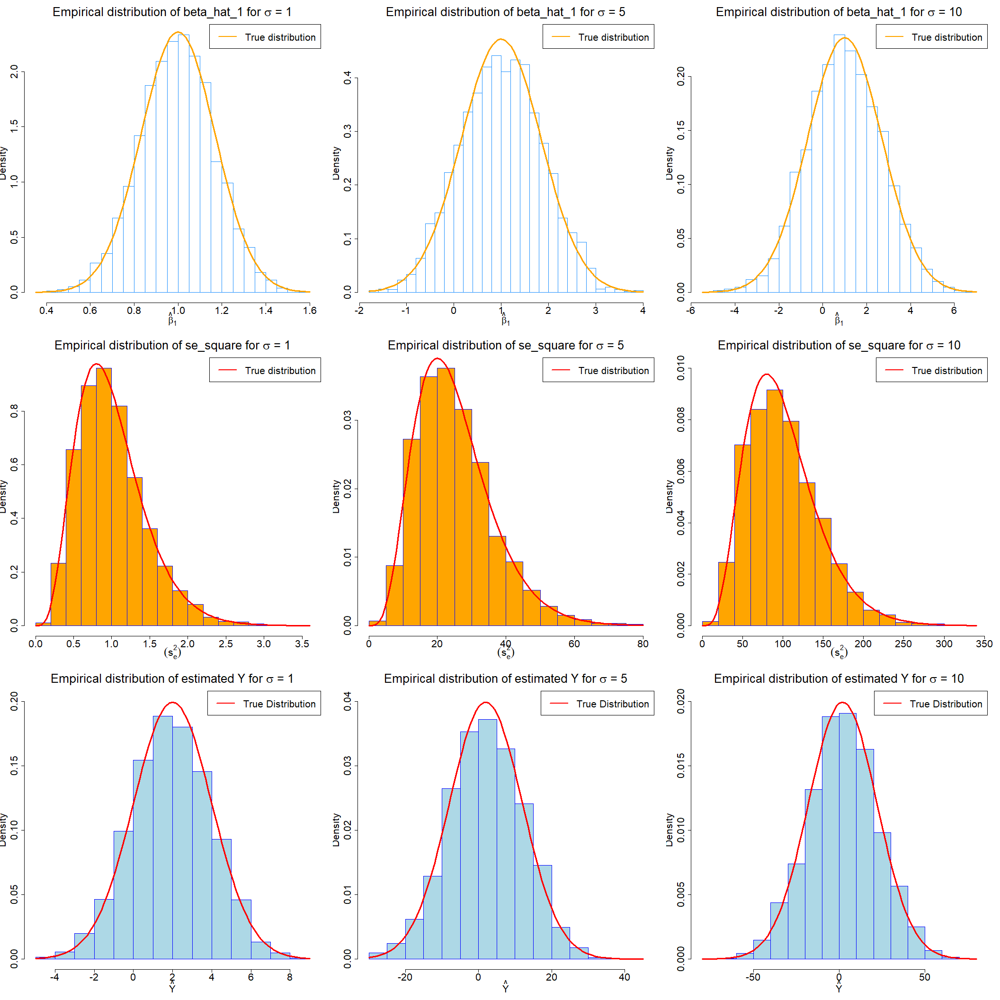
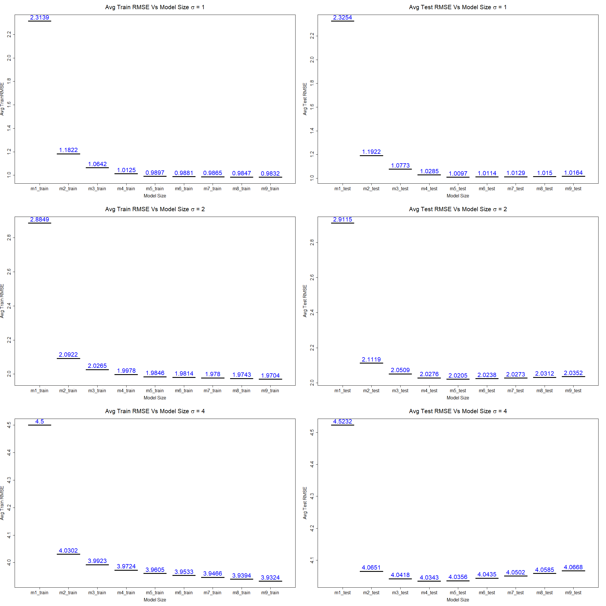
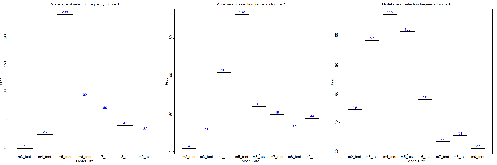
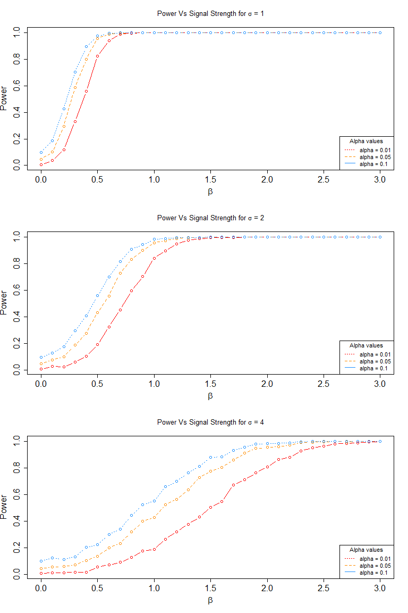

-   [Simulation Study 1, Estimate Distributions](#simulation-study-1-estimate-distributions)
-   [Simulation Study 2, RMSE for Selection?](#simulation-study-2-rmse-for-selection)
-   [Simulation Study 3, Power](#simulation-study-3-power)

Simulation Study 1, Estimate Distributions
------------------------------------------

-   **Introduction**

    For this study we have given a model

    *Y*<sub>*i*</sub> = *β*<sub>0</sub> + *β*<sub>1</sub>*x*<sub>*i*1</sub> + *β*<sub>2</sub>*x*<sub>*i*2</sub> + *β*<sub>3</sub>*x*<sub>*i*3</sub> + *β*<sub>4</sub>*x*<sub>*i*4</sub> + *ϵ*<sub>*i*</sub>.

    Where *ϵ*<sub>*i*</sub> ∼ *N*(0, *σ*<sup>2</sup>) and

    -   *β*<sub>0</sub> = 2
    -   *β*<sub>1</sub> = 1
    -   *β*<sub>2</sub> = 1
    -   *β*<sub>3</sub> = 1
    -   *β*<sub>4</sub> = 1
    -   *n* = 15
    -   *σ* ∈ (1, 5, 10)

    In this study, we will use process of simulation to obtain an empirical distribution of following estimates for each of the above *σ* values. The simulation size will be 3000 times. These estimates are:

    -   $\\hat{\\beta}\_1$
    -   *s*<sub>*e*</sub><sup>2</sup>
    -   $\\hat{E}\[Y | x\_{1} = -3,x\_{2} = 2.5, x\_{3} = 0.5,x\_{4} = 0\]$

    Where $\\hat{E}\[Y | x\_{1} = -3,x\_{2} = 2.5, x\_{3} = 0.5,x\_{4} = 0\]$ is $\\hat{y}(x\_{0})$ when *x*<sub>1</sub> = −3, *x*<sub>2</sub> = 2.5, *x*<sub>3</sub> = 0.5, *x*<sub>4</sub> = 0

    In particular, we will be discussing following:
    -   The true distribution of these estimates and whether or not we know them all?
    -   How do empirical distribution from simulations compares to true distribution? we will see it using plots.
    -   How does *σ* value affects the empirical distribution.

    We will use data from [`study_1.csv`](study_1.csv) for the values of the predictors. These values will be kept constant for entire study.

    By using simulation technique, we will try to prove that these empirical distributions and estimated are following the correct pattern and will try to derive the true distribution from it. Though we have given the true model, while doing this we will assume that we don't know these. Overall if simulated correctly, we would expect our empirical distributions to be close to the true distributions and true means. So lets get started.

-   **Methods**

    -   We have give a model with multiple predictors(from study\_1.csv file) and *β* parameters. We will start our simulation process by taking each *σ* value at a time and storing $\\hat{\\beta}\_1$, *s*<sub>*e*</sub><sup>2</sup> and $\\hat{E}\[Y | X\]$ in a data frame which will be used later to create and visualize the plots and results.

    For the sake of simplicity, we will take one *σ* value at a time for simulations will start with first *σ* value of 1.

``` r
#setting seed
birthday <- 19880918
set.seed(birthday)

#Importing data file for this simulation study
library(readr)
study_1 <- read_csv("study_1.csv")

n <- 15
p <- 5

beta_0 <- 2
beta_1 <- 1
beta_2 <- 1
beta_3 <- 1
beta_4 <- 1
num_sim <- 3000

x0 = rep(1, n)
x1 <- study_1$x1
x2 <- study_1$x2
x3 <- study_1$x3
x4 <- study_1$x4
  
#Create X vector and coverience matrix
X <- cbind(x0, x1,x2,x3,x4)
C <- solve(t(X) %*% X)

#Create data frame with x values to determine estimated true mean of Y during simulation
new_data <- data.frame(x1 = -3, x2 = 2.5, x3 = 0.5, x4 = 0)

#Calculate true mean of Y and given x value
true_y <-  beta_0 + beta_1 * -3 + beta_2 * 2.5 + beta_3 * 0.5 + beta_4 * 0

sigma_1 <- 1
sig_1 <- rep(0,num_sim) 
beta_hat_1_1 <- rep(0,num_sim)
est_1 <- rep(0,num_sim)
sd_1 <- sqrt(sigma_1 ^ 2 * C[1+1,1+1])

for(i in 1:num_sim){
 eps <- rnorm(n, mean = 0, sd = sigma_1)
 study_1$y <- beta_0 * x0  + beta_1 * x1 + beta_2 * x2 + beta_3 * x3 + beta_4 * x4 + eps
 model <- lm(y ~ ., data = study_1)
 beta_hat_1_1[i] <- coef(model)[2]
 sig_1[i] <- (summary(model)$sigma)^2
 est_1[i] <- predict(model, newdata = new_data)
}

#Storing estimated results in data frame 
estimates_sigma1 <- data.frame(S_e_square = sig_1, beta_hat_value = beta_hat_1_1, y_estimate = est_1)
```

-   Now we will perform same simulation with the *σ* value of 5

``` r
sigma_2 <- 5
sig_2 <- rep(0,num_sim) 
beta_hat_1_2 <- rep(0,num_sim)
est_2 <- rep(0,num_sim)
sd_2 <- sqrt(sigma_2 ^ 2 * C[1+1,1+1])

for(i in 1:num_sim){
 eps <- rnorm(n, mean = 0, sd = sigma_2)
 study_1$y <- beta_0 * x0  + beta_1 * x1 + beta_2 * x2 + beta_3 * x3 + beta_4 * x4 + eps
 model <- lm(y ~ ., data = study_1)
 beta_hat_1_2[i] <- coef(model)[2]
 sig_2[i] <- (summary(model)$sigma)^2
 est_2[i] <- predict(model, newdata = new_data)
}

estimates_sigma2 <- data.frame(sigma = sigma_2, S_e_square = sig_2, beta_hat_value = beta_hat_1_2, y_estimate = est_2)
```

-   Now we will perform same simulation with the *σ* value of 10

``` r
sigma_3 <- 10
sig_3 <- rep(0,num_sim) 
beta_hat_1_3 <- rep(0,num_sim)
est_3 <- rep(0,num_sim)
sd_3 <- sqrt(sigma_3 ^ 2 * C[1+1,1+1])

for(i in 1:num_sim){
 eps <- rnorm(n, mean = 0, sd = sigma_3)
 study_1$y <- beta_0 * x0  + beta_1 * x1 + beta_2 * x2 + beta_3 * x3 + beta_4 * x4 + eps
 model <- lm(y ~ ., data = study_1)
 beta_hat_1_3[i] <- coef(model)[2]
 sig_3[i] <- (summary(model)$sigma)^2
 est_3[i] <- predict(model, newdata = new_data)
}

estimates_sigma3 <- data.frame(S_e_square = sig_3, beta_hat_value = beta_hat_1_3, y_estimate = est_3)
```

-   **Results**

    After performing the simulations we see that we get three `y` vectors with the size of 3000 for each of *σ* values. We have stored the estimates of *β*<sub>1</sub>, *s*<sub>*e*</sub><sup>2</sup> and $\\hat{E}\[Y | X\]$ in data frame for each value of *σ* i.e. we have 3 data frame with dimension of 3 × 3000 with estimated values.

    we will now plot the these estimated or empirical distributions of *β*<sub>1</sub>, *s*<sub>*e*</sub><sup>2</sup> and $\\hat{E}\[Y | X\]$ along with true distribution curve on the top. we will discuss these results in discussion section.

``` r
#Setting placeholder frames for plots
par(mfrow = c(3,3))

#plots for empirical dsitribution of beta_1
hist(estimates_sigma1$beta_hat_value,breaks=20,main = expression(paste("Empirical distribution of beta_hat_1 for ", sigma, " = 1")),xlab = expression(hat(beta)[1]), border = "dodgerblue",prob = TRUE,cex.axis=2,cex.lab=2,cex.main=2.5)
legend("topright", c("True distribution"), lty = c(1, 2), lwd = 2,col = c("orange"),cex = 2, pt.cex=3)
curve(dnorm(x, mean = beta_1,sd = sqrt(sigma_1 ^ 2 * C[1+1,1+1])), col = "orange", add = TRUE,lwd = 3)

hist(estimates_sigma2$beta_hat_value,breaks=30,main = expression(paste("Empirical distribution of beta_hat_1 for ", sigma, " = 5")),xlab = expression(hat(beta)[1]), border = "dodgerblue",prob = TRUE, ylim = c(0.0,0.48),cex.axis=2,cex.lab=2,cex.main=2.5)
legend("topright", c("True distribution"), lty = c(1, 2), lwd = 2,col = c("orange"),cex = 2, pt.cex=3)
curve(dnorm(x, mean = beta_1,sd = sqrt(sigma_2 ^ 2 * C[1+1,1+1])), col = "orange", add = TRUE,lwd = 3)

hist(estimates_sigma3$beta_hat_value,breaks=20,main = expression(paste("Empirical distribution of beta_hat_1 for ", sigma, " = 10")),xlab = expression(hat(beta)[1]), border = "dodgerblue",prob = TRUE,cex.axis=2,cex.lab=2,cex.main=2.5)
legend("topright", c("True distribution"), lty = c(1, 2), lwd = 2,col = c("orange"),cex = 2, pt.cex=3)
curve(dnorm(x, mean = beta_1,sd = sqrt(sigma_3 ^ 2 * C[1+1,1+1])), col = "orange", add = TRUE,lwd = 3)

#plots for empirical distribution of S_e_square
hist(estimates_sigma1$S_e_square,col = "orange",main = expression(paste("Empirical distribution of se_square for ", sigma, " = 1")),xlab = expression((s[e]^2)), border = "blue",prob = TRUE,cex.axis=2,cex.lab=2,cex.main=2.5)
legend("topright", c("True distribution"), lty = c(1, 2), lwd = 2,col = c("red"),cex = 2, pt.cex=3)
curve(dchisq(x*10,10)*10, add=TRUE, col="red",lwd=3)

hist(estimates_sigma2$S_e_square,col = "orange",main =  expression(paste("Empirical distribution of se_square for ", sigma, " = 5")),xlab = expression((s[e]^2)), border = "blue",prob = TRUE,cex.axis=2,cex.lab=2,cex.main=2.5)
legend("topright", c("True distribution"), lty = c(1, 2), lwd = 2,col = c("red"),cex = 2, pt.cex=3)
curve(dchisq(x*.4,10)*.4, add=TRUE, col="red",lwd=3)

hist(estimates_sigma3$S_e_square,col = "orange",main =  expression(paste("Empirical distribution of se_square for ", sigma, " = 10")),xlab = expression((s[e]^2)), border = "blue",prob = TRUE,ylim=c(0.000,0.010),cex.axis=2,cex.lab=2,cex.main=2.5)
legend("topright", c("True distribution"), lty = c(1, 2), lwd = 2,col = c("red"),cex = 2, pt.cex=3)
curve(dchisq(x*.1,10)*.1, add=TRUE, col="red",lwd=3)

#plots for estimated mean value of Y
hist(estimates_sigma1$y_estimate,col = "lightblue",main = expression(paste("Empirical distribution of estimated Y for ", sigma, " = 1")),xlab = expression(hat(Y)), border = "blue",prob = TRUE,ylim = c(0.00,0.20),cex.axis=2,cex.lab=2,cex.main=2.5)
curve(dnorm(x, mean = true_y,sd = sigma_1*2), col = "red", add = TRUE,lwd = 3)
legend("topright", c("True Distribution"), lty = c(1, 2), lwd = 2,col = c("red"),cex = 2, pt.cex=3)

hist(estimates_sigma2$y_estimate,col = "lightblue",main = expression(paste("Empirical distribution of estimated Y for ", sigma, " = 5")),xlab = expression(hat(Y)), border = "blue",prob = TRUE,ylim = c(0.00,0.04),cex.axis=2,cex.lab=2,cex.main=2.5)
curve(dnorm(x, mean = true_y,sd = sigma_2*2), col = "red", add = TRUE,lwd = 3)
legend("topright", c("True Distribution"), lty = c(1, 2), lwd = 2,col = c("red"),cex = 2, pt.cex=3)

hist(estimates_sigma3$y_estimate,col = "lightblue",main = expression(paste("Empirical distribution of estimated Y for ", sigma, " = 10")),xlab = expression(hat(Y)), border = "blue",prob = TRUE,ylim = c(0.00,0.020),cex.axis=2,cex.lab=2,cex.main=2.5)
curve(dnorm(x, mean = true_y,sd = sigma_3*2), col = "red", add = TRUE,lwd = 3)
legend("topright", c("True Distribution"), lty = c(1, 2), lwd = 2,col = c("red"),cex = 2, pt.cex=3)
```



-   **Discussion**

    -   *True distributions*

    -   Lets start with true distribution of these estimates. Since we have given true model we can find the true distribution of these estimates by plugging *β* parameters and x values in the model.

    -   $\\hat{\\beta}\_1$ follows a normal distribution with mean of true *β*<sub>1</sub> = 1 and variance of *σ*<sup>2</sup>*C*<sub>11</sub> where *C*<sub>11</sub> is second element (second row and second column) of covariance matrix *C*<sub>*j**j*</sub> and we have calculated those values before simulation which are 0.1690573, 0.8452864 and 1.6905727 for the *σ* value of `1`,`5` and `10` respectively.

    -   For *β*<sub>1</sub> confidence intervals and hypothesis testing is performed using below equation

    $$
      \\frac{\\hat{\\beta}\_1 - \\beta\_1}{\\text{SE}\[\\hat{\\beta}\_1\]} \\sim t\_{n-2}
    $$

    note below quantity which follows chi-squared distribution with (n-p) degree of freedom

    $$
        \\frac{\\text{RSS}}{\\sigma^2} = \\frac{(n-p)s\_e^2}{\\sigma^2} \\sim \\chi\_{n-p}^2.
    $$

    -   using above notation, if we multiply both side by a constant , we can arrive at below equation which essentially illustrate that below quantity does follows chi-squared distribution with (n-p) degrees of freedom

    $$
       s\_e^2 \\sim \\chi\_{n-p}^2 \\frac{(n-p)}{\\sigma^2}
    $$

    -   where *χ*<sub>*n* − *p*</sub><sup>2</sup> is chi-square function with n-p degrees of freedom where n is sample size and p is number of *β* paramters used in the model. we have used this formula to calculate our true distribution directly in curve function. This quality follow mean equal to its degrees of freedom and variance of 2 times the degrees of freedom.

    -   The expected value of Y at given X values $\\hat{E}\[Y | x\_{1} = -3,x\_{2} = 2.5, x\_{3} = 0.5,x\_{4} = 0\]$ is 2. This is essentially an estimate of true mean so we would expect our empirical distribution to be centered around this value. Also the variance at these given X values is *σ*^2.

    -   *Estimated distributions*

    -   We have generated the empirical distribution of these estimates through simulations for each *σ* value. We simulated 3000 times and plot the histogram of empirical distribution of $\\hat{\\beta}\_1$, we see that it appears to follow normal distribution with the mean of true *β*<sub>1</sub> value but that alone does not guarantee that it is correctly matching the true distribution of the same. So to prove this we added a curve of true *β*<sub>1</sub> and we can see that it does indeed follows normal distribution with mean value of *β*<sub>1</sub> and with the correct variance as we expected. This is true for all *σ* values for which we have performed simulations. One thing to note here is as we increase the number of simulations, we will get closer and closer to the mean (true value of *β*<sub>1</sub> in this case). Another fact to note is as we increase the noise level the, data is more spread from the mean which makes sense.

    -   we have calculated *s*<sub>*e*</sub><sup>2</sup> from the model during simulation which was used to create the empirical distribution and when multiplied by the constant stated above, we get same exact distribution in terms of plotted histogram. For every *σ* value this quantity is following a chi-squared distribution of (n-p) = 10 degrees of freedom in our case and matches the true distributions. when we added the curve for true distribution for the same, we see that it is also matching for all values of *σ*.

    -   For the estimated Y value conditioned on given set of X values $\\hat{E}\[Y | x\_{1} = -3,x\_{2} = 2.5, x\_{3} = 0.5,x\_{4} = 0\]$ does appear to be centered around estimated of true mean, which is the true value of Y when we plug X values in given true model. Note that this is our unbiased estimate of Y. We can see from the empirical distribution plot that it follows normal distribution as well with the mean of true $\\hat{E}\[Y | x\_{1} = -3,x\_{2} = 2.5, x\_{3} = 0.5,x\_{4} = 0\]$ and with the variance of *σ*<sup>2</sup>.

    -   Lastly note that though all of these estimates follows same distribution irrespective of noise level, their variance does depend on noise level. We can clearly see that as the noise level increases in the model, range of distribution increase which make sense (more the error present in the model, more the variance will be).

Simulation Study 2, RMSE for Selection?
---------------------------------------

-   **Introduction**

    In this simulation study, we will calculate Train and Test RMSE to determine best model and to investigate on how good this process works. i.e. can we rely on RMSE to choose the best model atleast on average? To do this, we will split our data into train and test datasets and then we will use below 9 models in our simulations using both Train and Test datasets and calculate average train and test RMSE's for each of vales of *σ*. On an average we would expect our process to return the correct model over many iterations.

    for the simulation we wil consider true model below:

    *Y*<sub>*i*</sub> = *β*<sub>0</sub> + *β*<sub>1</sub>*x*<sub>*i*1</sub> + *β*<sub>2</sub>*x*<sub>*i*2</sub> + *β*<sub>3</sub>*x*<sub>*i*3</sub> + *β*<sub>4</sub>*x*<sub>*i*4</sub> + *β*<sub>5</sub>*x*<sub>*i*5</sub> + *ϵ*<sub>*i*</sub>.

    Where *ϵ*<sub>*i*</sub> ∼ *N*(0, *σ*<sup>2</sup>). and

    -   *β*<sub>0</sub> = 0
    -   *β*<sub>1</sub> = 6
    -   *β*<sub>2</sub> = −3.5
    -   *β*<sub>3</sub> = 1.7
    -   *β*<sub>4</sub> = −1.1
    -   *β*<sub>5</sub> = 0.7
    -   *n* = 15

    we will use sample size of 600 and three levels of noise.
    -   n = 600
    -   *σ* ∈ (1, 2, 4)

    We will use data from [`study_2.csv`](study_2.csv) for the values of the predictors. These values will be kept constant for entire study. The `y` values in this data represents a place holder. we will split dataset into train and test dataset with 300 observation each.

    for each we will following nine models:

    -   y ~ x1
    -   y ~ x1 + x2
    -   y ~ x1 + x2 + x3
    -   y ~ x1 + x2 + x3 + x4
    -   y ~ x1 + x2 + x3 + x4 + x5, the correct form of the model
    -   y ~ x1 + x2 + x3 + x4 + x5 + x6
    -   y ~ x1 + x2 + x3 + x4 + x5 + x6 + x7
    -   y ~ x1 + x2 + x3 + x4 + x5 + x6 + x7 + x8
    -   y ~ x1 + x2 + x3 + x4 + x5 + x6 + x7 + x8 + x9

    The RMSE formula we will be using is below:
    $$
        \\text{RMSE}(\\text{model, data}) = \\sqrt{\\frac{1}{n} \\sum\_{i = 1}^{n}(y\_i - \\hat{y}\_i)^2}
    $$

    We will repeat process with 500 simulations for each of three values of *σ*. Also we will plot for each value of *σ* that shows how average Train RMSE and average Test RMSE changes as function of model size and show the number of times the model of each size was chosen for each value of *σ*.

    Through these simulation, we will try to answer following questions:
    -   does the method always select the correct model? On average, does it select the correct model?
    -   How does the level of noise affect the result?

-   **Methods**

We will begin with creating variables and *β* parameters and fitting model through `lm()` function. We will simulate for each given value of *σ* above separately and will store result in train and test dataframes. So lets start with *σ* value of 1:

``` r
#Setting the seed
birthday <- 19880918
set.seed(birthday)

library(readr)
study_2 <- read_csv("study_2.csv")

#Creating necessasary variables 
beta_0 <- 0
beta_1 <- 6
beta_2 <- -3.5
beta_3 <- 1.7
beta_4 <- -1.1
beta_5 <- 0.7

n <- 600
p <- 6
sim_size <- 500

x0 <- rep(0,n)
x1 <- study_2$x1
x2 <- study_2$x2
x3 <- study_2$x3
x4 <- study_2$x4
x5 <- study_2$x5
x6 <- study_2$x6
x7 <- study_2$x7
x8 <- study_2$x8
x9 <- study_2$x9

m1_train <- rep(0,500)
m2_train <- rep(0,500)
m3_train <- rep(0,500)
m4_train <- rep(0,500)
m5_train <- rep(0,500)
m6_train <- rep(0,500)
m7_train <- rep(0,500)
m8_train <- rep(0,500)
m9_train <- rep(0,500)

m1_test <- rep(0,500)
m2_test <- rep(0,500)
m3_test <- rep(0,500)
m4_test <- rep(0,500)
m5_test <- rep(0,500)
m6_test <- rep(0,500)
m7_test <- rep(0,500)
m8_test <- rep(0,500)
m9_test <- rep(0,500)

#Custom function to calculate RMSE of the model
rmse  = function(actual, predicted) {
  sqrt(mean((actual - predicted) ^ 2))
}

sigma <- 1

#Looping through 3000 times for sigma value of 1
 for(i in 1:sim_size){
 eps <- rnorm(n, mean = 0, sd = sigma)
 study_2$y <- beta_0 * x0  + beta_1 * x1 + beta_2 * x2 + beta_3 * x3 + beta_4 * x4 + beta_5 * x5 + eps

 #split the dataset in training and test sets with random 300 observations each
 train_index <- sample(1:nrow(study_2),300)
 train_data <- study_2[train_index,]
 test_data <- study_2[-train_index,]

  model1 <- lm(y ~ x1, data = train_data)
  model2 <- lm(y ~ x1 + x2, data = train_data)
  model3 <- lm(y ~ x1 + x2 + x3, data = train_data)
  model4 <- lm(y ~ x1 + x2 + x3 + x4, data = train_data)
  model5 <- lm(y ~ x1 + x2 + x3 + x4 + x5, data = train_data)
  model6 <- lm(y ~ x1 + x2 + x3 + x4 + x5 + x6, data = train_data)
  model7 <- lm(y ~ x1 + x2 + x3 + x4 + x5 + x6 + x7, data = train_data)
  model8 <- lm(y ~ x1 + x2 + x3 + x4 + x5 + x6 + x7 + x8, data = train_data)
  model9 <- lm(y ~ x1 + x2 + x3 + x4 + x5 + x6 + x7 + x8 + x9, data = train_data)
  
  m1_train[i] <- rmse(train_data$y, predict(model1, train_data))
  m2_train[i] <- rmse(train_data$y, predict(model2, train_data))
  m3_train[i] <- rmse(train_data$y, predict(model3, train_data))
  m4_train[i] <- rmse(train_data$y, predict(model4, train_data))
  m5_train[i] <- rmse(train_data$y, predict(model5, train_data))
  m6_train[i] <- rmse(train_data$y, predict(model6, train_data))
  m7_train[i] <- rmse(train_data$y, predict(model7, train_data))
  m8_train[i] <- rmse(train_data$y, predict(model8, train_data))
  m9_train[i] <- rmse(train_data$y, predict(model9, train_data))

  m1_test[i] <- rmse(test_data$y, predict(model1, test_data))
  m2_test[i] <- rmse(test_data$y, predict(model2, test_data))
  m3_test[i] <- rmse(test_data$y, predict(model3, test_data))
  m4_test[i] <- rmse(test_data$y, predict(model4, test_data))
  m5_test[i] <- rmse(test_data$y, predict(model5, test_data))
  m6_test[i] <- rmse(test_data$y, predict(model6, test_data))
  m7_test[i] <- rmse(test_data$y, predict(model7, test_data))
  m8_test[i] <- rmse(test_data$y, predict(model8, test_data))
  m9_test[i] <- rmse(test_data$y, predict(model9, test_data))
 }

#Stroring results in train and test data frames
  rmse_traindata_sig1 <- data.frame(m1_train,m2_train,m3_train,m4_train,m5_train,m6_train,m7_train,m8_train,m9_train)
  rmse_testdata_sig1 <- data.frame(m1_test,m2_test,m3_test,m4_test,m5_test,m6_test,m7_test,m8_test,m9_test)
```

-   Now we will perform simulation procedure for *σ* value of 2

``` r
sigma <- 2

 for(i in 1:sim_size){
 eps <- rnorm(n, mean = 0, sd = sigma)
 study_2$y <- beta_0 * x0  + beta_1 * x1 + beta_2 * x2 + beta_3 * x3 + beta_4 * x4 + beta_5 * x5 + eps

 train_index <- sample(1:nrow(study_2),300)
 train_data <- study_2[train_index,]
 test_data <- study_2[-train_index,]

  model1 <- lm(y ~ x1, data = train_data)
  model2 <- lm(y ~ x1 + x2, data = train_data)
  model3 <- lm(y ~ x1 + x2 + x3, data = train_data)
  model4 <- lm(y ~ x1 + x2 + x3 + x4, data = train_data)
  model5 <- lm(y ~ x1 + x2 + x3 + x4 + x5, data = train_data)
  model6 <- lm(y ~ x1 + x2 + x3 + x4 + x5 + x6, data = train_data)
  model7 <- lm(y ~ x1 + x2 + x3 + x4 + x5 + x6 + x7, data = train_data)
  model8 <- lm(y ~ x1 + x2 + x3 + x4 + x5 + x6 + x7 + x8, data = train_data)
  model9 <- lm(y ~ x1 + x2 + x3 + x4 + x5 + x6 + x7 + x8 + x9, data = train_data)
  
  m1_train[i] <- rmse(train_data$y, predict(model1, train_data))
  m2_train[i] <- rmse(train_data$y, predict(model2, train_data))
  m3_train[i] <- rmse(train_data$y, predict(model3, train_data))
  m4_train[i] <- rmse(train_data$y, predict(model4, train_data))
  m5_train[i] <- rmse(train_data$y, predict(model5, train_data))
  m6_train[i] <- rmse(train_data$y, predict(model6, train_data))
  m7_train[i] <- rmse(train_data$y, predict(model7, train_data))
  m8_train[i] <- rmse(train_data$y, predict(model8, train_data))
  m9_train[i] <- rmse(train_data$y, predict(model9, train_data))

  m1_test[i] <- rmse(test_data$y, predict(model1, test_data))
  m2_test[i] <- rmse(test_data$y, predict(model2, test_data))
  m3_test[i] <- rmse(test_data$y, predict(model3, test_data))
  m4_test[i] <- rmse(test_data$y, predict(model4, test_data))
  m5_test[i] <- rmse(test_data$y, predict(model5, test_data))
  m6_test[i] <- rmse(test_data$y, predict(model6, test_data))
  m7_test[i] <- rmse(test_data$y, predict(model7, test_data))
  m8_test[i] <- rmse(test_data$y, predict(model8, test_data))
  m9_test[i] <- rmse(test_data$y, predict(model9, test_data))
 }

  rmse_traindata_sig2 <- data.frame(m1_train,m2_train,m3_train,m4_train,m5_train,m6_train,m7_train,m8_train,m9_train)
  rmse_testdata_sig2 <- data.frame(m1_test,m2_test,m3_test,m4_test,m5_test,m6_test,m7_test,m8_test,m9_test)
```

-   Again we will perform simulation procedure for *σ* value of 4

``` r
sigma <- 4

 for(i in 1:sim_size){
 eps <- rnorm(n, mean = 0, sd = sigma)
 study_2$y <- beta_0 * x0  + beta_1 * x1 + beta_2 * x2 + beta_3 * x3 + beta_4 * x4 + beta_5 * x5 + eps

 train_index <- sample(1:nrow(study_2),300)
 train_data <- study_2[train_index,]
 test_data <- study_2[-train_index,]

  model1 <- lm(y ~ x1, data = train_data)
  model2 <- lm(y ~ x1 + x2, data = train_data)
  model3 <- lm(y ~ x1 + x2 + x3, data = train_data)
  model4 <- lm(y ~ x1 + x2 + x3 + x4, data = train_data)
  model5 <- lm(y ~ x1 + x2 + x3 + x4 + x5, data = train_data)
  model6 <- lm(y ~ x1 + x2 + x3 + x4 + x5 + x6, data = train_data)
  model7 <- lm(y ~ x1 + x2 + x3 + x4 + x5 + x6 + x7, data = train_data)
  model8 <- lm(y ~ x1 + x2 + x3 + x4 + x5 + x6 + x7 + x8, data = train_data)
  model9 <- lm(y ~ x1 + x2 + x3 + x4 + x5 + x6 + x7 + x8 + x9, data = train_data)
    
    m1_train[i] <- rmse(train_data$y, predict(model1, train_data))
    m2_train[i] <- rmse(train_data$y, predict(model2, train_data))
    m3_train[i] <- rmse(train_data$y, predict(model3, train_data))
    m4_train[i] <- rmse(train_data$y, predict(model4, train_data))
    m5_train[i] <- rmse(train_data$y, predict(model5, train_data))
    m6_train[i] <- rmse(train_data$y, predict(model6, train_data))
    m7_train[i] <- rmse(train_data$y, predict(model7, train_data))
    m8_train[i] <- rmse(train_data$y, predict(model8, train_data))
    m9_train[i] <- rmse(train_data$y, predict(model9, train_data))
  
    m1_test[i] <- rmse(test_data$y, predict(model1, test_data))
    m2_test[i] <- rmse(test_data$y, predict(model2, test_data))
    m3_test[i] <- rmse(test_data$y, predict(model3, test_data))
    m4_test[i] <- rmse(test_data$y, predict(model4, test_data))
    m5_test[i] <- rmse(test_data$y, predict(model5, test_data))
    m6_test[i] <- rmse(test_data$y, predict(model6, test_data))
    m7_test[i] <- rmse(test_data$y, predict(model7, test_data))
    m8_test[i] <- rmse(test_data$y, predict(model8, test_data))
    m9_test[i] <- rmse(test_data$y, predict(model9, test_data))
 }
  rmse_traindata_sig3 <- data.frame(m1_train,m2_train,m3_train,m4_train,m5_train,m6_train,m7_train,m8_train,m9_train)
  rmse_testdata_sig3 <- data.frame(m1_test,m2_test,m3_test,m4_test,m5_test,m6_test,m7_test,m8_test,m9_test)
```

-   **Results**

    So we have ran our simulations for each values of *σ* and stored the result in train and test data frames. Each data frame has dimension of 9 × 500. for each *σ* value we have 2 data frames, one for train and one for test containg RMSE for 9 models. we will now use these dataframes to calculate average of these models and plot it.

``` r
par(mfrow = c(3,2))
  #Plotting RMSE's
  #sigma value of 1
   means_train <- apply(rmse_traindata_sig1,2,mean)
   means_test <- apply(rmse_testdata_sig1,2,mean)
   rmse_train <- (data.frame(model=names(means_train), means_train))
   rmse_test <- (data.frame(model=names(means_test), means_test))
   plot(means_train~model, data=rmse_train,main=expression(paste("Avg Train RMSE Vs Model Size ", sigma, " = 1")),cex.axis=1.5,cex.lab=1.5,     xlab="Model Size",ylab="Avg TrainRMSE",cex.main=2)
   text(rmse_train$model,rmse_train$means_train, labels = round(rmse_train$means_train,4),pos=3,cex=2,col="blue")
   plot(means_test~model, data=rmse_test,main=expression(paste("Avg Test RMSE Vs Model Size ", sigma, " = 1")),cex.axis=1.5,cex.lab=1.5, xlab="Model Size",ylab="Avg Test RMSE",cex.main=2)
   text(rmse_test$model,rmse_test$means_test, labels = round(rmse_test$means_test,4),pos=3,cex=2,col="blue")
   
  #sigma value of 2
   means_train <- apply(rmse_traindata_sig2,2,mean)
   means_test <- apply(rmse_testdata_sig2,2,mean)
   rmse_train <- (data.frame(model=names(means_train), means_train))
   rmse_test <- (data.frame(model=names(means_test), means_test))
   plot(means_train~model, data=rmse_train,main=expression(paste("Avg Train RMSE Vs Model Size ", sigma, " = 2")),cex.axis=1.5,cex.lab=1.5, xlab="Model Size",ylab="Avg Train RMSE",cex.main=2)
   
   text(rmse_train$model,rmse_train$means_train, labels = round(rmse_train$means_train,4),pos=3,cex=2,col="blue")
   plot(means_test~model, data=rmse_test,main=expression(paste("Avg Test RMSE Vs Model Size ", sigma, " = 2")),cex.axis=1.5,cex.lab=1.5, xlab="Model Size",ylab="Avg Test RMSE",cex.main=2)
   text(rmse_test$model,rmse_test$means_test, labels = round(rmse_test$means_test,4),pos=3,cex=2,col="blue")

   #sigma value of 4
   means_train <- apply(rmse_traindata_sig3,2,mean)
   means_test <- apply(rmse_testdata_sig3,2,mean)
   rmse_train <- (data.frame(model=names(means_train), means_train))
   rmse_test <- (data.frame(model=names(means_test), means_test))
   plot(means_train~model, data=rmse_train,main=expression(paste("Avg Train RMSE Vs Model Size ", sigma, " = 4")), cex.axis=1.5,cex.lab=1.5,xlab="Model Size",ylab="Avg Train RMSE",cex.main=2)
   text(rmse_train$model,rmse_train$means_train, labels = round(rmse_train$means_train,4),pos=3,cex=2,col="blue")
   plot(means_test~model, data=rmse_test,main=expression(paste("Avg Test RMSE Vs Model Size ", sigma, " = 4")),cex.axis=1.5,cex.lab=1.5, xlab="Model Size",ylab="Avg Test RMSE",cex.main=2)
   text(rmse_test$model,rmse_test$means_test, labels = round(rmse_test$means_test,4),pos=3,cex=2,col="blue")
```



-   We will now plot model selection for each size for every value of *σ*

``` r
#Model Selection for each value of sigma
df1 <- as.data.frame(table(colnames(rmse_testdata_sig1)[apply(rmse_testdata_sig1,1,which.min)]))
df2 <- as.data.frame(table(colnames(rmse_testdata_sig2)[apply(rmse_testdata_sig2,1,which.min)]))
df3 <- as.data.frame(table(colnames(rmse_testdata_sig3)[apply(rmse_testdata_sig3,1,which.min)]))

par(mfrow = c(1,3))
plot(Freq~Var1, data=df1,main= expression(paste("Model size of selection frequency for ", sigma, " = 1")),cex.main=2,cex.axis=2,cex.lab=2, xlab="Model Size")
text(Freq~Var1, data=df1, labels = Freq,pos=3,cex=2,col="blue")
plot(Freq~Var1, data=df2,main= expression(paste("Model size of selection frequency for ", sigma, " = 2")),cex.main=2,cex.axis=2,cex.lab=2,
     xlab="Model Size",xpd=TRUE)
text(Freq~Var1, data=df2, labels = Freq,pos=3,cex=2,col="blue")
plot(Freq~Var1, data=df3, main=expression(paste("Model size of selection frequency for ", sigma, " = 4")),cex.main=2,cex.axis=2,cex.lab=2,
     xlab="Model Size")
text(Freq~Var1, data=df3, labels = Freq,pos=3,cex=2,col="blue")
```



-   **Discussion**

    -   RMSE's are common measure of goodness of fit which can be calculated easily by fitting the model. In this simulation study we can calculated both train and Test RMSE's for model selection. Lets start with train RMSE first. When looking at above plots, we see that the models that have been used in these simulation study are nested models. i.e each small model is nested inside full model. It illustrates that train RMSE gets smaller and smaller as we increase the model size. For each value of *σ* we see that the lowest train RMSE comes from highest model size. but this does not mean that full model is always the best model (in case of nested models). Also this can not be fully trusted as these Train RMSE's are based on data that model has already seen or trained. One interesting thing to note here is that for every *σ* value Train RMSE's with only one predictor is way higher than with more than one predictor in the model. It makes sense as model with only one predictor won't be able exlpain much of variability compared to models with multiple predictors. When we take multiple predictors in account, we see that RMSE's are closer at this point a number of things may needs to be considered such as checking the p-value of predictors and include only relevant ones.

    -   On the contrary Test RMSE's are calculated on unseen data. i.e. once we fit the model, we will apply it on data that is not used for creating model. From the plots above for the test RMSE, which is fitted to unseen data we can see that for every *σ* value our simulation result in lowest RMSE is not always associated with true model but most of the time i.e. the true model size of 5 is not always the best model for every value of *σ*. For two *σ* values (1 and 2) the true model (model 5) overall was the best model.

    -   This simulation procedure is also indicating the true model on average has the least or slightly higher Test RMSE than the best model chosen. Though overall simulation procedure does appear to select the true model as the best model(with the least RMSE value).

    -   Lets discuss how many time this process selected the each model as the best model for each *σ* values. When we look at the three model selection frequency plots above where it illustrates which model was chosen as the best model and how many times. From this, it can be seen that model 5 was chosen 238,182 and 103 times for *σ* value of 1,2 and 4 respectively. So on average we are seeing that out simulation process picks the given true model as the best model. It was chosen maximum number of times for *σ* value of 1 and 2 and for *σ* value of 4, model 4 was chosen maximun number of times. Also unlike the Train RMSE's none of the simulations selected model of size 1. Model 1 was by far the worst model (very high RMSE in Train) and our Test dataset never selected it.

    -   Another interesting trend that we see from above plots is as the *σ* values increases, the variation in average RMSE value decreases. from the first plot (*σ* = 1) we see that the range of average RMSE value is between 1.02 to 2.33 that's the length of 1.31. The same statistics for *σ* value 2 and 4 are 0.88 and 0.46 respectively.

Simulation Study 3, Power
-------------------------

-   **Introduction**

In this simulation study we will investigate the power of the significance of regression test for simple linear regression.
*H*<sub>0</sub> : *β*<sub>1</sub> = 0 vs *H*<sub>1</sub> : *β*<sub>1</sub> ≠ 0

As we know that `significance level` *α* is the probability of a type I error and can represented as

*α* = *P*\[Reject *H*<sub>0</sub> ∣ *H*<sub>0</sub> True\]=*P*\[Type I Error\]

Also thr probability of type II error is denoted by *β* (not same as *β* parameter from the model) and can be represented as

*β* = *P*\[Fail to Reject *H*<sub>0</sub> ∣ *H*<sub>1</sub> True\]=*P*\[Type II Error\]

*Power* is the probability of rejecting the null hytpothesis when the null is not true i.e. the alternative is true and *β*<sub>1</sub> is non-zero. It can be written as

Power = 1 − *β* = *P*\[Reject *H*<sub>0</sub> ∣ *H*<sub>1</sub> True\]

Power is the probability that a signal of a particular strength will be detected. Many things affect the power of a test. In this case, some of those are:

-   Sample Size
-   x
-   values
-   Signal Strength, *β*
-   Noise Level, *σ*
-   Significance Level, *α*

In this simulation study, we will investigate how signal strength *β*, *σ* and *α* is affecting the Power and how these are inter related .

To perform the simulation, we will use below model:
*Y*<sub>*i*</sub> = *β*<sub>0</sub> + *β*<sub>1</sub>*x*<sub>*i*</sub> + *ϵ*<sub>*i*</sub>
 where *ϵ*<sub>*i*</sub> ∼ *N*(0, *σ*<sup>2</sup>)

we will let ??0=0, thus ??1 is essentially controlling the amount of "signal." We will then consider different signals and noises:

-   *β*<sub>1</sub> ∈ (0, 0.1, 0.2, 0.3, …3)
-   *σ* ∈ (1, 2, 4)

As well as three significance levels:

-   *α* ∈ (0.01, 0.05, 0.10)

We will use the following x values for all simulations. (Thus, x values and sample size will not be investigated.)

``` r
x_values <- seq(0, 5, length = 25)
```

Some of the questions that we will try to answer using simulations are:

-   How do *α*, *β*<sub>1</sub> and *σ* affect power?
-   Are 1000 simulations sufficient?

-   **Methods**

Also for each combination of *β*<sub>1</sub> and *σ*, we will simulate from true model at least 1000 times. We will also perfrom significance of regression test. To estimate power with these ssimulations, and *α*, we will use below formula:l

$$
  \\hat{\\text{Power}} = \\hat{P}\[\\text{Reject } H\_0 \\mid H\_1 \\text{ True}\] = \\frac{\\text{\# Tests Rejected}}{\\text{\# Simulations}}
$$

-   *σ* value of 1

``` r
library(dplyr)
birthday <- 19880918
set.seed(birthday)

sigma <- 1 
n <- 25
beta_0 <- 0
beta <- seq(0,3,by=0.1)
sim_size <- 1000
p_val <- rep(0,1000)

pframe <- list(beta,p_val)

#List to data frame conversion
merge.all <- function(x, y) {
    merge(x, y, all=TRUE, by=c("b","p_val"))
}

for(i in seq_along(beta)){
  for(j in 1:sim_size){
    eps <- rnorm(25,mean=0,sd=sigma)
    y_values <- beta_0 + beta[i] * x_values + eps
    model <- lm(y_values~x_values)
    p_val[j] <- summary(model)$coefficient[2,4]
  }
    pframe[[i]] <- data.frame(b = beta[i], p_val = p_val)
}

outsig1 <- Reduce(merge.all, pframe)
outsig1["alpha_1"] <- ifelse(outsig1$p_val < 0.01,0.001,0)
outsig1["alpha_2"] <- ifelse(outsig1$p_val < 0.05,0.001,0)
outsig1["alpha_3"] <- ifelse(outsig1$p_val < 0.1,0.001,0)
outsig1$p_val <- NULL

sig1 <- outsig1 %>%
    group_by(b) %>%
     summarise_at(vars(starts_with("alpha")), sum)
```

-   *σ* value of 2

``` r
sigma <- 2

for(i in seq_along(beta)){
  for(j in 1:sim_size){
    eps <- rnorm(25,mean=0,sd=sigma)
    y_values <- beta_0 + beta[i] * x_values + eps
    model <- lm(y_values~x_values)
    p_val[j] <- summary(model)$coefficient[2,4]
  }
    pframe[[i]] <- data.frame(b = beta[i], p_val = p_val)
}

outsig2 <- Reduce(merge.all, pframe)
outsig2["alpha_1"] <- ifelse(outsig2$p_val < 0.01,0.001,0)
outsig2["alpha_2"] <- ifelse(outsig2$p_val < 0.05,0.001,0)
outsig2["alpha_3"] <- ifelse(outsig2$p_val < 0.1,0.001,0)
outsig2$p_val <- NULL

sig2 <- outsig2 %>%
    group_by(b) %>%
     summarise_at(vars(starts_with("alpha")), sum) 
```

-   $sigma$ value of 4

``` r
sigma <- 4

for(i in seq_along(beta)){
  for(j in 1:sim_size){
    eps <- rnorm(25,mean=0,sd=sigma)
    y_values <- beta_0 + beta[i] * x_values + eps
    model <- lm(y_values~x_values)
    p_val[j] <- summary(model)$coefficient[2,4]
    
  }
    pframe[[i]] <- data.frame(b = beta[i], p_val = p_val)
}

outsig3 <- Reduce(merge.all, pframe)
outsig3["alpha_1"] <- ifelse(outsig3$p_val < 0.01,0.001,0)
outsig3["alpha_2"] <- ifelse(outsig3$p_val < 0.05,0.001,0)
outsig3["alpha_3"] <- ifelse(outsig3$p_val < 0.1,0.001,0)
outsig3$p_val <- NULL

sig3 <- outsig3 %>%
    group_by(b) %>%
     summarise_at(vars(starts_with("alpha")), sum)  
```

-   **Results**

Now lets plot this data and see what relatiobship we have between power and other things.

``` r
par(mfrow = c(3,1))
plot(sig1$b,sig1$alpha_1, xlim = range(sig1$b), ylab = "Power", xlab = expression(beta)[1], main= expression(paste("Power Vs Signal Strength for ", sigma, " = 1")),cex.axis=1.5,cex.lab=1.5)

#"Power Vs Signal Strength (Beta) for Sigma = 1"
lines(sig1$b,sig1$alpha_1, type = "b", lty=1, col="red")
lines(sig1$b,sig1$alpha_2, type = "b", lty=2,col="darkorange")
lines(sig1$b,sig1$alpha_3, type = "b",lty=3,col="dodgerblue")
legend("bottomright",title="Alpha values",lty=c(3, 2, 1), legend = c("alpha = 0.01","alpha = 0.05","alpha = 0.1"), col=c("red","darkorange","dodgerblue"))

plot(sig2$b,sig2$alpha_1, xlim = range(sig2$b), ylab = "Power", xlab = expression(beta)[1],main= expression(paste("Power Vs Signal Strength for ", sigma, " = 2")),cex.axis=1.5,cex.lab=1.5)
lines(sig2$b,sig2$alpha_1, type = "b", lty=1,col="red")
lines(sig2$b,sig2$alpha_2, type = "b",lty=2,col="darkorange")
lines(sig2$b,sig2$alpha_3, type = "b",lty=3,col="dodgerblue")
legend("bottomright",title="Alpha values",lty=c(3, 2, 1), legend = c("alpha = 0.01","alpha = 0.05","alpha = 0.1"), col=c("red","darkorange","dodgerblue"))

plot(sig3$b,sig3$alpha_1, xlim = range(sig3$b), ylab = "Power", xlab = expression(beta)[1],main= expression(paste("Power Vs Signal Strength for ", sigma, " = 4")),cex.axis=1.5,cex.lab=1.5)
lines(sig3$b,sig3$alpha_1, type = "b", lty=1,col="red")
lines(sig3$b,sig3$alpha_2, type = "b", lty=2,col="darkorange")
lines(sig3$b,sig3$alpha_3, type = "b",lty=3,col="dodgerblue")
legend("bottomright",title="Alpha values",lty=c(3, 2, 1), legend = c("alpha = 0.01","alpha = 0.05","alpha = 0.1"), col=c("red","darkorange","dodgerblue"))
```



-   **Discussion**

    -   To start our discussion, lets begin with definition of Power again. It is *Probability that test will reject a null hypothesis correctly when the alternative is true.* One way to think about power is in terms of false negative results: power refers to the likelihood of avoiding a false negative. Though there are many things affect the Power, we will be discussing about *β*, *σ* and *α* specifically.

    -   *α* : the significance level has an effect on Power. when we increase the *α*, what we really do is reducing the acceptance region and increasing rejection region of the test and as a result we are more likely to reject the null hypothesis. This means we are less likely to accept the null hypothesis when it is false; i.e., less likely to make a Type II error. Hence, the power of the test is increased. for example taking *α* as 0.10 instead of 0.05. This increases the chance of rejecting the null hypothesis (i.e. obtaining a statistically significant result) when the null hypothesis is false, that is, reduces the risk of a Type II error. This can be seen in above 3 plots where blue lines in each plot represents highest *α* value of 0.1 out of all *α* that we are considering has has higher Power compare to rest of *α* values. Note that each blue lines has the most steep slope compare to other alpha i.e. for the *α* value of 0.1 we see that we get more and more rejects quickly for given *β* value. When we take *α* value in consideration epseically "higher" *α*-level, we mean that we are *increasing* the chance of a Type I error, therefore lower *α* indicates of a *more rigorous* test.

    -   increasing *α* (e.g., from .01 to .05 or .10) increases the chances of making a Type I Error (i.e., saying there is a difference when there is not), decreases the chances of making a Type II Error (i.e., saying there is no difference when there is) and decreases the rigor of the test.

    -   increasing *α* (e.g., from .01 to .05 or .10) increases power because one will be rejecting the null more often (i.e., accepting the alternative) and, consequently, when the alternative is true, there is a greater chance of accepting it (i.e., power)

    -   *σ* : *σ* has an inverse effect on Power. As *σ* strength increases in the model, Power decreases. Since noise is not something we can control, we just have to deal with best we can. As we see the above plots that as the strength of noise increases in the model, the chance to get type II error increases. For *σ* value of 1 we seen that we get to higher power even with low *β* values i.e. due to the present of less noise, the probability of rejecting null hypothesis increasing sharply and on the contrary with the *σ* value of 4, there were quire a bit of fail to rejects for all *α* level. It decreased the chances of rejecting the null hypothesis.

    -   *β* parameters : *β* parameter here is the true model parameter (as we have givne the true model). if we take a look at the hypothesis test for the parameter being used in this test (*β*<sub>1</sub>), the t statistics can be written as follows:

    $$
      t = \\frac{\\hat{\\beta}\_1-\\beta\_{10}}{\\text{SE}\[\\hat{\\beta}\_1\]} = \\frac{\\hat{\\beta}\_1-\\beta\_{10}}{s\_e / \\sqrt{S\_{xx}}}
    $$

    -   here we can see that the the greater the difference between the value of parameter and the value being specified in null hypothesis, the greater the power of the test. This is also called effect size. This is because when the effect is large, the true distribution of the test statistic is far from its hypothesized distribution, so the two distributions are distinct, and it's easy to tell which one an observation came from. The intuitive idea is simply that it's easier to detect a large effect than a small one. This approach has two downsides 1. it's important to understand here that a subtle but important effect may be demonstrable but could require a powerful test with a large sample size to produce statistical significance. 2. a small, unimportant effect may be demonstrated with a high degree of statistical significance if the sample size is large enough.

    -   We Can clearly see this in our plots above that as the value of *β* increase, we get higher Power value. For all the *α* and *σ* values the highest Power are from higher value of *β* parameters.

    -   Another interesting fact in above plots are value of *β* parameter when is 0 reverse is true i.e. we are seeing the null hypothesis is true. When we look at our model, in this case both *β*<sub>0</sub> and *β*<sub>1</sub> are 0 so essentially all we have in the model is the noise and therefore at this value (except in the case when *α* value is high) we will see the opposite results.

    -   Lastly in this simulation study, we have chosen sample size of 1000. Considering this size and our result we feel that this is a reasonable size for our Power estimation. When changed the size our simulation we saw that Power is decrease and curve is not as smooth as with larger sample sizes. Essentially Power of test depends on distributions of the test statistics when null hypothesis is false. Typically, a test statistic is some sort of average whose long term behaviour is governed by the strong and/or weak law of large numbers. As the sample size gets large, the distribution of the test statistic approaches that of a point mass under either the null or the alternative hypotheses. Thus, as n gets large, the acceptance region (complement of the rejection region), gets smaller and closer to the value of the null. Based on out test with sample size of 1000 and *α*, *β* and *σ* affects the Power, it can be proven so we conclude that the sample size considered for this simulation study was enough.
